## начало

**Playlist за МПУ:**
2021-09-27-MPU

[https://youtube.com/playlist?list=PLX9ryRl9v7BD-PaKbxayefKsDdcN31FUR](https://l.facebook.com/l.php?u=https%3A%2F%2Fyoutube.com%2Fplaylist%3Flist%3DPLX9ryRl9v7BD-PaKbxayefKsDdcN31FUR%26fbclid%3DIwAR3G4JHcM2iCWlhKn-hDya7TD5ZKlAwwg5WmQXHh4WiVRempgcoPPeLqcmU&h=AT08LI66gJlPbBxxXX1qOxJheqIFh4K6vOmp5NDeHvZeh0zc8jeEApcjFh1ccsEw1es5hKH-f2S7gC4FFnsfEcdNTMVfZXZK4SdSRaNeAfnnw1d0S-hCvzBmSZczO0LIoeXzHg)

**Това не е нашата песничка. [00-01-Connie Francis - Que Sera
Sera.mpg.mp4](00-01-Connie%20Francis%20-%20Que%20Sera%20Sera.mpg.mp4)**

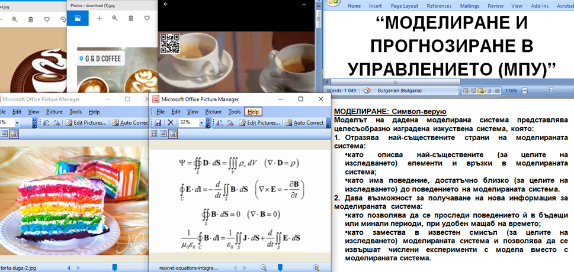

**Поздравления с ‘наша’ песничка.
<https://www.youtube.com/watch?v=asDXpfFMKNA>**

**ДОБРЕ ДОШЛИ В ДИСЦИПЛИНАТА “МОДЕЛИРАНЕ И ПРОГНОЗИРАНЕ В УПРАВЛЕНИЕТО
(МПУ)” **

**(Встъпителна лекция)**

**Поздравления\!**

**Започвате вашия 7-ми семестър**

**113-ти за мен**

**201-ви за УНСС**

**Вадете телефоните и се включете в групата\!**

**УЧАСТВАЙТЕ ВЪВ ФБ ГРУПАТА\! Задължително\! **

**MARCHEV & MARCHEV & THEIR BRILLIANT
STUDENTS**

[**https://www.facebook.com/groups/502926693178771/?ref=group\_header**](https://www.facebook.com/groups/502926693178771/?ref=group_header)

**Ще ви потвърдя след малко.**

**ФБ група. Съдържание. Пиши/Питай/Чети тук, а не на ЛС или mail\!**

**Pinned Post: Всички важни линкове. Преглед.
**

## Мотивационна проповед. Послание към 4-ти курс. МПУ = добре платената професия + много интересна + много полезна.

ВЕСТНИКЪТ, 2021-09-24-00-30, Започваме да започваме.

На вниманието на всички 4-ти курс, БА (редовно и дистанционно),
изучаващи МПУ (Моделиране и прогнозиране в управлението) +
тези, които още не са си взели изпита от предишни випуски (проверете
дали сте записани във файла МПУ в ГРАФИК).  
Започва учебната година, започва 7-ми (за вас) семестър, а за мен
113-ти. Започва МПУ. **Курса има 3 основни задачи:  
**1. **Да усвоите знанията и уменията,** достатъчни да изкарате $120,000
за три месеца (ако работите за Warton по поръчка на Shell). Мотивационна
история (истинска) - в лекцията. С голям обем практически занятия.  
2\. **Да получите знания по компютърно моделиране на сложни системи**,
започвайки от там, където учебниците свършват, до най-предния фронт на
съвременната наука. Ние ви докарваме дотук, а нататък сте ВИЕ.

3\. В края на курса ще погледнем още по-напред в бъдещето с **малко
‘Футурология и трансхуманизъм**‘.

Много е важно всички да дойдат/се включат в петък, 24.09. от 9.00 часа
за встъпителна/мотивационна лекция.   
Всичко, което знам до сега е вече в ГРАФИК. Ще го променяме по-нататък.

Работим както обикновено: 30 часа на ден, 10 дни в седмицата, 400 дни в
годината.  **Книжков ден** ще проведем преди Студентския празник, на
3.**12., петък, от 9.00 часа, в лекционното време**.

След Книжков ден очаквайте традиционните за 4-ти курс лекции: ‘Как се
добива чисто злато (инструкция за драпащи зубри)‘, 'Всичко за 4-ти
курс от гледна точка на бюрокрацията', 'Стажовете през летния
семестър', ‘Подготовка за Държавен изпит‘, 'Само за истински
зубъри: с един куршум много зайци', 'Международни проекти',
'Възможности за изява' и пр.\!

Специално за Мрън-Мрън пояснявам (отчитайки опита от предишните
години):   
1\) Курса по МПУ предполага 30 часа лекции (този семестър може би
online), 30 часа упражнения (смесен режим) и 120 часа извън аудиторни
занимания (online, асинхронен режим).

2\) Задължителните и изборните задания са описани на **страницата на
МПУ**. В следващите дни ще я подобряваме и обновяваме, отчитайки
миналогодишния опит.

3\) **Изпит само за НЛО-та**. Куизовете през семестъра ще играят ролята
на предварителен изпит. Възможност за повишаване за 'драпащи зубъри'.

4\) **Консултации:** Петък, online 'Friday brunch' :), от 10.30 до 13.30
и Събота “Online coffee sharp at 9.00”, от 9.00 до 16.00.

5\) **Всички задания могат да се правят от всяка точка на света.**
Голямата част на лекциите са записани на видео. Преди години
Junior проведе упражнения по МПУ в рейса за Лариса (Гърция) с групата,
която участваше в международен проект. Консултации on-line са
постоянна практика. Всички учебни материали по курса са също
достъпни on-line.

Всичко останало (има още много) - на лекциите в петък. 

ИГРАТА никога не спира\!   
Очаквайте ВЕСТНИКЪТ\!  
Казах засега на кратко, понеже бързам.

Маестро,
МУЗИКА\!   
[https://www.youtube.com/watch?v=5Vg5oSyyDN4](https://www.facebook.com/l.php?u=https%3A%2F%2Fwww.youtube.com%2Fwatch%3Fv%3D5Vg5oSyyDN4&h=MAQFrbJKJAQFbS_HpK4WvaIvrrjiIreskWYFHsrgeX7UuwA&enc=AZM5L2ypNU7JtyHTYeKxIxVl0NisctDqu669pLk38MojVQDTgrALm_w4GWI8Req7vdFhM7to9opKox3GTPDzr4S-TB4piXKO4awsRNwG2K-y22Rs0sGnxmrSE9mSBiMqTq1Xw5EHwsbrRXNluc4BldiMtwC_GJrJGp79QcFIxjUqOg&s=1)

## курсът

Курсът е забавление тип „Торта”:

  - слой блат (теория, инструкции),

  - слой кремче (активна форма, най-често изследователска задача),

  - нов блат,

  - нов крем и т. н.

до ‘черешката на тортата’ (‘Книжков’ ден на 03. декември)

Почваме да я правим сега\! Ще я ядете в следващите години.

Успешно взета, дисциплината:

  - дава 6 ECTS кредита

  - предполага 180 часа работа (120 часа извънкласно + 60 часа
    присъствено/online)

  - за Средньо Среднев, в средно Уни, със средни Профи

Ние Средньовци ли сме? :)

## Нашият екип.

> **ОЧАКВАЙТЕ ИЗНЕНАДИ\!**
> 
> **(МАЛКИ И ГОЛЕМИ)**
> 
> 
> 
> **Prof. Angel Marchev, Jr. has been educated by computer games since
> the age of four. By the time he finished high school he already
> participated as Instructor for various CMG and active methods for
> education so he has more than 10 years of teaching experience. He
> teaches variety of courses and has excelled at implementing active
> methods in all of them. He is a Ph.D. candidate at modeling.**
> 
> 
> 
> **Prof. Ph.D. Eng. Angel Marchev is one of the pioneers of
> implementing computer business games and active methods in education
> for adults in Bulgaria. Over the last 50 years he has educated more
> than one hundred thousand students and managers using over hundred and
> twenty CMG and other active methods in his courses. He teaches courses
> such as “Simulation and gaming in management”, “Business games”,
> “Modeling” and “Financial modeling in management” at the University
> for National and World Economy and Bourgas Free University among
> several others business schools and collages.**
> 
> **Prof. Marchev has been among the first members of ISAGA since it was
> founded and was member of the steering committee of ISAGA almost until
> 1990. He was also a member of EESAGA. Now he is establishing BASAGA in
> Bulgaria.**

**РАБОТИМ КАКТО ОБИКНОВЕНО:**

  - **30 часа в денонощие**

  - **10 дни в седмицата**

  - **400 дни в годината **

  - **Multi Tasking **

**ИГРАТА НИКОГА НЕ СПИРА \! **

## куиз

ЕДНА ИЗНЕНАДКА ЗА НАЧАЛО:

„ЦАЦА, АМА РИБА“

Засега Ви предлагаме малък куиз.

Засега само с един въпрос.

Колкото да отработим метода.

Още днес ще усложним задачите.

Вадете телефоните\!

quiz (начален, за проба и за ‘преброяване на дивите зайци’)

[**http://bit.ly/daily-quiz**](http://bit.ly/daily-quiz)

Отговорете на поставения въпрос:

Какви очаквания имате за курса по МПУ? (кратко\!)

Резерва: аngel\_marchev@yahoo.co.uk

Капка по капка = вир.

Куиз по куиз = предварителен тест.

## консултации

**КОНСУЛТАЦИИ**

  - **Консултациите ще се провеждат виртуално: през Zoom or Google
    Hangouts (нещо като виртуално кафе). За линкове =\> гледай в ГРАФИК.
    **

  - **Всеки петък:**

  - **Консултации 'Friday online brunch' 😊 **

  - **От 10.30 до 13.30 (официално) **

  - **Всяка събота:**

  - **‘Online coffee sharp at 9.00’ 😊**

  - **От 9.00 до 16.00**

  - **+ Всички освободени часове от разписанието. Гледай ГРАФИК\! **

  - 
  - **или чрез аватари в Virbela, gather-town, ОpenSim (експериментално)
      **

  - **(Виж във ФБ групата) танцуващи аватари 😊**

  - <https://www.youtube.com/watch?v=_O_Gbz1noTM>

>   

## Начин на оценяване, НЛО, нормални и зубри

  - 
> 
> 

## графика

**СЛЕДЕТЕ ГРАФИК\!**

**Кога? Къде? Кой? Какво? С кого? Екипи. Контакти с другите. Изисквания
за минаване. Точки до момента. Оценки. Драпане. и пр. + Постоянно се
променя\!
<https://docs.google.com/spreadsheets/d/1mIAVKl0WNGw6byrVRJa52wKEDniTsgSBTUGIt8nV6Nc/edit#gid=0>**

> 
> 
> **МАЛКО ОРГАНИЗАЦИЯ**

  - **Важни дати (отзад напред):**

  - **30.01.2022 – Край на ‘последен шанс’ изпитна сесия (само за НЛО
    \!\!)**

  - **23.01.2022 – Край на редовната сесия (главно за НЛО) **

  - **23.12.2021 – Край на семестъра **

  - **03.12.2021 – “Книжков” Ден\! (за ‘зубри’ и ‘нормални’)**

## Предложение

**Оптимизация на разписанието. Няколко предложения:**

1.  **Скок в септември 1965г. От тогава променям разписания (за
    добро\!).**

2.  **Освобождаване от изпит за всички ‘нормални’ и ‘зубри’.**

3.  **‘Книжков ден’ преди Студентския празник (3.12.). **

4.  **Но има цена\! **

**ПРЕДЛОЖЕНИЕ, КОЕТО НЕ МОЖЕ ДА СЕ ОТКАЖЕ:**

БЛОКУВАНИ ЗАНЯТИЯ ПО МПУ

СЪБОТА, от 9.00 до 16.00 часа = Време за активни консултации.

НЕДЕЛЯ, 26.09. от 9.00 до 25.00 часа =\> взимаме часовете за декември.

Гледай в ГРАФИК за линк.

С кофа кафе и храна за 3 дни\!

Ще напреднем с теорията за да осигурим упражненията и самостоятелната
работа.

## Страница на МПУ. <https://docs.google.com/spreadsheets/d/1q_f5kcvnJp1AMGpyDeh3VZHVXzjTLRsFYZi-O6zuI5A/edit?usp=sharing> 

[**Учебна програма.**](00-02-2016-bak-MPU-uchb-prog.docx) Основни части
на курса по МПУ. Резюме на съдържанието. Learning by doing.

Online обучение. Синхронен и асинхронен режим (+/-).

Синхронен режим (еквивалент на присъствени часове) + асинхронен режим на
обучение (с неговите предимства и недостатъци)

## Check list

**Кой какво прави по време на online сесия? =\> анкетата на Анета**

**Учебни пособия. \*.html; \*.pdf; DRIVE; WikiBA; База с анотирани
линкове; YouTube; Видео-лекции/упражнения. Автоматизирани сайтове.
….. =\> (предстои GitHub).**

**Задания в клас (в състезателен режим, но и с инструктори). Екипи.
Съдба. [you are my destiny Paul Anka subtitulada
español](00-02-you%20are%20my%20destiny%20Paul%20Anka%20subtitulada%20español.flv)**

**Задания за самостоятелна работа (по избор, в консултационен режим).
Описание.**

**Автоматизирани занятия. Сайт за автоматично оценяване.**

**Помощни учебни материали, DEMOS и видео записи. Необработените
видео-за МПУ.**

**Критерии за успех (изкарване). Система за оценяване = точкова .
(\*.ppt)**

**Освобождаване от изпит, тест, редовна, поправителна, годишна сесия и
условни изпити.**

**Книжков ден. НЛО, нормални, зубри и драпащи. Кой е НЛО (UFO) ?**

**Допълнителни занятия. Всички са поканени. Силно препоръчително. В
освободените от лекции времена. Гледай ГРАФИК\!**

**Само за ценители. Friday Night Seminar. Нашите групи, сайтове и
конференции.**

## Дати за курса. 

**2021-09-24: Встъпителна лекция. Моето любимо четиво.**

**2021-09-26: Прогнозиране. Експертни оценки.**

**2021-09-26: Прогнозиране чрез екстраполация.**

> **2021-09-26: Синтез на математически описания (прогнозиращи
> функции)**

**2021-10-01: Параметрична идентификация на математически описания.**

**2021-10-08: Модел и моделиране. Видове модели. Етапи при моделирането.
Как се добива чисто „Злато“. Много зайци с един куршум.**

**2021-10-15: Подходи при изграждане на моделите. Моята концепция за
курса, а и за света **

**2021-10-22: Fact based world view. Апология за Hans Rosling.**

**2021-10-29: **

**2021-11-05: Синтез на модели чрез много-редни селекционни процедури.**

**2021-11-12: Синтез на модели чрез много-редни селекционни процедури.**

**2021-11-19: Прогнозиране и моделиране на Longevity and Transhumanism**

**2020-11-26: резерва**

**2021-12-03: Книжков ден**

**2021-12-10: резерва**

**2021-12-17: Администрацията: Всичко за 4-ти курс. Как да се подготвим
за държавния изпит?**

**Има ли доброволци за тютори за 1-ви курс? Може и за сметка на стажа
през следващия семестър.**

**Има ли доброволци за виртуален уни.? **

**Тук трябва си погледна часовника\!**

**С какво
продължаваме???**

## 2021-09-26-09-00….ХХХХХХХХХХХХХХХ

[**звук**](01%20-%20Antonio%20Vivaldi%20-%20Concerto%201%20Spring%20-%20Allegro.mp3)

## тютори

**Доброволци за тютори: ако обмисляте преподавателска дейност; за да
оценяваме по-бързо; за да си заверите стажа; за някоя и друга точка
**

**Задачи:**

**Оценка на ‘подвизите’ на 1-ви курс**

**Провеждане на тестове на 1-ви курс**

**Участие в деловата игра с 1-ви курс**

**Допълване на онагледяването по МПУ **

**Учебно пособие в \*.html формат в GitHub**

**Сваляне текст от видео записи на лекциите**

**Редактиране на видео записите от лекциите**

**И др.**

## любимо четиво

**Да се пренесат тук**

Моята концепция за курса, а и за света -\> при ‚Подходи в
моделирането‘

**………………………………………**

**Прогнозиране**

# ЧАСТ 1. ПРОГНОЗИРАНЕ

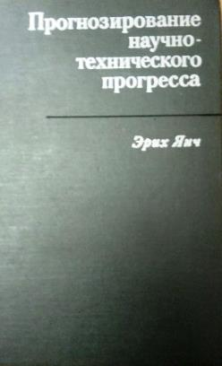
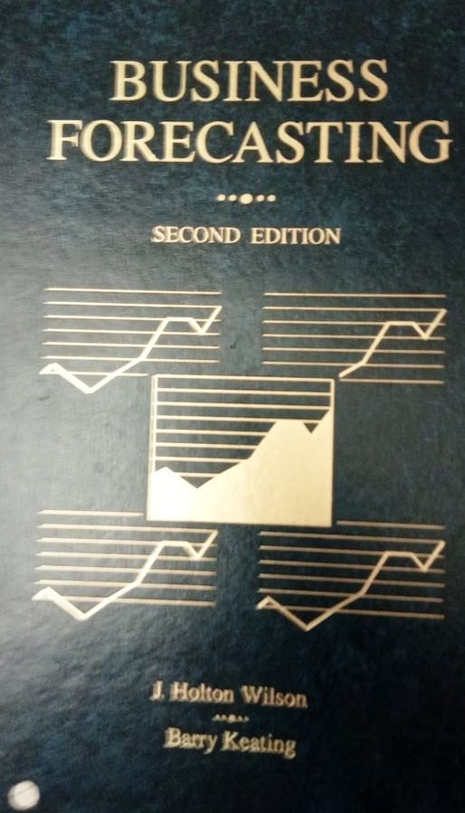

Текст от записа

1.  ## ВЪВЕДЕНИЕ В ПРОГНОЗИРАНЕТО.
    
    1.  ### Определения и основни понятия. 

За първи път думата “**prognosis”** (узнавам напред) е била произнесена
преди 2000 години от древногръцкия лекар Хипократ, който е предвиждал
развитието на различни болестни състояния.

Прогнозирането винаги е било неразделна част от почти всички видове
вземане на решения в управлението, но като самостоятелна учебна
дисциплина то съществува относително от скоро.

Жалон в развитието на прогнозирането е книгата на **Erich Jantsch**
\[1\]. Спокойно може да се говори за прогнозирането ‘преди’ и ‘след’
тази книга, която често бива определяна като „фундамент за
създаването на Римския клуб“, поради формирането на
научно-обоснован подход и възможност за прогнозиране на
научно-техническия прогрес в глобален мащаб.

Съществува много голям брой определения на това що е ‘прогноза’ и
‘прогнозиране’. Без да правим анализ на всички, ще посочим само
няколко от тях, съпроводени с кратък коментар.

  - **Прогнозата е научно обоснована представа за бъдещето (за бъдещо
    явление, за бъдещо развитие на процес, за бъдещи последствия и
    пр. ... ).** Коментар: Подчертава се научността на
    прогнозата/прогнозирането. За разлика от ‘гадание’,
    ‘предчувствие’, ‘пророчество’, ‘баба Ванга каза...’, ‘усещане под
    лъжичката’ и други ненаучни/псевдо-научни твърдения.

  - **Прогнозата е предвиждане на тенденциите в развитието на
    икономическите процеси, пораждано от действието на
    обективните закони и конкретните условия.** Коментар: Обръща
    се внимание на тенденцията, т. е. на основната насока в развитето
    на прогнозирания процес във времето, изчистена от случайни шумове
    и смущения. Освен това прогнозата се основава на ‘обективни закони’
    (т. е. независещи от мнения и субективизъм), които трябва да се
    познават и на ‘конкретни условия’ (отразяващи фактическата
    обстановка), които следва да се отчитат при прогнозирането.

  - **Прогнозата е предварително определяне на очакваната реализация на
    даден процес въз основата на изводите, направени от определени
    сигнали и взаимозависимости**. Коментар: По същество това е
    същата мисъл, но изказана с професионалния език на инженер, а не
    на икономист. Освен това се посочва, че прогнозираният процес има
    много възможни бъдещи реализации, между които се избира
    ‘очакваната’.

  - **Прогнозата е комплексно научно-обосновано предсказание за
    съдържанието, насоката и обема на възможностите за
    използване на изучаваните явления в природата, обществото и
    човешкото мислене**. Коментар: Подчертава се, че
    прогнозите/прогнозирането могат да се отнесат към
    всички области на човешката дейност, т. е. имат универсален
    характер.

  - **Прогнозата е вероятностна оценка за възможните пътища и резултати
    в развитието на науката и техниката, а също и на необходимите за
    тяхното осъществяване ресурси и организационни мерки.** Коментар:
    Много важен момент. Подчертава се вероятностния (стохастичния)
    характер на всяка прогноза, резултат от стохастичния характер
    на света, в който живеем. От това следва извода, че не съществува
    абсолютно точна прогноза, или метод за прогнозиране. Поради
    неизбежната неопределеност, породена от действието на
    непредсказуеми случайни фактори, всяка прогноза оценява
    бъдещето с някаква неточност (грешка на прогнозирането). Това
    също така означава, че всяко решение, базирано на някаква прогноза
    е свързано с определен риск. Освен това това определение предполага
    наличието на ‘ресурси’ и ‘организационни мерки’ (т. е. целенасочена
    управленска дейност) за достигане на едно научно-техническо
    постижение.
    
    В посочените определения е особено важно да се подчертаят научният
    характер, многовариантността и вероятностния характер на всяка
    прогноза.

За целите на настоящото изложение, за **прогноза** ще се счита:

**Научно-обоснована, многовариантна, вероятностна оценка на бъдещето,
отчитаща действащите обективни закономерности и конкретните
условия.**

Съответно процесът на прогнозиране може да бъде дефиниран от системна
гледна точка като **процес по съставяне на научно-обоснована оценка
за бъдещо поведение на наблюдавания обект, процес или явление**. **При
това тази оценка трябва да има количествен характер, а нейната проверка
(поне post-factum) трябва да се базира на емпирични доказателства. **

### Видове прогнози. 

Възможни са (и съществуват) много класификационни белези за
разграничаване на различните прогнози. Като най-очевидни
примери могат да се посочат:

  - **Според прогнозираното явление:** научно-технически, демографски,
    военно-политически, икономически, пазарни, борсови, валутни и др.
    прогнози

  - **По равнище:** международни, национални, отраслови, фирмени и др.
    прогнози;

  - **По срок (дълбочина) на прогнозиране:** краткосрочни, средносрочни
    и дългосрочни.

  - **По подход:** прогнози, използващи изследователски или нормативен
    подход при избора на метод за прогнозиране;

  - **По метод за прогнозиране:** експертни, екстраполационни, получени
    чрез експерименти с модели и др. видове прогнози;
    
    3.  ### Прогнозиране и планиране. 

Както е известно от курса по ‘Основи на управлението’, прогнозирането,
планирането и целеполагането са взаимосвързани функции в управленската
дейност. Едновременно с това е важно да се посочи, че съществува разлика
между ‘прогнозиране’ и ‘планиране’. Тя се състои в това, че **прогнозата
посочва какво, как, къде, кога, по какъв начин може да стане (на
основата на обективно действащи закономерности и конкретни
условия), а планът указва какво, как, къде, кога, по какъв начин
трябва да стане (на основата на нечия субективна воля): **

  - При прогнозирането се отразяват обективни закономерности и
    съществуващи възможности;

  - При планирането субектът на управлението активно влияе на обекта;
    Планът е инструмент за активно въздействие (за "изграждане на
    бъдещето"), докато прогнозата посочва алтернативите за
    възможното бъдеще и е научна основа на плана/планирането.

  - "Прогнозиране без план е литературно начинание, планиране без
    прогноза е административна акция " (анонимен плановик)
    
    Още може да се направи следната
съпоставка:

| **Прогноза**                                   | **План**                                                            |
| ---------------------------------------------- | ------------------------------------------------------------------- |
| Научно обосновано предвиждане за бъдещето      | Предвиждане и изграждане на бъдещето                                |
| Посочва различни възможности (поливариантност) | Еднозначно фиксира пътищата и средствата за решаване на опр. задачи |
| Има научно обоснован характер                  | Има задължителен характер                                           |
|                                                | Балансово обвързан (но не винаги)                                   |

Възможно е различно съчетаване на прогнозата с планът:

  - прогнозата предшества плана и служи като негова основа;

  - прогнозата допълва плана (прогнозира последствията му извън
    пределите на плановия период);

  - прогноза за хода на изпълнението / неизпълнението на плана.
    
    4.  ### Методи за прогнозиране. 

Съществуват над 250 метода за прогнозиране, голяма част от които бяха
описани още през 1967г. в \[1\]. Само за илюстрация на фиг. 1.4.-1. и
1.4.-2. е показана една от многото класификации на различните групи
методи за прогнозиране \[4\].

За целите на изучаваната дисциплина (“Моделиране и прогнозиране в
управлението”), те могат да бъдат групирани е следните основни
групи:

  - **Експертни методи за прогнозиране** (Разгледани в раздели 2 и 3).

  - **Екстраполационни методи за прогнозиране** (Разгледани в раздели 4
    до 8).

  - Методи за **прогнозиране с помоща на модели** (Разгледани в част II
    „Моделиране”).

  - Нормативни методи за прогнозиране (Разгледани накратко в раздел 9).

  - **Авангардни методи** за прогнозиране (разработени в последно време
    и разгледани накратко в раздели 17 и 18)

  - Други методи (не попадащи в горните групи и разгледани частично в
    раздел 2.4).

Основната цел на дисциплината е да даде на студентите теоретични
познания и практически умения за изграждане и използване на
модели и прогнози в управлението на стопанските системи. Вниманието
е фокусирано върху практическото усвояване на най-използваните методи за
прогнозиране от първите три групи. Те още могат да се нарекат ‘методи,
базирани на изследователски подход’.

Реализация на научният метод.

**ХХХХХХХХХХХХХХХХХХХХХХХХХХХХХХХХХХХХХХХХХХХХХХХХХХХ**

**Експертни
    оценки**

2.  ## ЕКСПЕРТНИ МЕТОДИ ЗА ПРОГНОЗИРАНЕ. 
    
    [falsh-psewdo-prognozi](file:///F:\\1-DISCIPLINI\\MPU\\1-lekcii\\falsh-psewdo-prognozi.docx)

![May be an image of text that says 'пирамида на доказателствата в
наүката пирамида на доказателствата в интернет спорове анализи
мнение на експерти (op× казал 18) обсервационни личен onum aбomu,
значки ефектийно) ம интуиция/ /наблюдение върху приятели (слушай
свгурен съ) изследвания (няма HaVENDe antu, maka ራAህ споровете
интернет мнението експерти продължава бъде считано за доказателсво
огромна тежест. миналото също cMe използвали оснобно мнението експерти
Kamo доказателстбо лечение хора взимане решения. cmomuuu puwepu показали
обаче, този nogxog не само GUA неефективен, но често водел опустошителни
xopama последствия. личното мнение, DUлO mo експерти, гледна точка,
преценка, коrmо често основана субектибни неизмерими фактори KORMO
може cчuma за оконачателна общовалидна.
SCIENCE'](media/media/image14.jpeg)

### Същност на експертните методи. 

Преди всичко трябва да се отбележи, че експертните методи (понякога
наричани качествени методи) се използват за решаване на различни
задачи в различни области на човешката дейност. Една от тези области
е прогнозирането. Те се използват тогава, когато точните количествени
методи не са приложими – например при на слабо изучени явления,
характеризиращи се с висока степен на неопределеност, висока
степен на сложност, липса на статистически данни и натрупани
количествени измервания и голяма дълбочина на прогнозиране
(далечен времеви хоризонт)..

**Експертните методи се базират на множество субективни мнения на група
лица, компетентни в разглежданата област (наричани експерти). При това
се вземат мерки за ‘обективизиране’ на получените в крайна сметка
прогнози.** За разлика от количествените методи, при експертните
методи не се синтезира математическо описание на прогнозираното
явление. Нито се прави допускане за неизменност на действалите
закономерност в миналото. Въпреки че историческото развитие на
прогнозираното явление все пак се отчита, по-важно значение за
точността на прогнозиране имат компетентността, знанията, опита,
въображението, таланта на експертите.

Всички експертни методи за прогнозиране включват:

• Целесъобразно организирано допитване до група специалисти (експерти),
които са компетентни в дадена област;

• Подходяща обработка на събраните експертни мнения с цел получаване на
обективизирани оценки на основата на субективни мнения.

Различните методи се различават по начина на провеждане на допитването и
начина на обработка на информацията (просто гласуване, назначаване на
коефициенти на относителна важност, Делфи и т. н. ).

Съществуват десетки видове експертни методи за прогнозиране, всеки от
които с десетки или стотици модификации. В следващите раздели ще
разгледаме по-подробно два най-характерни представителя на
експертните методи (метод ‘Делфи’ и метод на ранговата
корелация). Добре е да се отбележи, че методиката за провеждане
на всички останали експертни методи и модификации в значителна степен е
подобна.

### Метод "Делфи". 

[JAPANESE SIGN FINAL SURRENDER on USS Missouri
\[subtitled\_HQ\]](01-01-JAPANESE%20SIGN%20FINAL%20SURRENDER%20on%20USS%20Missouri%20%5bsubtitled_HQ%5d.mp4)

Методът Делфи представлява метод за изработване на съгласувани решения,
основани на познанията на експерти. В този смисъл е особено подходящ (и
оригинално замислен) за целите на прогнозирането. Наименованието на
самия метод произлиза от известния Делфийски оракул в антична
Гърция. **Методът е разработен през 50-те години на XX-ти век от
корпорацията Rand за нуждите на дългосрочното военно-политическо
прогнозиране. Към настоящия момент методът се е развил в много
модификации и се използва във всички области на човешката дейност.
**

Първото приложение на метода ‘Делфи” в България е описано в
\[10\].

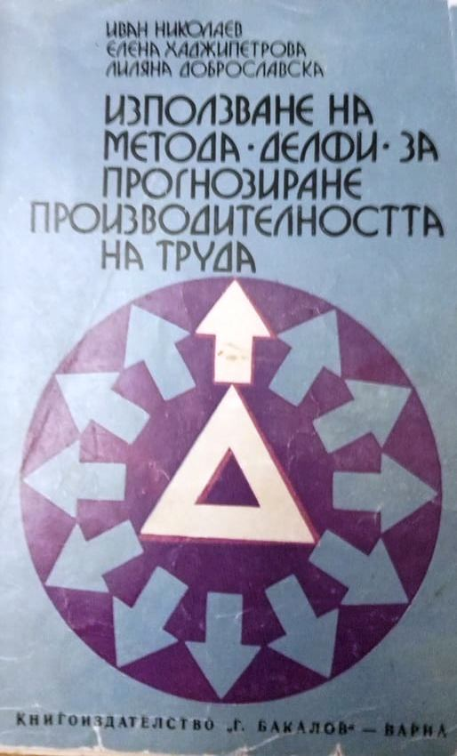

‘Делфи’ е систематичен и рационален метод за събиране на субективни
мнения на експерти. Всеки експерт независимо и анонимно попълва
бланка с отговор по поставени въпроси, като също така може да добавя
аргументи, или предложения към отговора си. Груповата прогноза се
съставя въз основа на многократно събиране, обобщаване и
оповествяване на междинни резултати, аргументиране на крайни
мнения, коригиране на първоначалните становища на отделните експерти
и отново повторение на цикъла до изработване на окончателно становище
по разглеждания проблем.

Методът има следните основни характеристики:

• **Контролирана обратна връзка.** Прогнозата се изработва от
изследователска група чрез допитване на експертите в няколко
последователни тура. Това дава възможност резултатите, получени в края
да един тур се ползват на следващия за уточняване и съгласуване на
субективните експертни оценки. По този начин след няколко
последователни итерации се постига постепенно сближаване на
мненията на експертите и намаляване на интервала на разсейване на
прогнозата

• **Анонимност на експертите един спрямо друг.** Изследователската група
взима всички мерки отделните експерти да не знаят имената на останалите
и да не поддържат връзка помежду си. По такъв начин се преодоляват
недостатъците на други методи, основаващи се на експертни групи.
Отстранява се възможността за влияние на “авторитета”; избягват се
проблемите с междуличностните отношения; отпадат основанията за
опасения от уронване на собствената репутация; елиминират се в
определена степен евентуалния пряк натиск на групата върху своите
членове както и възможността за конформистко поведение от страна на
определен експерт.

• **Статистическа обработка на отговорите на участниците.** Извършва се
с оглед на обективизация на получаваните резултати и минимизиране на
субективността в тях. В оргиналния метод ‘Делфи” като показател за
груповото мнение (най-вероятната прогноза) се използва медианата на
индивидуалните мнения, а като граници за интервала на разсейване се
използват первия и третия квартил.

Прилагането на метода ‘Делфи” преминава през следните основни етапи:

1.  **Формира се група, която провежда изследването.** Тя организира и
    провежда разработката на прогнозата. От квалификацията, такта и
    съобразителността на нейните членове зависи правилното провеждане
    на цялото изследване.

2.  **Определят се експертите, които ще бъдат допитвани**. Вън от всяко
    съмнение успешното използване на метода “Делфи” зависи от правилния
    подбор на експертите (както на равнището на тяхната квалификация,
    така и от сферата, в която те са специалисти).

3.  **Определя се показател за мнението на групата.** Най-често се
    използва медианата на съвкупността от индивидуални мнения;

4.  **Формулиране на въпросите**. В оригиналния си вид методът "Делфи"
    се използва за прогнозиране на момента за настъпване на определено
    събитие. Това означава, че въпросите са от типа „Кога ще настъпи
    ..... (определено събитие)?” Очаквания отговор от всеки експерт е
    посочване на определен момент по скалата на времето.

В последствие методът започва да се използва и за прогнозиране на
очаквани числени стойности на определен показател в определен
бъдещ момент. В такъв случай въпросите ще бъдат от типа: "Колко ще
бъде стойността на ....... (дефиниран показател) към ...... (определен
бъдещ момент)?". Ако се поиска мнение за стойностите на този показател
за няколко последователни моменти, може да се получи оценка за
очакваното развитие на показателя във времето.

На практика много рядко се прави изследване само по един въпрос. Това не
е удобно по организационни причини. Освен това задаването на няколко
въпроса от една и съща област води до по-голямо "замисляне" и
"задълбочаване" и по-високо качество на получените отговори.

5.  **Провеждане на един тур от изследването.** Това разбира се става
    при пълно спазване условията за анонимност на експертите, които
    дават независимо един от друг своите оценки, като и своите
    коментари по направените прогнози.

6.  **Обработка и анализ на резултатите от един тур.** Изчисляват се
    медианата и квартилите по всяка скала (т. е. по всеки въпрос).
    Представят се в таблична и графична форма. Оценява се степента на
    съгласие между мненията на отделните експерти (т. е. ширината на
    интервала на разсейване). За граници на интервала на разсейване
    се приемат първия и третия квартил, отстранявайкит
    най-песимистичните и най-оптимистичните прогнози.
    Това се прави с цел да се отсеят мненията на тези експерти,
    които са заинтересовани от изместване на прогнозата в
    определена посока, или нямат достатъчна компетентност по
    въпроса. Анализират се крайните мнения. Иска се допълнителна
    аргументация от тези експерти, които са ги изразили. Преценява
    се необходимостта от провеждане на нов тур от изследването. Типичния
    графичен вид на една прогноза изглежда така:

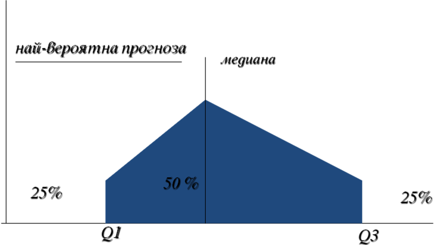

7.  **Формулиране на уточнени въпроси и провеждане на нов тур.** Нов тур
    се провежда, когато интервалът на разсейване (разликата между първи
    и трети квартил) е прекалено голям. Най-често това се дължи на
    нееднозначно или неточно формулирани въпроси. На всеки експерт
    се представят усреднените резултати и анонимизираните отговори на
    всички останали експерти от предходния тур. Направените нови
    предложения и коментари също се разпространяват между
    експертите. Въпросите, породили двусмислено тълкуване се
    преформулират и съпровождат с допълнителни уточнения. Процедурата
    продължава с повторението на стъпки 5, 6, 7 и може да включва
    няколко последователни
> итерации.

> 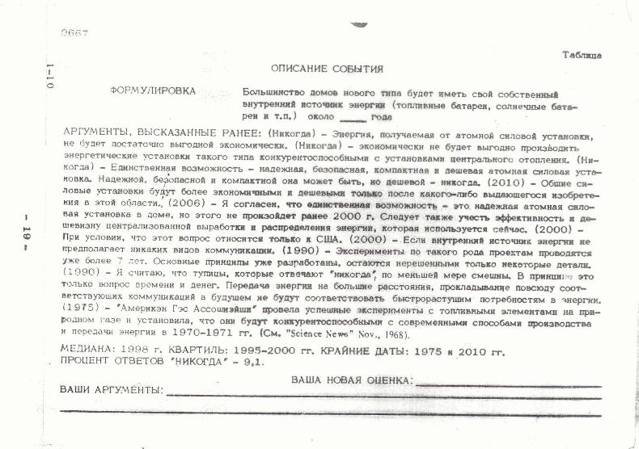
> 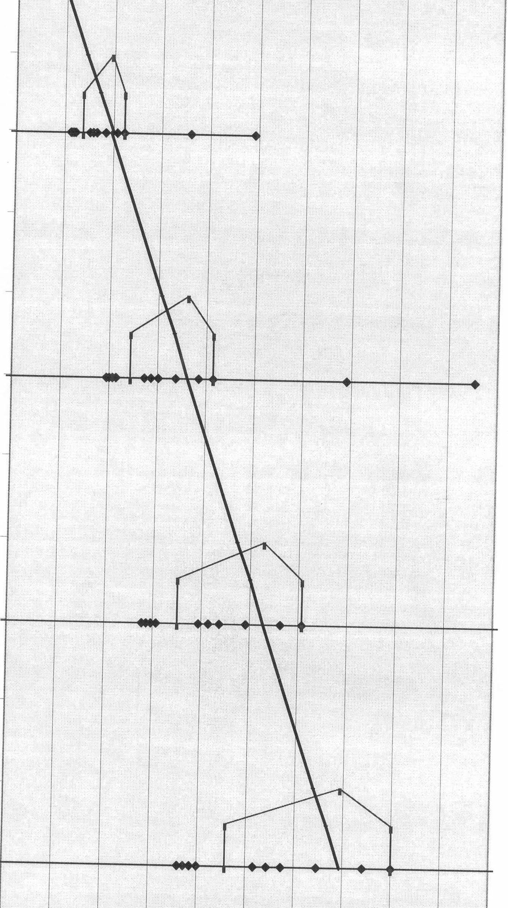

8.  **Оформяне на резултатите от проведеното изследване.** Когато
    въпреки всички мерки за повишаване на съгласието между
    експертите, резултатите от поредния тур не се отличават силно
    от предходните е настъпил момента за прекратяване на изследването
    (т.е. допълнителните усилия, разходи и време за нов тур не
    съответстват на евентуалното подобрение в качеството на
    прогнозите). Всички получени резултати (прогнози, интервали на
    разсейване и аргументации), придружени със съответните анализи и
    коментари, се представят в удобен за използване вид.

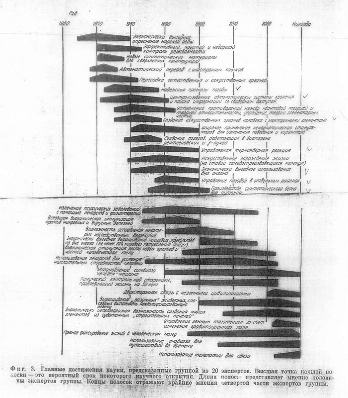

9.  **Оценка на компетентността на експертите.** Компетентността на
    експертите е ключев фактор за точността на прогнозиране. В
    началната фаза на изследването тя може да се оцени по формални
    белези: завършено образование, наличие на научни степени и звания,
    продължителност на практичексия опит и пр.

Най-добрата мярка за компетентността на един експерт е фактическата
точност на направените от него прогнози в миналото. Такъв анализ на
компетентността е възможен, когато се провеждат чести краткосрочни
прогнози, точността на които става проверима след не голям период
от време. В такъв случай експертите които са правили по-точни прогнози
се открояват и това дава основание да бъдат включвани в нови
изследвания на основата на емпирично доказана компетентност.

В някои случаи към всеки въпрос се прилага подвъпрос за самооценка на
компетентността на експерта по съответната тема. Тогава може при
обработка на резултатите мненията да се претеглят с тези
самооценки.

Основно предимство на метода „Делфи” е неговата простота. Освен това,
той отчита знанията и опита на група експерти, при намалена степен на
субективност. Контролираната обратна връзка, т.е. анализът на оценките
на другите експерти и възможността за промяна на личното становище
осигуряват постигане на по-точно прогнозиране. Друго предимство на
метода е, че отговорите са анонимни. Експертите работят самостоятелно.
Така не може да има емоционална обвързаност на експертите с отговорите
на колегите им и се елиминира ефектите на конформизъм, авторитарност и
влияние на групата.

Развитието на метода води до идеята за “електронен форум” -
непрекъснато, циклично повтарящо се допитване до множество
експерти и получаване на нови актуализирани прогнози по много теми,
подпомагано от възможностите на съвременната изчислителна и
комуникационна технология.

Граф на възможното бъдеще

**Демо за Делфи Младши **

**Рангова
корелация**

### Методи на ранговата корелация. 

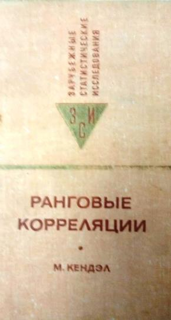

В много управленски ситуации, възниква задачата за подреждане (или
приоритизиране) на някакви обекти по степента на изява на техен
общ, но количествено неоценим признак.

Подобна задача възниква и при синтез на многофакторни прогнозиращи
функции и модели, когато трябва да се направи предварителен подбор
на най-съществените фактори, които да бъдат включени в разглеждането.
Това става на основата на априорни знания за явлението, а когато тези
знания са недостатъчни (в случай на изследване на слабо познато явление)
с помощта на методът на ранговата корелация.

Най-пълна разработка на теорията и приложението на ранговите методи е
направена от M. G. Kendall в \[8\]. Монографията представлява
изчерпателно описание на всички основни разновидности на
методите на ранговата корелация. Обосновани са всички необходими
формули и разчети и са приложени всички необходими статистически таблици
за тяхното приложение.

Първото приложение на метода на ранговата корелация в България е описано
в \[9\]. Сп. „Автоматика и телемеханика“ 1968

Ще направим кратко описание на метода на ранговата корелация в неговата
най-опростена версия, използвайки за основа тези два източника.

Нека имаме n условно номерирани обекта, притежаващи някакъв общ, числено
не оценим признак:

**Ранжиране.** Под ‘ранжиране’ ще разбираме подреждането (номерирането)
на тези обекти в зависимост от нарастването или намаляването на този
техен числено неоценим признак.

Обекти: 1, 2, 3, ..., n

Рангове: R1, R2, R3, …,RN

Ранговата корелация е експертен метод и в основата му стои допитване до
група от m независими експерти в дадена област с цел ранжиране на
обекти. Всеки експерт ранжира обектите по своя преценка. В
резултат получаваме m на брой ранжировки на едни и същи обекти
от гледна точка на един и същ признак.

Пример: Нека обектите ни са момичета участващи в конкурс за красота.
Всяка от тях дефилира пред журито (независими експерти). Всеки от
тях ранжира обектите по числено неоценимия признак ‘красота’.

Нека разгледаме по-полезно приложение на метода. Трябва да синтезираме
прогнозираща функция за прогнозиране бъдещото развитие на определена
променлива в зависимост от много потенциално влияещи фактори. Списъка
на факторите е твърде дълъг и е необходимо да подберем само най-силно
влияещите. Затова организираме експертно проучване като изискваме от
всеки експерт да ранжира факторите по признак ‘степен на влияние върху
поведението на прогнозираната променлива’. В такъв случай може да
работим в следната последователност:

1.  **Формулиране на въпроса.** Очевидно той трябва да е типа:
    “Ранжирайте по важност обектите (факторите), влияещи
    върху …. (наименование на прогнозираната променлива)\!”
    Експертите трябва да разполагат с предварително изготвен
    списък с n фактора, влияещи на изследваното явление. За
    определянето им може да се направи предварително допитване
    сред експертите.

2.  **Определяне на експертите.** Разбира се трябва да се подберат лица,
    компетентни по изследваното явление.

3.  **Провеждане на допитването.** Експертите ранжират факторите по
    степен на влияние върху прогнозираната променлива. При
    анкетирането се съблюдава изискването за независимост и
    анонимност на експертите един спрямо друг.

4.  **Оценка на близостта между две мнения.** Оценката на близостта
    между мненията на всяка двойка експерт/експерт и между всеки
    експерт и груповата ранжировка е разгледана подробно в \[8\].
    Препоръчва се да се използва ранговия коефициент на корелация на
    Спирман (ρ).

> **Обект: 1 2 3 4 5 …. n**
> 
> **Ранг на Мистър X: R2 R5 R1 R6 R3 … **
> 
> **Ранг на Мистър Y: R3 R5 R6 R1 R4 …**
> 
> **Рангов коефициент на Спирмен:**

Доклад за партиите и популизма

5.  **Подготовка на отговорите на експертите за обработка.** Събраните
    експертни мнения (ранжировки) се систематизират в таблица с общ
    член R(I,J), където: J е поредния номер на фактора в
    първоначалния списък, I е поредния номер на експерта, а
    R(I,J) е рангът присвоен на J-ти фактор от I-ти
експерт.

|        | ЕКСПЕРТИ |                |   |                |   |                |               |                          |
| ------ | -------- | -------------- | - | -------------- | - | -------------- | ------------- | ------------------------ |
| ОБЕКТИ |          | 1              | … | i              | … | m              | S             | Общ ранг (Rg) |
|        | 1        | R11 | … | Ri1 | … | Rm1 | S1 | Rg1           |
|        | …        | …              | … | …              | … | …              | …             | …                        |
|        | J        | R1j | … | Rij |   | Rmj | Sj | Rgj           |
|        | …        | …              | … | …              | … | …              | …             | …                        |
|        | N        | R1n | … | Rin | … | Rmn | Sn | Rgn           |

6.  **Определяне груповата ранжировка.** За определяне на
    най-съществените фактори преди всичко е необходимо да
    се изчисли ранговата сума на всеки от тях:
    
    Изхождайки от получената рангова сума на всеки фактор се назначава
    групов ранг, отчитащ в себе си мнението на всички експерти. Така
    на фактор с най-малката рангова сума се присвоява ранг 1, на
    следващата по размер – ранг 2 и т. н. В случай че има две или
    повече равни рангови суми, факторите получават еднакъв ранг, равен
    на средната стойност на ранговете, които тези фактори си делят.
    (Например при рангова сума S(1)=20, S(2)=25, S(3)=25, S(4)=30,
    ранговете трябва да станат R1=1, R2=2.5, R3=2.5, R4=4. ).

7.  **Оценка на груповото съгласие.** За оценка на съгласието между
    експертите се изчислява W - коефициентът на съгласие
    (коефициент на конкордация на Кендъл). Това е число между
    0 и 1, като колкото по-близко до 1 е стойността му, толкова
    груповото съгласие между експертите е по-високо. При W = 1,
    експертите са единодушни (т. е. преставили са еднакви ранжировки), а
    при W = 0 между експертите не съществува никакво съгласие.

В най-простия случай (липса на свързани рангове, т. е. експертите са
инструктирани да не присвояват еднакви рангове на два фактора),
формулата е:

Когато има свързани (повтарящи се) рангове в мнението на поне един
експерт, се използва коефициент на Кендал за свързани рангове:

Основното в тази версия на формулата е въвеждането на корекция:

, където:

tz - броят на свързани рангове в z-тата група от свързани рангове

qj - броят на групи от свързани рангове в рамките на ранговете от
експерт j

Tj - корекционен фактор за мнението на експерт j

8.  **Оценка на статистическата значимост на получените резултати.** В
    \[8\] са разгледани всички възможни случаи за проверка на
    статистическата значимост на получените от ранжирането
    резултати и съответните критерии за всеки от случаите. При това
    нулевата хипотеза е че таблицата с ранговете е попълнена със
    случайни числа. Ако тя бъде отхвърлена, остава в сила
    алтернативната хипотеза, че резултатите нямат случаен
    характер и са статистически значими.

Пак в \[8\] е доказано, че при изпълнение на условията **n \> 7 и m \>
10**, за проверка на статистическата значимост може да се използва
критерият хи-квадрат. В такъв случай емпиричната стойност на
критерия се изчислява по формулата:

Теоретичната стойност на критерия се определя от таблица (също приведена
в \[8\]), при степени на свобода v = n-1 и съответното ниво на
значимост. За практически нужди най-често се приема ниво на
значимост α = 0, 05. При зададените v, α се извлича стойността на
X2теор. от статистическа таблица.

За да се счита че резултатите от разжирането са статистически значими
(т. е. нулевата хипотеза са случайност на ранговата таблица е
отхвърлена) е необходимо:

X2теор. \< X2емп. 

таблица или функция на Excell

9.  **Оценка на близостта между мненията.** Оценката на близостта между
    мненията на всяка двойка експерт/експерт и между всеки експерт и
    груповата ранжировка е разгледана подробно в \[8\]. Препоръчва се
    да се използва ранговия коефициент на корелация на Спирман (ρ).

За практически нужди може да се оцени близоста на мненията по следните
приблизителни граници интервала:

от -1 до -0, 7 има силна отрицателна корелация

от -0, 7 до -0, 35 има слаба отрицателна корелация

от -0, 35 до 0, 35, то няма значима корелация

от 0, 7 до 0, 35 има слаба положителна корелация

от 0, 7 до 1 има силна положителна корелация

10. **Графично представяне на близостта между мненията.** За удобство
    при анализа на корелацията между експертните мнения е удобно да
    се направи графично онагледяване във вид на ненасочен граф. На
    всеки експерт се съпоставя един възел в графа, на всеки рангов
    корелационен коефициент – една дъга. По такъв начин се открояват
    кои експерти имат мнение, най-близко до груповото (лидери), кои му
    противоречат (черни овци), кои нямат статистически.значима връзка с
    груповото мнение (оутсайдери). При построяване на подобен граф за
    коефициентие експерт/експерт може да се правят изводи относно
    наличието на подгрупи от експерти със сходни възгледи
    (наличието на школи), или източниците на противоречия между
    експертите (виж примерите по-долу).

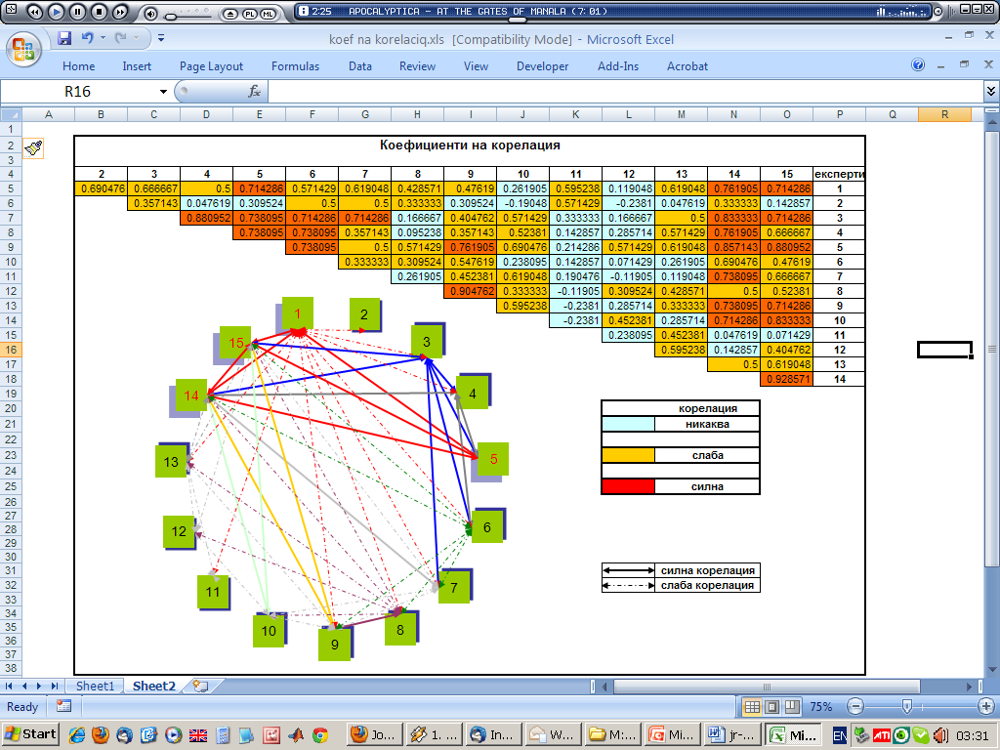

Взаимовръзки между мненията в експертната група (включително груповото
мнение):

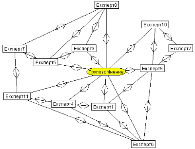

Взаимовръзки между мненията в експертна група (без отчитане на груповото
мнение):

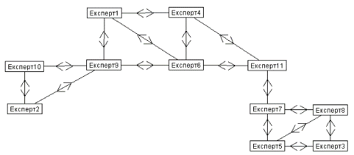

**Снимки на
отчети**

**ХХХХХХХХХХХХХХХХХХХХХХХХХХХХХХХХХХХХХХХХХХХХХХХХХХХ**

## Prediction markets

[**https://www.predictit.org/markets/detail/3698/Who-will-win-the-2020-US-presidential-election**](https://www.predictit.org/markets/detail/3698/Who-will-win-the-2020-US-presidential-election)

**видео запис от преди 2020-10-24 13-56-16 1:48:ьь**

**ХХХХХХХХХХХХХХХХХХХХХХХХХХХХХХХХХХХХХХХХХХХХХХХХХХХ**

**Куиз 1.
Младши**

**Екстраполационни методи за прогнозиране**

3.  ## ПРОГНОЗИРАНЕ ЧРЕЗ ЕКСТРАПОЛАЦИЯ. 
    
    4.  ### Основни понятия.

Всички екстраплационни методи са количествени методи, базирани на
количествени данни за минал период от време. Преди да бъдат
разгледани подробно тези методи (тук и в следващите раздели),
трябва да се дефинират основни понятия:

  - *Времевия ред* е непрекъснат ред от наблюдения разположени на равни
    интервали от време. Един времеви ред представлява последователност
    от числени стойности, характеризиращи определен процес (показател)
    в последователни периоди или моменти от време.

  - Тенденцията във Времевия ред определя неговото движение във времето.
    Следователно определянето на тенденцията на даден ред е необходима
    стъпка при неговото прогнозиране. Съществуват следните основни
    видове тенденции:

  - *Случайна тенденция.* Времеви редове притежаващи случайна тенденция
    са в резултат на много влияния, които действат независимо едно от
    друго и водят до несистематични и неповтаряеми тенденции. Напълно
    случайните редове притежават постоянна средна стойност и нямат
    изразена тенденция.

  - *Сезонно влияние*-Сезонните тенденции могат да бъдат открити в
    данните квалифицирани като тримесечие, месечни и седмични. Те
    периодично имат значение в период от една година, като се повтарят
    година след година и са предсказуеми.

  - *Тренд*-Тренд е продължително движение на Времеви ред по времето на
    дълъг период от време. То може да се прояви като линейна или
    нелинейна форма. Обикновено силите, които влияят или
    предизвикват тези движения, включват промяна в
    технологията, промяна в производителността или промени в
    международното съревнование между другите.

  - *Цикличност*-Цикличното движение се отнася към флуктоация на вълните
    (често случайно) в продължение на повече от една година, които за
    резултат на промените в основната икономическа активност.
    Цикличността е трудна за прогнозиране, тъй-като тя е
    повтаряща се, но не е периодична.

  - *Автокорелационна тенденция-* Корелацията измерва степента на
    асоциация между две променливи. Определението автокорелация
    обозначава зависимостта на наблюдаваните стойности през различни
    периоди. Времеви редове с висока автокорелация, които не
    притежават тренд или сезонност се наричат “случаен ход”
    (random walk).

  - *Изключения (outliers)-* Анализът на минали стойностти на даден ред
    може да е много сложен, ако се наблюдават нетипични данни. Тези
    нетипични се наричат *изключения* и представляват наблюдения,
    които не са индикатор за тенденцията във Времевия ред. Обикновено
    са в резултат на необичайни събития: война, земетресения и др.

Необходимо е обяснението на понятията “ex post” и “ex ante” (“ex ante” –
преди факта; “ex post” – след факта). Прогнозиращите функции се
синтезират за да дават информация за определен бъдещ период от
време. Те прогнозират “ex ante” събития, т. е. събития, очаквани да се
случат в бъдеще. От друга страна ако е необходимо да се направи
проверка за точността на прогнозиране на функцията е необходимо
да се използуват “ex post” стойности.

Тъй като историческите данни са известни, много често е удобно да се
използват “ex post” стойности като приблизителни на “ex ante”, т. е.
прави се допускането за запазване на действалите закономерности и за
определен бъдещ период (с достатъчна за целите на изследването
точност) и се поема определен риск, че това допускане може да бъде
нарушено.

### Постановка на задачата и основна хипотеза.

В основата на групата методи за прогнозиране чрез екстраполация е
заложено съждението, че един времеви ред представлява
последователност от числени стойности, които характеризират
определен показател (или процес) в последователни периоди или моменти
от време.

Екстраполационните методи ползват историческите данни на динамичния ред,
за да открият математическа закономерност, която го описва. Такава една
закономерност бива определяна като „прогнозираща функция“, а процесът
по нейното откриване и описание – „синтез на прогнозираща функция“.

**Прогнозиране чрез екстраполация. Основни понятия.
(1:50-6:50)[M2U01374](02-01-M2U01374-Extrapolation-1.MPG)-Extrapolation-1.mp4**

**Постановка на задачата за синтез на прогнозираща функция
(математическо описание). (7:10-8:00;) Екстраполатор.**

**По данни от досегашното развитие на процеса да се оценят бъдещите му
стойности (с определена степен на точност).**

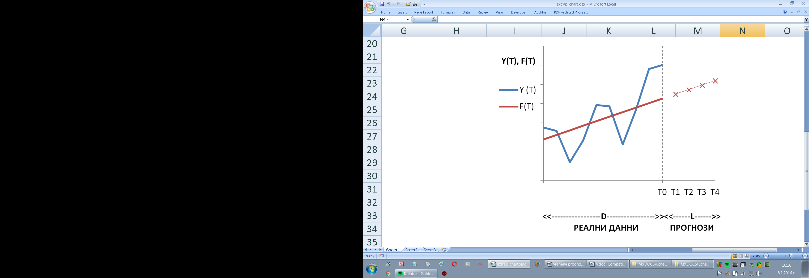
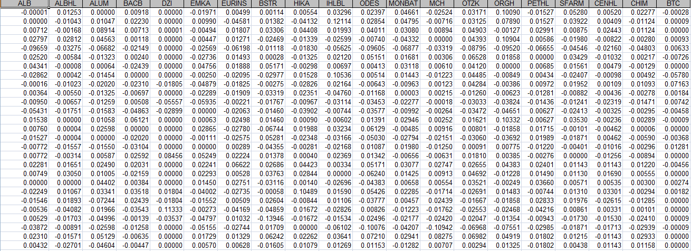
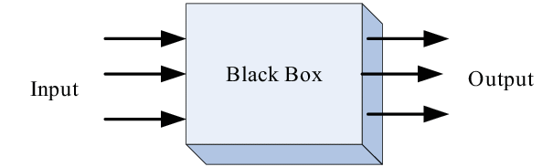

**Y (Т) – реални стойности на изследвания процес**

**T= 1, 2,. . ., D – дискретно време**

**D – дълбочина на отчитаната предистория**

**L – дълбочина на прогнозиране**

**F(Т) – изчислени стойности от прогнозиращата
функция**

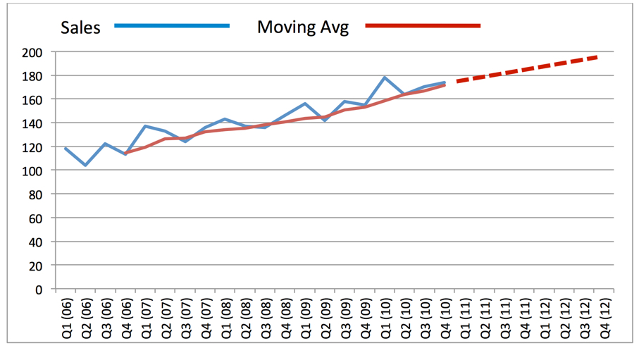

Емпирично правило: L ≤ (1/3, 1/2) D

**Основно допускане при всички екстраполационни методи:**

**Закономерностите, действали в миналото, ще продължат да действат и в
бъдеще. Хипотеза за
стационарност.**

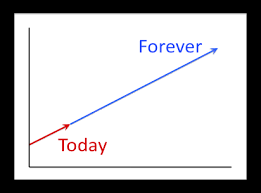

От тази гледна точка, база за всички методи за прогнозиране чрез
екстраполация се явява предположението, че действали в миналото
закономерности, ще продължават да действат и в бъдещето. Това от една
страна често бива определяно като основния недостатък на тази група
методи, поради факта, че не биха могли да отчетат действието на
случайни събития, произтичащи от неопределеността на средата

Методите, за екстраполация на времеви редове, се употребяват за
извършване на подробен анализ на характеристиките на данните от
миналото, за да се проектират в бъдещето. Едно от основните
предположение на всички методи за екстраполация на времеви
редове е това, че математическото описание може да бъде разделено на
такива компоненти, като средно равнище, тренд, сезонност, цикличност
и грешка. Когато компонентите се съберат заедно (или в някои случаи се
умножат), те ще дадат достатъчно точно изчисление на оригиналния
времеви ред. Основната стратегия, използвана при прогнозирането
на временните редове, е да се намери значението и формата на всеки
компонент на основата на наличните данни от миналото. Тези
компоненти (с изключение на случайната компонента) се
проектират в бъдещето. Ако остане само малък случаен компонент
и развитието се запази в бъдеще, тогава може да бъде получена подходяща
прогноза.

Анализирането на тези тенденции, помага да се определи техния ефект
върху движението на времевите редове. Четирите компонента си
взаимодействат, за да определят вариацията на стойностите на
данните във времето. Тези влияния определят хаотичното поведение на
икономическите Времеви редове.

Използване на данни от предходни периоди за прогнозиране е уместно при
силна вътрешна автокорелация на процеса, т. е. при силна зависимост на
дадено наблюдение на времевия ред от предходните.

Когато прогнозиращата функция се използва за изчисляване на бъдещите
стойности на времевия ред, се говори за екстраполиране. Когато се
изчисляват междинни стойности на динамичния ред, се говори за
интерполиране.

При по-сложни случаи, се налага в прогнозиращата функция да се отчете
действието на редица външни фактори, влияещи върху прогнозирания
времеви ред т. е прилагането на многофакторни прогнозиращи фукции.
Това изисква значително по-голям обем първични данни, усложнен синтез и
затруднено използване.

При изучаването на един времеви ред, може да се окаже целесъобразно
синтезирането на различни прогнозираши функции с последващ
съпоставителен анализ за:

  - тяхната приложимост;

  - ·точността на различните прогнозиращи функции;

  - ·влияние на вида на прогнозиращите функции върху точността на
    прогнозиране;

  - ·икономически анализ на изследвания процес;

  - ·обоснован избор на най-подходяща прогнозираща функция за
    изследвания процес.

Следва да се отбележи, че е е възможно да се синтезират и използват
екстраполатори (прогнозиращи функции) с много сложно математическо
описание. Например ако в прогнозиращата функция участват лагови
променливи или външни фактори, свързани с нелинейни зависимости
и нестационарни коефициенти, или ако прогнозираната променлива е само
една от много други прогнозирани променливи, свързани в система от
едновременни уравнения (които могат да бъдат нелинейни и
нестационарни).

### Етапи на работа при прогнозиране чрез екстраполация. 

Синтезът на прогнозираща функция за един времеви ред включва следните
етапи:

**СТРУКТУРНА ИДЕНТИФИКАЦИЯ**

1.  Определяне на съществените фактори (ако се използва много факторна
    прогнозираща функция).

2.  Определяне видът на прогнозиращата функция, т. е. общия вид на
    математическото описание на прогнозирания процес.

3.  Представяне на необходимите данни в удобен за обработка вид.

> **ПАРАМЕТРИЧНА ИДЕНТИФИКАЦИЯ**

4.  Оценка на параметрите в прогнозиращата функция по данни от
    досегашното развитие на процеса

5.  Предположения за неизменност на действащите закономерности за
    периода на прогнозиране.

> **ПРОГНОЗИРАНЕ**

6.  Изчисляване на прогнозиращите стойности F(Т) за T = D+1, …, D+L

7.  Оценка на точността на прогнозиране и проверка на синтезираната
    прогнозираща функция.

8.  Анализ и визуализация на получените резултати.

9.  Използване на прогнозата.

**МПУ: В най-чист вид приложение на научният метод за решаване на
практически проблеми. От всички области на живота\! (Като фото
проявяване).**

## СТРУКТУРНА ИДЕНТИФИКАЦИЯ

**Математически описания (модели, прогнозиращи функции, дискриминиращи
правила и пр.) (идентификация на структури) и оценка на параметри. Две
ортогонални оси.**

> **Класове математически описания (прогнозиращи функции): **
> 
> **Инерция =\> предистория; **
> 
> **времето = универсален фактор; **
> 
> **решаващ фактор; **
> 
> **много фактори; **
> 
> **всичко е взаимосвързано**
> 
> **Избор на вида на прогнозиращата функция (математическото описание).
> Структурна идентификация на черната кутия. Базова хипотеза за класа
> на функцията.**
> 
> **По-нататък:**

**Оценка на параметрите в избраната по вид прогнозираща функция
(математическо описание). Параметрична идентификация. Избор на
метод за оценка на парамeтрите.**

### Видове прогнозиращи функции. 

В настоящият учебник вниманието е насочено към следните видове функции,
прогнозиращи по метода на екстраполацията:

  - Методи за прогнозиране чрез пълзящи средни – при тях се разглеждат
    единствено данните за явлението от предходни периоди и се търси
    връзка между миналото поведение и бъдещите очаквания за
    явлението. Разгледани са в раздел 7.

  - Времеви прогнозиращи функции – използват времето (като пореден номер
    на наблюдение порез равен интервал) като независим фактор. Най-често
    се използва линейна регресия за настройка на коефициентите във
    функцията, но може да се ползват и други методи за търсене в
    пространството на параметрите. Те са разгледани в раздел 5.

  - Методи за прогнозиране чрез декомпозиране на хармоници – подходът на
    работа при тях е поетапно моделиране на все по-усложняващи се
    хармонични функции до получаване на немоделируем (т.е.
    случаен) остатък. Те са разгледани в раздел 6.

  - Методи за прогнозиране чрез авторегресионни функции – Подобно на
    пълзящите средни се търси връзка с предходните наблюдения за
    явлението, но коефициентите се настройват на база получената
    статистика вместо предварително да се задават. Разгледани са в
    раздел 8.

  - Еднофакторни и многофакторни модели – те могат да се използват за
    прогнозиране при дефазиране на използваните фактори спрямо
    изследваното явление. Разгледани са в раздел 14.

  - Модели във вид на системи едновременни уравнения – това е в общи
    линии най-сложният тип модели, които могат да се използват за
    изграждане на комплексни прогнози за повече от едно явление.
    Разгледани са в раздел 15.

  - Авангардни методи за прогнозиране – този клас методи всъщност не
    може да се каже, че имат много прилики, но са обособени по-скоро
    поради научната си актуалност. В настоящия учебник в раздел 17 са
    разгледани изкуствените невронни мрежи и еволюционните алгоритми,
    а в раздел 18 са описани и най-сложните методи – тези на
    многоредните селекционни процедури.

### Класове математически описания (прогнозиращи функции): 

**Класове математически описания (прогнозиращи функции):
> **

> **02-01-[M2U01374](02-01-M2U01374-Extrapolation-1.MPG)-Extrapolation-1**
> 
> **Инерция =\> предистория; **
> 
> **(24:20-28:20) – наивен метод N 1:**
> 
> **F(T) = Y(T-1)**
> 
> **33:30 – пълзящи средни**
> 
> **F(T) = ( Y(T-1) + Y(T-2) + Y(T-3) ) / 3**
> 
> **F(T) = ( Y(T-1) + Y(T-2) + … + Y(T-M) ) / M**
> 
> **37:57 – експоненциално изглаждане**
> 
> **F(T) = (1-w) \* w\*\*0 \* Y(T-1) + (1-w) \* w\*\*1 \* Y(T-2) + … +
> (1-w) \* w\*\*(M-1) \* Y(T-M)**
> 
> **0 \< w \< 1 (коефициент в геометрична прогресия) /?? (1-w)**
> 
> **………**
> 
> **44:35 – времеви прогнозиращи функции (трендове)**
> 
> **времето = универсален фактор; **
> 
> **Например: **
> 
> **F(T) = A0 + A1\*T (линеен тренд)**
> 
> **Нелинейни:**
> 
> **Полиномиална:**
> 
> **F(T) = A0 + A1\*T + A2\*T\*\*2 +А3\*Т\*\*3 =\> смешно\!**
> 
> **Логаритмична:**
> 
> **F(T) = A \* LN (B \* T)**
> 
> **Експоненциална:**
> 
> **F(T) = C0\*EXP(C1\*T) **
> 
> **Синусоидална:**
> 
> **F(T) = A\*SIN(W\*T + B) **
> 
> **Хармонична функция (Фурие). Най-използвания числен метод. Пример:
> изследване на мозъка. Спектрална плътност. **
> 
> **F(T) = A0 \* SIN(W0\*T + B0) + A1 \* SIN(W1\*T + B1) + … + AM \*
> SIN(WM\*T + BM)**
> 
> **Авторегресионна:**
> 
> **F(T) = A0 + A1 \* Y(T-1) + A2 \* Y(T-2) + … + AM \* Y(T-M) **
> 
> **Еднофакторна:**
> 
> **решаващ фактор;
> **
> 
> 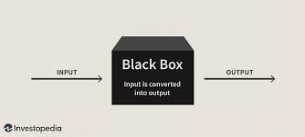
> 
> **Линейна:**
> 
> **F(T) = A + B \* X(T)**
> 
> **Нелинейна:**
> 
> **F(T) = A \* LN(B\*X(T) + C)**
> 
> **…..**
> 
> **Многофакторна:**
> 
> **много фактори (нищо не е толкова просто); **
> 
> **Линейна:**
> 
> **F(T) = A0 + A1 \* X1(T) + A2 \* X2(T) + … + AM \* XM(T)**
> 
> **LINEST\!\!\!**
> 
> **С лагове:**
> 
> **F(T) = A0 + A1 \* X1(T) + A2 \* X2(T) + … + AM \* XM(T) +**
> 
> **B1\*X1(T-1)+B2\*X2(T-1)+ … + BM\*XM(T-1)+ /lag = 1**
> 
> **C1\*X1(T-2)+C2\*X2(T-2)+ … + CM\*XM(T-2) /lag = 2**
> 
> **Нелинейна:**
> 
> **F(T) = A \* L(T)\*\*B \* К(T)\*\*C \* e\*\*(D\*T)**

### СЕУ

**Синтез на модели във вид на системи едновременни уравнения (СЕУ):**

> **всичко е взаимосвързано.
**

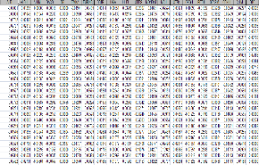

Идентификация на СЕУ

Най-общо задачата за идентификация може да бъде формулирана така:

Зададен е обект, в процеса на нормалното функциониране, на който
едновременно могат да бъдат намерени входните (екзогенните) и
изходните (ендогенните) променливи. От резултатите на направените
наблюдения да се построи законът, в съответствие на който входните
променливи да определят изходните.

Чист екстраполатор: Премахваме Х(Т). T.e. хипотеза, че зависимите
променливи зависят с поне един такт лаг от независимите. Отпада
необходимостта да се правят прогнози за Х(Т).

Модел на Александър Ефремов (във вид на система от диференчни
уравнения). 4 000 000 независими, 120 000 наблюдаеми.

Всъщност вече ‘не сме женени’ за линейността в съвременни условия. А
строго казано и със стационарността.Съвременните компютри работят
бързо.

Беше време, когато компютрите не можеха да обръщат матрица по-голяма от
16х16.

**Това е Блок-схема на модела СИМУР. Вертикалните в ляво са независимите
променливи, хоризонталните са зависимите, виждат се блоковете с чисти
закъснения (лаговите променливи). Лично съм го чертал на
милиметровка. **

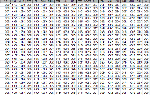

**КУИЗ 2. младши**

### СИНТЕЗ НА МОДЕЛИ ВЪВ ВИД НА СИСТЕМИ ЕДНОВРЕМЕННИ УРАВНЕНИЯ 

Може да се прескочи.

**СИНТЕЗ НА МОДЕЛИ ВЪВ ВИД НА СИСТЕМИ ЕДНОВРЕМЕННИ УРАВНЕНИЯ **

> [15.1. Кратък исторически преглед на подхода. 280](#_Toc465408442)
> 
> [15.2. Същност на модела от СЕУ. 283](#_Toc465408443)
> 
> [15.3. Начини за представяне на МСЕУ. 286](#_Toc465408444)
> 
> [15.4. Информационно осигуряване на МСЕУ. 295](#_Toc465408445)
> 
> [15.5. Идентификация на СЕУ. 298](#_Toc465408446)
> 
> [15.6. Традиционни методи за спецификация на уравненията в СЕУ.
> 303](#_Toc465408447)
> 
> [15.7. Методи за оценяване на параметрите на СЕУ. 307](#_Toc465408448)
> 
> [15.8. Пример – МСЕУ с макроикономически данни за България.
> 313](#_Toc465408449)

**000-01-Sistemi ednovremenni uravnenia.doc**

**Същност**

Методът за едновременно оценяване на взаимозависимостите в икономиката
води началото си от 40-те години на миналия век. Изследвайки
зависимости в области като потреблението и пазарния механизъм,
редица икономисти стигат до необходимостта от съвместното разглеждане на
цялата съвкупност от взаимоотношения, характеризиращи изучаваното
явление като цяло.

В последствие методът на едновременните уравнения намира голямо
приложение при разработването на т. нар. комплексни
икономически модели. (Например модела "Брукингс", който в
първоначалния си вид представлява система от 359 едновременни
уравнения).

Моделът от система едновременни уравнения (МСЕУ) представлява
математическа система, характеризираща по аналитичен път
някакви връзки и взаимозависимости между икономическите процеси и
явления.

В най общ вид МСЕУ може да се представи чрез следното **аналитично
записване**:

Yi = F(Xj , εj)

където:

YI - зависими (ендогенни) променливи

Xj - променливи, определящи поведението на Yi.
Наричат се още независими (екзогенни, външни) променливи и се
приемат за предварително зададени величини

εj - променливи, включващи в себе си частта от изменението на
YI , което се обяснява от променливите Xj и имат
случаен характер. Наричат се остатъци или грешки на регресионните
уравнения

F - изразява аналитичен вид на ендогенните променливи, участващи в МСЕУ

i = 1, 2, …, n - брой на ендогенните променливи, участващи в МСЕУ

j = 1, 2, …, m - брой на екзогенните променливи, участващи в МСЕУ

**Изразен по такъв начин МСЕУ може да се характеризира като модел,
определящ условния закон за вероятностното разпределение на
ендогенните променливи, за всяко фиксирано значение на
екзогенните променливи.**

**Начини за представяне на МСЕУ**

За повечето икономически процеси се явява типично явлението, че ефектът
на въздействие на определящите величини върху зависимата променлива се
появяват не веднага, а постепенно и с известно закъснение. Този процес
се нарича закъсняване на адаптацията. Доколкото МСЕУ представлява образ
на оригиналния обекта от икономическата действителност и с цел
увеличаване на реалността на МСЕУ, се налага отразяването по
някакъв начин на процеса на закъснение. За тази цел се използват т.
нар. лагови променливи, представляващи стойности за ендогенни и/или
екзогенни променливи за някакви предходни периоди.

По такъв начин в даден момент ендогенните променливи се оказват зависими
от няколко вида определящи променливи - екзогенни променливи, лагови
стойности на екзогенните променливи, лагови стойности на самите
ендогенни променливи.

Едно от изискванията от икономическия анализ е да бъдат отчетени
възможно най-много фактори и съотношения между тях и зависимите
променливи, за да се осигури комплексност на изследването. В този
смисъл математическият инструмернтариум на системата от линейни
уравнения се явява най-подходящото средство за моделиране на сложни
стопански системи. Линейните уравнения имат по-малко недостатъци в
сравнение с нелинейните, тъй като последните са лишени от
възможността за включването на голям брой променливи
съотношения между тях. С други думи - по-добре е да се
използват по-елементарни функции, но за сметка на това да се
въведат повече значещи променливи.

Всъщност вече ‘не сме женени’ за линейността в съвременни условия. А
строго казано и със стационарността.Съвременните компютри работят
бързо.

Беше време, когато компютрите не можеха да обръщат матрица по-голяма от
16х16.

Така линейните МСЕУ могат да бъдат представени в следния **общ
(структурен) вид**:

където:

Yt - вектор стълб на ендогенните променливи (на практика
представлява матрица с размерност Т х n)

Yt-S - вектор стълб на лаговите стойности на ендогенните
променливи

Xt - вектор стълб на екзогенните променливи

Xt-S - вектор стълб на лаговите стойности на ендогенните
променливи

Еt - вектор стълб на остатъците в МСЕУ

А - квадратна матрица (n x n) от коефициентите пред ендогенните
променливи

BS - квадратна матрица (n x n) от коефициентите пред лаговите
стойности на ендогенните променливи

C - правоъгълна матрица (n x m) от коефициентите пред екзогенните
променливи

D - правоъгълна матрица (n x m) от коефициентите пред лаговите стойности
пред екзогенните променливи

Решаването на общия вид на МСЕУ спрямо ендогенните променливи довежда да
нова система от уравнения (**редуциран вид**). Преобразуването в
редуцирана система позволява да се отчетат всички връзки (преки
и косвени), засягащи всяка една зависима променлива.

Чист екстраполатор: Премахваме Х(Т). T.e. хипотеза, че зависимите
променливи зависят с поне един такт лаг от независимите. Отпада
необходимостта да се правят прогнози за Х(Т).

Модел на Александър Ефремов (във вид на система от диференчни
уравнения). 4 000 000 независими, 120 000 наблюдаеми.

В зависимост от направлението и сложността, връзките в линейните МСЕУ
могат да имат рекурсивен или взаимозависим характер и съответно МСЕУ
се делят на рекурсивни и взаимозависими.

**Рекурсивният вид** МСЕУ може да бъде представен като ориентирана
верига от причинно следствени връзки. Система от n на брой
уравнения, в която i -то уравнение може да се разглежда като
определящо величината на i -та ендогенна променлива за периода t;
като функция на определящите променливи с индекс по малък от I (т.е.
всички променливи участващи в предходните уравнения).

**За всяка система от уравнения може да се намери (при определени
условия) еквивалентна на нея рекурсивна система. Така, че всеки
МСЕУ винаги може да бъде представен в три форми: структурна,
редуцирана и рекурсивна.**

> 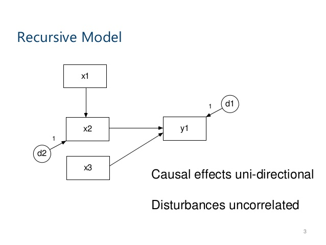

**Взаимозависимите МСЕУ** предполагат наличието на някакъв цикъл в
зависимостите между ендогенните променливи. Дадена ендогенна
променлива представляваща следствие на цялата система от
взаимозависими уравнения, може да се окаже причина за някое
друго уравнение. С други думи дадена променлива може да бъде
ендогенна за целия МСЕУ и същевременно екзогенна за част от
него.

Такъв тип връзки отразяват възможно най адекватно съществуващите
съотношения в икономиката и следователно МСЕУ от взаимозависим
вид са ценен инструмент при изследването и измерването на
количествените връзки между икономическите показатели.

За да е възможно решаването на взаимозависими МСЕУ, се разглеждат
успоредно взаимозависимите ендогенни променливи и техните лагови
стойности т.е. се отразява процесът на закъснение на адаптацията. Това
може да се опише като "разгъване" на цикличната взаимозависимост и
довеждане на МСЕУ до рекурсивен вид.

**Това е Блок-схема на модела СИМУР. Вертикалните в ляво са независимите
променливи, хоризонталните са зависимите, виждат се блоковете с чисти
закъснения (лаговите променливи). Лично съм го чертал на
милиметровка. **

> 

**Идентификация на СЕУ**

Най-общо задачата за идентификация може да бъде формулирана така:

Зададен е обект, в процеса на нормалното функциониране, на който
едновременно могат да бъдат намерени входните (екзогенните) и
изходните (ендогенните) променливи. От резултатите на направените
наблюдения да се построи законът, в съответствие на който входните
променливи да определят изходните.

По-точно при идентификацията е поставена задачата не за определянето на
самия модел на обекта, а на неговото приблизително значение,
представляващо негова оценка.

Поради голямата обобщеност на така поставената задача, тя се свежда до
изясняването на въпроса: Съществува ли еднозначно съответствие между
структурираните и редуцираните параметри?

Според признака "идентифицируемост" МСЕУ се разделят на три групи:

  - > Свръхидентифицирани - въз основа на коефициентите на редуцираната
    > форма може да се получат две или повече (обикновено различни)
    > значения за един структурен параметър;

  - > Непълно идентифицирани - коефициентите на редуцираната форма не
    > позволяват определянето на структурните параметри;

  - > Точно идентифицирани - коефициентите на редуцираната форма
    > определят еднозначно структурните параметри.

**Методи за оценяване на параметрите на СЕУ**

В моделите от едновременни уравнения задачата за оценяване на
неизвестните параметри значително се усложнява в сравнение с
другите видове модели

Усложненията настъпват от факта, че във всяко едно уравнение от СЕУ
участват по няколко текущи значения на ендогенните променливи.
Избирайки едно от тях за зависима променлива в даденото уравнение,
останалите ще се корелират помежду си и ще оказват смущаващо
въздействие. Така ако бъде приложен МНК към това уравнение,
ще се получат изместени и несъстоятелни оценки на параметрите.

При наличието на изпълнени много изисквания в крайна сметка МНК би дал
способ за оценяване само при рекурсивните СЕУ. За по-общия случай,
когато СЕУ не е от рекурсивен тип и не са изпълнени условията за
прилагане на МНК, е необходимо използването на други методи.

За целта се използва един прост метод за оценяване - т.нар. косвен МНК
(или индиректна регресия), който обаче е ефективен само когато СЕУ е
точно идентифициран.

Същността на този метод се състои в това, че при КМНК всяко уравнение в
редуцирана форма на СЕУ се третира като многофакторен регресионен
модел, чийто параметри се оценяват по МНК. Т.е МНК се прилага за
оценка не направо в структурните уравнения, а в редуцираните.

След като се оценят коефициентите в редуцираната форма на СЕУ, чрез
нормализация може да се получат коефициентите на структурната форма
на СЕУ.

Най-общо класическите методи за оценяване на параметри в
свръхидентифицираните СЕУ могат да бъдат разграничени в
две групи - методи за оценка с ограничена информация и методи за оценка
с пълна информация.

При първата група методи, оценките на параметрите се изчисляват за всяко
уравнение поотделно, но с отчитане на информацията за всички определящи
променливи, участващи в модела (Такива процедури са например двустъпков
МНК и обобщен МНК). За съжаление оценките, получени по тези методи
обикновено са значително изместени, когато се работи с маломерна
извадка от наблюдения.

Когато параметрите се оценяват с помощта на методите с пълна информация,
се осигурява едновременното измерване на всички неизвестни параметри
(такъв метод е например тристъпков МНК; за най-добър метод от
теоретическа гледна точка се счита метод на максимално
правдоподобие с пълна информация). Тези методи са по-ефективни
в сравнение с методите с ограничена информация. От друга страна, обаче,
методите с пълна информация изискват по-голямо количество изчисления.

Като най-перспективна насока за усъвършенстване и модификация може да се
счита възможността за използване на итерационни процедури при методите с
ограничена информация. Изчисляването с помощта на итерация, води до
получаването на оценки за неизвестните параметри на СЕУ,
притежаващи същите свойства, които имат получените по
горепосочените методи. При това на всяка итерация може да бъде
използван различен метод за получаване на търсените оценки.

При итеративните процедури, пренасянето на грешките в оценката от едно
уравнение на СЕУ в друго се компенсира дори по-добре, отколкото при
методите с пълна информация. Като при това изчислителните процедури
на отделните итерации, обикновено са прости (и не изискват обръщането
на матрици от висок порядък, както е при двъстъпков МНК и тристъпков
МНК). А по тази причина резултатите, получени по тях не са и толкова
чувствителни към мултиколиарността в определящите променливи.

Проблемите при итеративните методи са свързани предимно с голямото
количество изчисления, което при наличието на съвременната
електронно - изчислителна техника следва да се счита за
несъществено. По-опасна е несходимостта и нееднозначността на
итеративния процес, които понякога възникват при изчислителните
процедури.

### Foundation

**Разходка в Пшемисъл с Иван Пунчев. Система от едновременни уравнения,
описващи Вселената. Чист екстраполатор. Светлинни години, мегапарсеци и
купове от галактики.**

**А Азимов – и той като нас (всъщност преди нас) **

Foundation Isaac Asimov

**СЕУ, описващи общественото развитие на Вселената. **

**Холографният аватар на автора се явява периодично в гробницата му и
прави анализ на изтеклия период, давайки жокери за преодоляване на
текущата криза.**

**След случайна мутация прогнозите и действителността се разминават все
повече и повече (дълбочината на прогнозиране е станала твърде голяма, а
точността твърде малка)**

**Много различни форми на обществено устройство с техните предимства и
недостатъци.**

**При всяка криза се налага да се разруши предишното и да се установи
новото.**

**Адптивността = Умението на се от-учим от наученото и да се пре-научим
на новото.**

## Оценка на параметрите

> **Оценка на параметрите в избраната по вид прогнозираща функция
> (математическо описание). Параметрична идентификация. Избор на
> метод за оценка на парамeтрите.**

### Метод на псевдопрогнозата. 

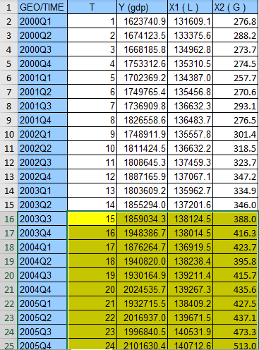

Създателите на модели за прогнозиране често надценяват качеството на
прогнозите, генерирани от тези модели. Причината за това е липсата
на тестване на модела. Тестването на модела за прогнозиране е неговата
оценка върху исторически данни, които не са използвани при създаването
на модела.

За да се тества едни модел за прогнозиране, емперичните данни са
разделени на две части. Първата част се използва за да се
създаде модела за прогнозиране. Това включва избиране на метод за
прогнозиране и оценяване на параметрите. Тогава, се прави прогнозиране
на данните от втората част, за да се оцени качеството на прогнозите.
Ако качеството на прогнозите не е приемливо, се избира друг метод за
прогнозиране и процесът се повтаря. Ако качеството е приемливо, то
създаденият модел може да се използва за прогнозиране. Фиг. 5
обобщава процеса на създаване и тестване на модел за
прогнозиране.

За целите на обучние или за проверка на точността на прогнозиране на
даден ектраполационен метод данните е уместно използването на метода
на псевдопрогноза. При него данните от времевия ред се разделят на две
групи - на т. нар**. “обучаваща последователност” и “контролна
последователност”**.

Първата част от наблюденията са обучаваща последователност и включва
данните, които да послужат за синтезиране на прогнозиращата функция
(настройка на коефициенти).

Останалата част наблюдения са контролна последователност. Нормално
контролната последователност включва данни, следващи по време
спрямо обучаващата последователност т. е. данни които не участват в
синтезирането на прогнозиращата функция.

Въз основа на данните от обучаващата последователност се изграждат
прогнозите за периода на контролната последователност, все едно,
че стойностите за този период са неизвестни. НАЙ-НАКРАЯ, когато
прогнозите по съответния метод са готови, се използват данните от
контролната последователност за изчисляване на точността на
прогнозиране.

Обща последователност при метода на псевдо-прогнозиране по всеки отделен
метод (в някои случаи отделни етапи от последователността се пропускат):

1.  Избор на метод за прогнозиране.

2.  Разделяне на данните на обучаваща (първа част) и контролна (втора
    част) последователност.

3.  Настройка на коефициентите в математическото описание на метода,
    използвайки данните от обучаващата последователност. .

4.  Използване на математическото описание за изчисляване на прогнозни
    данни за периодите от контролната последователност.

5.  Изчисляване на прогнозна грешка за прогнозните данните от
    контролната последователност.

6.  
**Априорна и апостериорна информация. ‘Ex post’ и ‘Ex ante’.**

**Класически подход vs МСП (Многоредни Селекционни Процедури). **

**Автоматизация на изследователската
дейност.**

### Оценка на параметри по метода на най-малките квадрати. МНК =\> LINEST

### Gaus

**Оценка на параметри по метода на най-малките квадрати. МНК =\>
LINEST**

> **Необработените видео-за МПУ.**
> 
> **M2U01374-Extrapolation-1.mp4**
> 
> **M2U01376-Extrapolation-MNK-upr.mp4**
> 
> **M2U01380-Extrap-nelin-regres.mp4 (01:00)**
> 
> **Нататък =\> Както е в старата лекция (виж по-долу)**

[**Johann Carl Friedrich
Gauß**](https://upload.wikimedia.org/wikipedia/commons/a/a1/De-carlfriedrichgauss.ogg)

**Странната заповед на Наполеон: Никой да не доближава Гьотинген\!**

**(Princeps
mathematicorum)**

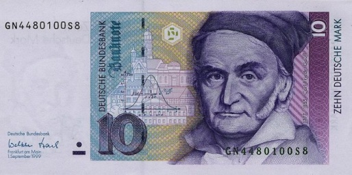

> 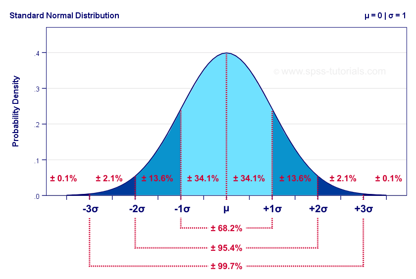
> 
> 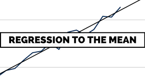
> 
> 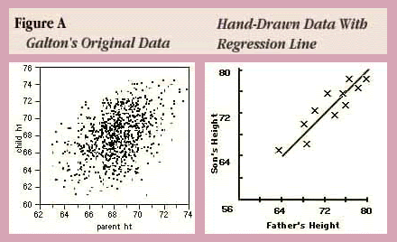

**Регресионно уравнение, прогнозиращо положението на
> луната:**

> 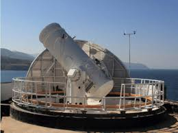

**Уравнение на елипса (конично
> сечение):**

> 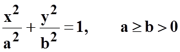

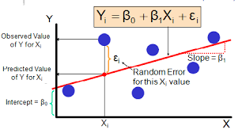

> 

**Производствена функция (от Ал. Димитров (ур.на прогресия) до Последния
Мохикан)**

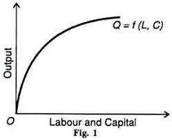

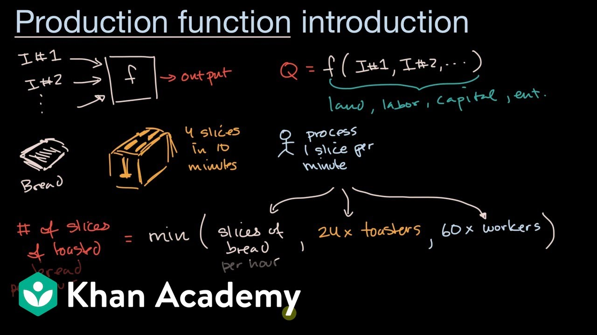

**Един истински научен подвиг. Открива планета с върха на перото, след
30 години изчисления и 900 литра мастило. **

**Koj be\[e
> tozi**

> 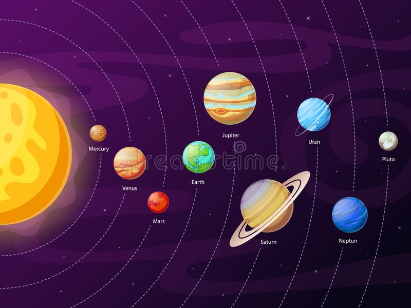

### Упражнение с LINEST

**LINEST =\> гледай инструктивните
филмчета**

<https://www.youtube.com/playlist?list=PLX9ryRl9v7BCfKRzdiWhriYLBQ9bB8xTi>

> **M2U01376-Extrapolation-MNK-upr.mp4 (първите 15 мин).**
> 
> **M2U01374-Extrapolation-1.mp4**
> 
> **M2U01376-Extrapolation-MNK-upr.mp4**

**Ще има ли днес нелинейни функции?**

**Оценка на параметри на вътрешно линейни функции с помощта на линейна
регресия.**

> **[M2U01380-Extrap-nelin-regres.mp4](02-01-M2U01380-Extrap-nelin-regres.MPG)
> (01:00)**

**Блок-схема**

  - **Описано е във видео инструкциите функция по функция:**

  - **Таблицата с първичните данни се подлага на подходящо нелинейно
    преобразуване**

  - **Получава се нова (междинна) таблица с данни**

  - **Междинната таблица се използва за оценка на коефициенти в линейно
    регресионно уравнение (например с функцията LINEST)**

  - **Получените коефициенти се използват за изчисляване на ‚истинските‘
    коефициенти в нелинейното уравнение (т. е. прави се обратно
    нелинейно преобразуване).**

**КУИЗ 3.
Младши**

ьььььььььььььььььььььььььььььььььььььььььььььььььььььььььььььььььььььььььььььььььььььььь

Звук=кафе

## Оценка на коефициентите в математическото описание (прогнозиращата функция)

**Оценка на параметри в математически описания (общ случай)**

**Дотук разгледахме линейни функции и вътрешно линейни (т. е. приводими
до линейни с някакво нелинейно преобразуване). Става най-вече с LINEST.
Всичко това има своята сложност, но общо взето е ‚бял кахър‘. 😊**

**Сега да разгледаме по-общ случай.**

**План за лекцията.**

1.  **Вътрешно нелинейни прогнозиращи функции.**

2.  **S-образни криви. Криви на Гомперц. Примери.**

3.  **Обща схема за оценка на коефициентите в математическото
    описание.**

4.  **Приемаме, че структурна идентификация е вече извършена. Факторите
    са избрани, видът на математическото описание е избран.**

5.  **Разполагаме с база от емпирични данни. **

6.  **Работим в класа на екстраполационните прогнозиращи функции.**

7.  **Търсим числените стойности на коефициентите в математическото
    описание (вектор на коефициентите).**

8.  **Математическо описание = модел (в нашия случай) = прогнозираща
    функция (в нашия случай) = екстраполатор.**

9.  **Методи за оптимизация = методи за търсене на екстремум = методи за
    търсене на минимум = методи за настройка на коефициенти в модела (в
    прогнозиращата функция) = основен елемент в machine learning.
    Използват се в най-различни области на живота.**

10. **Видове алгоритми за търсене на минимум. (Всички методи за
    оптимизация).**

11. **Стотици алгоритми, но само няколко основни принципа (слава
    Богу).**

12. **Класификация на алгоритмите за търсене: детерминирани, случайни,
    комбинирани; за търсене на един минимум, за търсене на глобален
    минимум; в пространство без ограничения, с ограничения; с
    различни допускания за приложимост на алгоритъма.**

13. **Оценки за близост до минимума. SSUM (Sum Sumarum). Не непременно
    квадратична.**

14. **Какъв е МНК (Метод на най-малките квадрати)? Детерминиран, за един
    минимум, без ограничения, с допускания (не корелирани фактори,
    достатъчно наблюдения, нормалност на грешката), SSUM = средно
    квадратично отклонение. Подходящ за ‘ръчни’ изчисления. Свършил
    страхотна работа за прогреса на човечеството. Примери. Трудно
    приложим за действително сложни задачи. Регуляризация на
    решението (например делене на ‘обучаваща’ и ‘контролна’
    последователност). При съвременните компютри е ‘Ракетен двигател
    на каруца’.**

15. **SOLVER. Има предимства и недостатъци. Историята на Младен.**

16. **Учебни ресурси.**

**M2U01381-Extrap-nelin-mod-nastr-koef-1.mpg**

**M2U01382-Extrap-nelin-mod-nastr-koef-2.MPG**

**До голяма степен картирани и свалени. Лошо се вижда дъската/екрана.**

### Вътрешно нелинейни прогнозиращи функции

**По-подробно по точките на плана на лекцията:**

**Вътрешно нелинейни прогнозиращи функции.**

**S-образни криви. Криви на Гомперц. Примери.**

> **Типични за описани на развитието на определена
технология.**

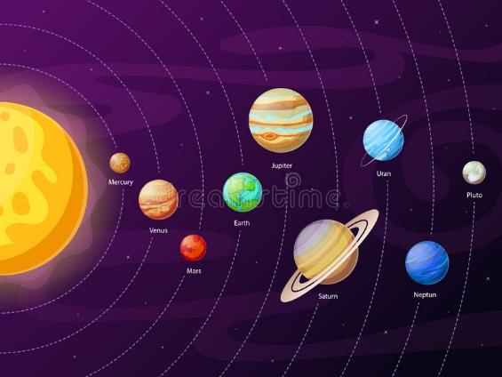

**Криви на
обучение:**

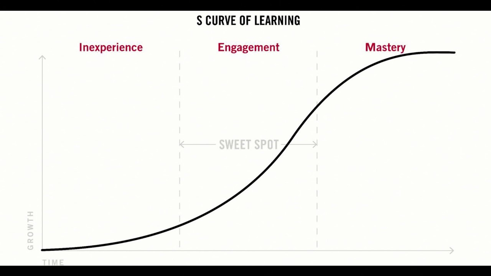

**Характерни
> фази:**

> 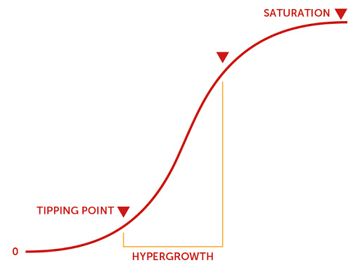
> 
> **Припокриване на стара и нова
технология:**

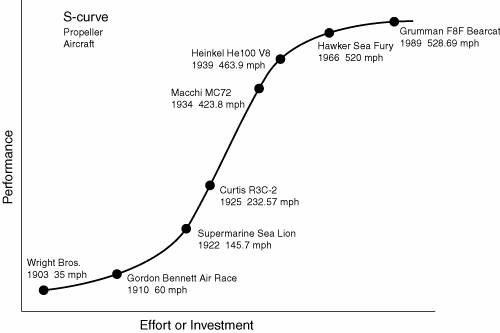

**Прогнозиране по ‘обвиваща
крива’:**

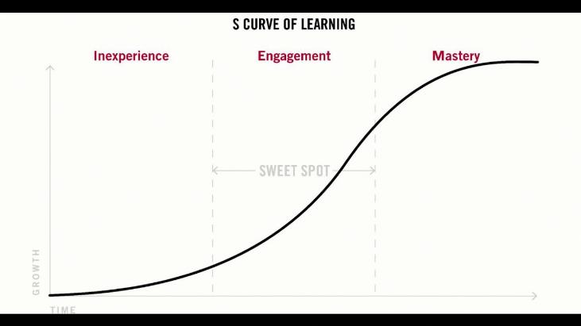

**Пример от ФМУ:**

**Y(x) = L+R\*e-a\*e-b\*x**

**\<L\> = 600 \<R\> = 200 \<a\> = 20 \<b\> = +0.006**

**У...............................................................**

**R**

**X**

> **Приходи от прод.**
> 
> **Ерих
Янч**

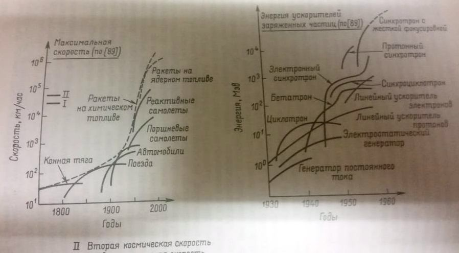

### Обща схема за оценка на коефициентите в математическото описание.

**Обща схема за оценка на коефициентите в математическото описание.**

**Спомени, спомени (от моята дисертация). Автоматизация при изграждане
на модели на сложни системи. Контур ‘Настройка на коефициентите’.
> **

> 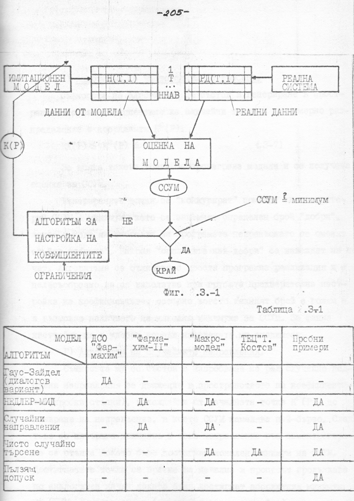

### автоматизация

**Първоначално (1970+), алгоритъма за настройка бях аз. После почнах да
се автоматизирам. Светът също се автоматизираше. Процесът продължава\!
**

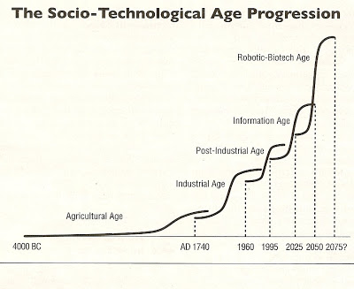

**Същото, но именно за прогнозиращи функции (по лекциите):**

### Алгоритми и принципи

**Приемаме, че структурна идентификация е вече извършена. Факторите са
избрани, видът на математическото описание е избран.**

**Разполагаме с база от емпирични данни. **

**Работим в класа на екстраполационните прогнозиращи функции.**

**Търсим числените стойности на коефициентите в математическото описание
(вектор на коефициентите).**

**Математическо описание = модел (в нашия случай) = прогнозираща функция
(в нашия случай) = екстраполатор.**

**Методи за оптимизация = методи за търсене на екстремум = методи за
търсене на минимум = методи за настройка на коефициенти в модела (в
прогнозиращата функция) = основен елемент в mashine learning. Използват
се в най-различни области на живота.**

**Видове алгоритми за търсене на минимум. (Всички методи за
оптимизация).**

**Стотици алгоритми, но само няколко основни принципа (слава Богу).
Това, което е важно е да се разбират принципите. **

**Класификация на алгоритмите за търсене: детерминирани, случайни,
комбинирани; за търсене на един минимум, за търсене на глобален
минимум; в пространство без ограничения, с ограничения; с различни
допускания за приложимост на алгоритъма.**

**Оценки за близост до минимума. SSUM (Sum Sumarum). Не непременно
квадратична.**

**Какъв е МНК (Метод на най-малките квадрати)? Детерминиран, за един
минимум, без ограничения, с допускания (не корелирани фактори,
достатъчно наблюдения, нормалност на грешката), SSUM = средно
квадратично отклонение. Подходящ за ‘ръчни’ изчисления. Свършил
страхотна работа за прогреса на човечеството. Примери. Трудно
приложим за действително сложни задача. Регуляризация на
решението (например делене на ‘обучаваща’ и ‘контролна’
последователност). При съвременните компютри е ‘Ракетен двигател
на каруца’.**

**SOLVER. Има предимства и недостатъци. Историята на Младен.**

### Пространство на състоянията

**Повърхност на отклика. SSUM е по вертикалната ос. Два коефициента.
Прожекция върху равнината. Линии на ниво в равнината. Движението на
представителната точка по повърхността и траекториите в
> равнината.**

> 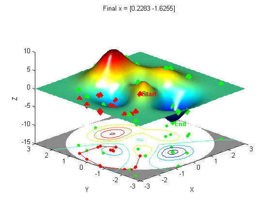

**Само равнината на проектиране. Два параметъра. Линии на ниво.
Траектория към
минимума.**

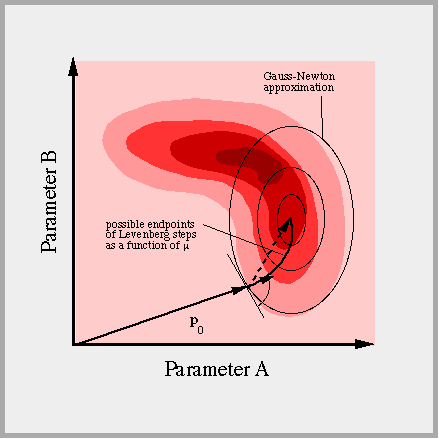

**Да си представим, че това е картата на Черно море, а ние имаме корабче
с ехолот и търсим най-дълбоката точка. **

**Коя е най-добрата стратегия за търсене?**

**(Всичко по-долу съм го програмирал лично. Преди 1000 години
> 😊)**

> 
> 

**Анимация на корабчето**

### Метод на Гаус-Зайдел

**Метод на Гаус-Зайдел. Детерминиран метод за локален минимум.
Последователни стъпки по единия параметър, до достигане на
локален минимум. После по следващия параметър и т. н. Начупена
траектория до
> минимума.**

> 
> 
> 

### Градиентен мето

**Градиентен метод = метод на най-бързото спускане. Детерминиран метод
за локален минимум. Вие сте тежка метална топка, търкаляща се по
баира. Обичате диференциалното смятане. (Виж и във ФБ
групата).**

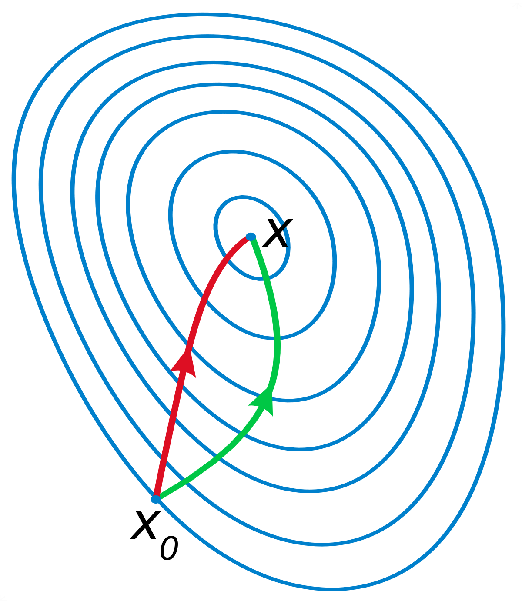

**Пак за градиентния метод (ако сте нежна капка роса, ще минете по
същата
траектория):**

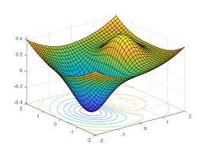

### Симплекс метод

**Симплекс метод (любим на Мая Ламбовска ). Детерминиран метод за
локален минимум. Приятно ми е. Аз съм Симплекс. (N + 1) мерен
правилен многостен с постоянен размер в N мерното пространство на
коефициентите. В двумерно пространство, аз съм равностранен
триъгълник. В тримерното съм равностранна пирамидка. И т. н.
Винаги местя ‘най-лошия’ си връх в посока към ‘по-доброто’ (в търсене
на пълното щастие). Така се търкалям докато достигна минимума. Там може
да зацикля, защото не мога да си променям размера. Може да ме
изчислявате на ръка, макар че това не е умна идея при
наличието на съвременните компютри.**

**Ще го оставя на Мая
Ламбовска.**

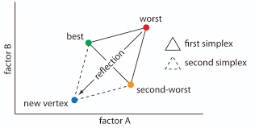

### Нелдер-Мийд

**Метод на деформируемия многостен (Нелдер-Мийд). Детерминиран метод за
локален минимум. Много по-интелигентен и адаптивен от Симплекс.
Адаптира се към особеностите на повърхността на отклик.
‘Разтяга’ се при дълъг слаб наклон, свива се при ‘тесен
пролом’, променя стъпката на придвижване в зависимост от
‘терена’.**

> 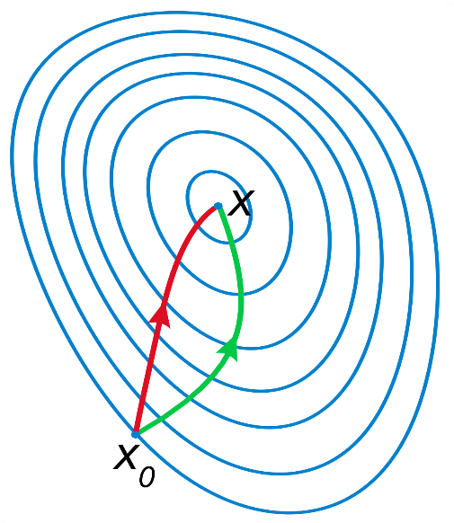
> 
> 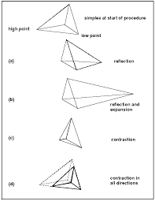

[**https://www.youtube.com/watch?v=asDXpfFMKNA**](https://www.youtube.com/watch?v=asDXpfFMKNA)

### Ограничения

**Ограничения в пространството на коефициентите. ‘Тараби’ в многомерното
пространство. Типично за почти всички оптимизационни задачи. Примери.
Примери при синтез на модели.
**

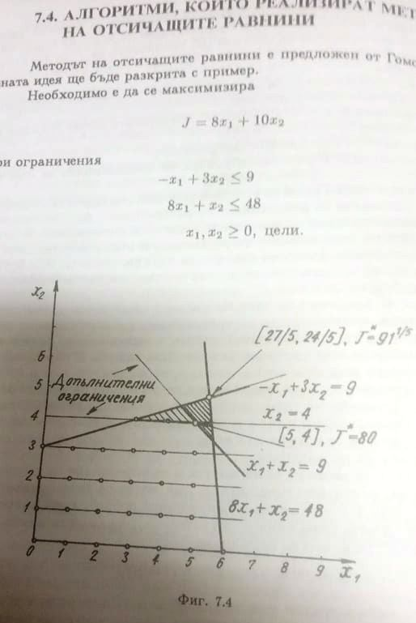
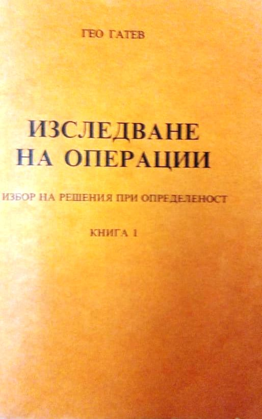

### хиперболичен параболоид

**Седло, или хиперболичен параболоид. Доста странно животно. Психо за
малко да ми напише диагноза. **

**Няма минимум. Няма максимум. Крива във всяка своя точка по двете оси,
но се състои от две фамилии прави линии, които никога не се пресичат
взаимно.
**

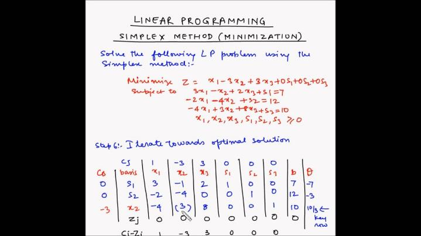

### глобален минимум

**Търсене на глобален минимум (минимум от всички минимуми).**

### чисто случайното търсене

**Метод на чисто случайното търсене. Валят случайни точки, в които
правим измерване. Постоянно сравняваме и пазим координатите на
най-добрите резултати (като резултатите от теста по МПУ ). Няма нужда
от никакви допускания. Търси глобалния минимум. Сходимост към минимума с
нарастване на броя опити. ‘Филтър’ при наличие на ограничения. Нужен е
бърз компютър. Историята със СИМУР-0. (Техниката с пълна мощ\!
Компютрите са нашите танкове\!
)**

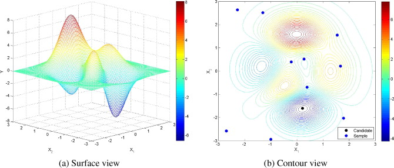

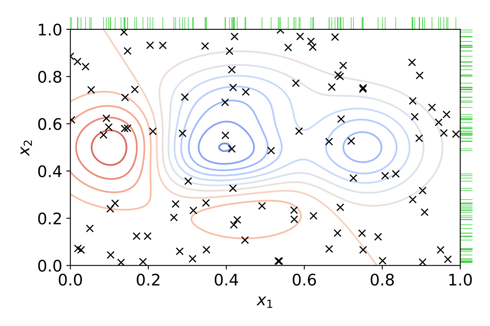

### Комбинирани методи

**Комбинирани методи за търсене на глобален минимум. Поредица от опити
със случайно начало + детерминирано търсене на локален минимум
(бързо). Съчетават се предимствата на двата подхода. Алгоритъм на
случайните направления. Ускорена сходимост в сравнение с чисто
случайното търсене.**

**Dobawki kym
> kombinirani**

> 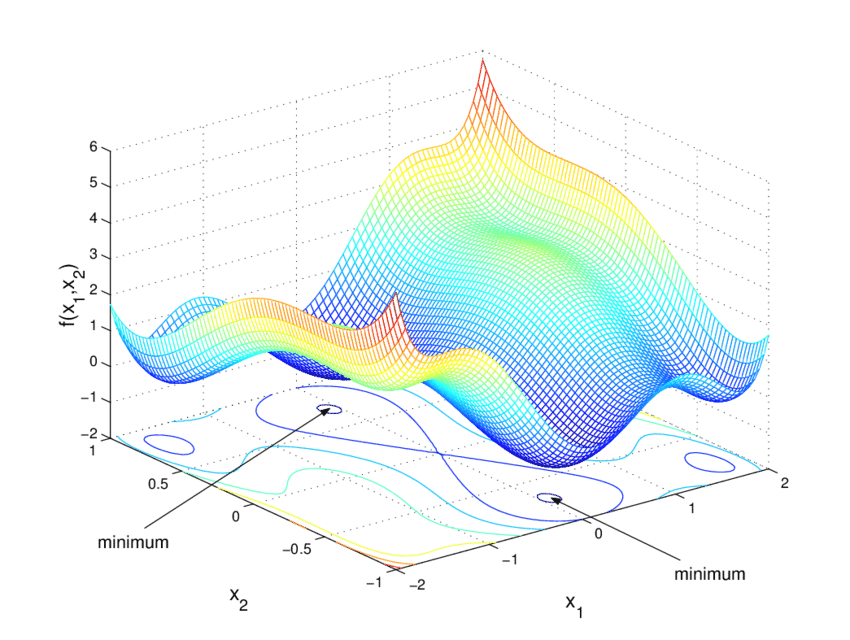

**‘Телепатични амеби се блъскат в тарабите на многомерното
пространство.’ **

**(Swarm solution)**

**(виж записа). **

**Запис за
амебата??**

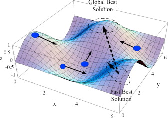

### Упражнение със SOLVER

### Поредния куиз. Junior:

<http://bit.ly/mpu-quiz>

…………………………………………………………………………………….

### Demos

DEMOS. Junior.

Маестро, Музика\! 😊

Xxxxxxxxxxxxxxxxxxxxxxxxxxxxxxxxxxxxxxxxxxxxxxx

## символ верую + Токата и фуга

**МОДЕЛИРАНЕ: Символ-верую**

**Моделът на дадена моделирана система представлява целесъобразно
изградена изкуствена система, която: **

1.  **Отразява най-съществените страни на моделираната система: **

> **•като описва най-съществените (за целите на изследването) елементи и
> връзки в моделираната система; **
> 
> **•като има поведение, достатъчно близко (за целите на изследването)
> до поведението на моделираната система. **

**2. Дава възможност за получаване на нова информация за моделираната
система: **

> **•като позволява да се проследи поведението й в бъдещи или минали
> периоди, при удобен мащаб на времето; **
> 
> **•като замества в известен смисъл (за целите на изследването)
> моделираната система и позволява да се извършат числени
> експерименти с модела вместо с моделираната система.**

Съобщения:

### Съобщение за ДИУ и ФПИ

Условни изпити по ФПИ и ДИУ.

ФПИ. Запознайте се/припомнете си страницата на ФПИ\!. Изпълнявайте
всички борсови симулатори (StockMarket, PRM1, PRM2 и точно
указаните 5 нива на WS Tycoon). Задължително направете поне 20
сделки на Ню Йоркската борса (симулатор VSE). Ще свалим точките на
24-ти януари. (Играта е регистрирана до тогава).

Тест по ФПИ ще проведем на условната изпитна дата през януари. Гледайте
да не я прозяпате.

Оценките ще внесем когато разполагаме с електронните протоколи, т. е.
пак тогава.

ДИУ. Запознайте се/припомнете си страницата на ДИУ\! Изберете си
задание, съгласувайте с мен. Разработете и пратете за оценяване.
Трябва да наберете поне 30 точки. ‚Идеалното‘ задание дава до 10 точки.

Друга възможност. Включете се в комплексната делова игра Bulgarian
Yogurt Business Game. За целта ми се обадете, до 15 октомври, за да ви
включа в регистъра на директорите.

Оценките ще внесем когато разполагаме с електронните протоколи (през
януари).

### Примерни теми за ДЕЛФИ, РАНГ и др. : 

**Още не е пълен комплект, но все пак за начало. Гледай в страницата на
МПУ. Заповядайте на консултации.**

**Бонус\! Чиста аванта\! +1 точка ако предадете до неделя, 16.00 часа.**

Прогнозирайте средната продължителност на живота към края на \<година\>

Прогнозирайте настъпването на 'clinical immortality' (наличие на терапия
на терапия за всички заболявания с вероятност за успех над 95%)
\<година\>

Прогнозирайте достигането на 'longevity escape velocity' \<година\>

Прогнозирайте срока за широко внедряване (поне 50% от инплантираните
протези) на сърдечни протези с ламинарен поток. \<година\>

…………..

Ранжирайте 8-те най-важни фактора, определящи прогнозираната
величина/срок с метода ДЕЛФИ.

### Задания по ‚Прогнозиране чрез екстраполация‘

Задания ‚Прогнозиране чрез екстраполация‘ EXTRA

Съдбата ви е определила комплект данни с уникален номер. Използвайте ги
за да направите прогнози по всички методи.

Изпращайте резултатите на сайта за автоматично оценяване. Точките се
получават автоматично. Ще получите потвърждаваш мейл. Анализирайте
си грешките и пращайте отново. Няма ограничение за броя на опитите.
Засега рекорда е 149. 😊

## Модел, моделиране, видове модели, области на приложение ….

[МОДЕЛИ И МОДЕЛИРАНЕ В СИСТЕМИТЕ ЗА УПРАВЛЕНИЕ. 176](#_Toc465408413)

Определения и основни понятия. Модел. Моделиране.

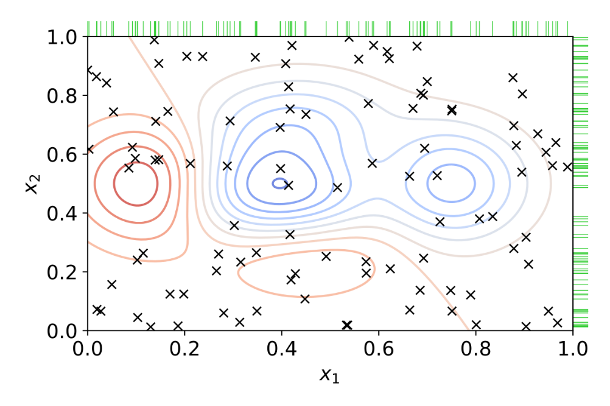

Анализ на различни определения за понятието ‚модел‘. Твърде дълго.
Статистически модел; графичен модел; математически модел;
икономически модел; словесен модел; модел на развития
социализъм; Модел на баница със сирене; ….

**фигура**

**‚Нашето‘ определение:**

**Моделът на дадена моделирана система представлява целесъобразно
изградена изкуствена система, която: **

**Отразява най-съществените страни на моделираната система: **

> **•като описва най-съществените (за целите на изследването) елементи и
> връзки в моделираната система; **
> 
> **•като има поведение, достатъчно близко (за целите на изследването)
> до поведението на моделираната система. **

**Дава възможност за получаване на нова информация за моделираната
система: **

> **•като позволява да се проследи поведението й в бъдещи или минали
> периоди, при удобен мащаб на времето; **
> 
> **•като замества в известен смисъл (за целите на изследването)
> моделираната система и позволява да се извършат числени
> експерименти с модела вместо с моделираната система.**
> 
>  **What …. If ….? **

## Видове модели.

### Модели на физическо подобие: 

Модели на физическо подобие:

Спомен от детинството:

> Белмекен – Сестримо Кольо
Фичето

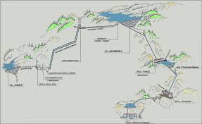
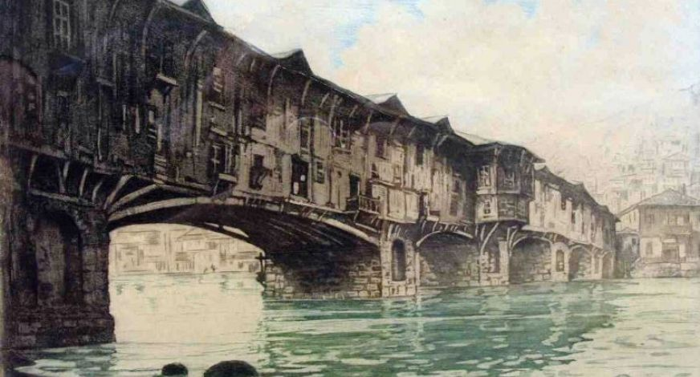

### аналогови модели

аналогови модели: едно и също математическо описание на различни по
своята природа процеси =\> аналогови модели в различни среди

електролитен модел; хидравлични: MONIAC; Кембриджки хидравличен модел на
икономиката; ХТИ; Упражнението за кат. Автоматика със Стойчо;

Механични: Буш; дискови интегратори
(?);

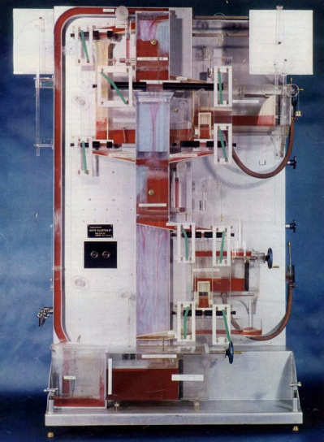
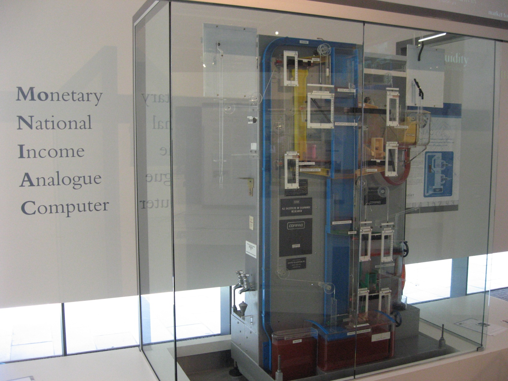

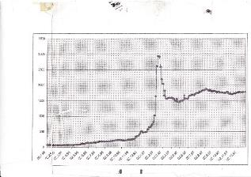

Електронни: Analog 1, Analog
2

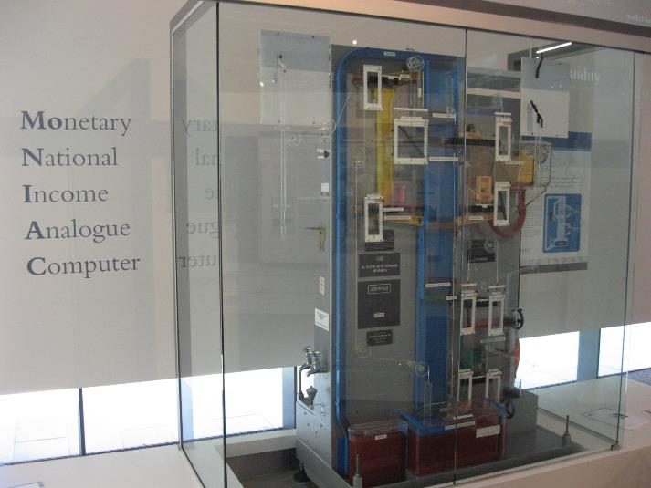

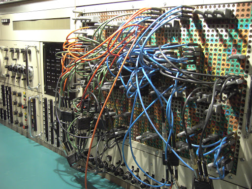

### компютърни модели

### loopy 

Loopy
Demo

<https://l.facebook.com/l.php?u=https%3A%2F%2Fncase.me%2Floopy%2Fv1.1%2F%3Ffbclid%3DIwAR2dRofV24BHKziA6EvIdcHblDY9c6W0bBFOskfOn8Jpn9sb_J_M6TAkdYI&h=AT3hgAFh18xaEDfVbWFJ0WH0C5_oH0hg4Z8QnGLwlpWKYzB9l24mK65KU_6s5_krraH8wUHufDMouQ8NS_G-00nfeTIkObIGIzPd-5aE3fDeUWZEEu1i17kgcbmfSqC8rM2W>

### Forrester 

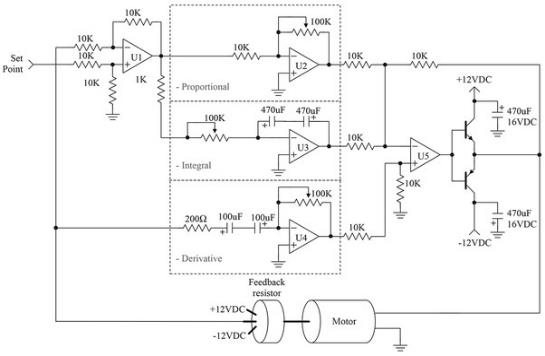

### NORAD

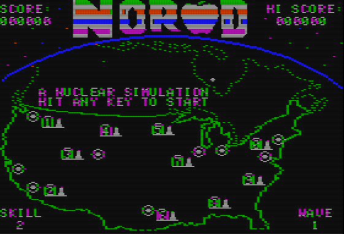 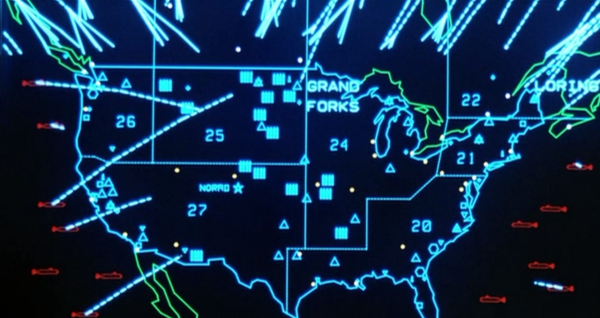

Истинска имитация – книгата на Пери Розов. Промяна на организацията на
противо въздушната отбрана. Симулация на външната среда със записи на
данни, вместо с уравнения.

Компютърна игра за 8-битов компютър

Филм ‘Военни игри’. По NORAD.

Flight simulators. Тренажори. От физическо подобие към компютърен модел.
Към VR.

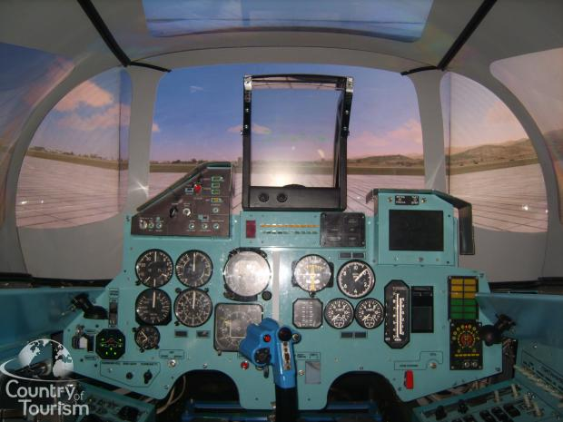 …..

### [Аналитични и имитационни модели. 188](#_Toc465408416)

[Аналитични и имитационни модели.
188](#_Toc465408416)

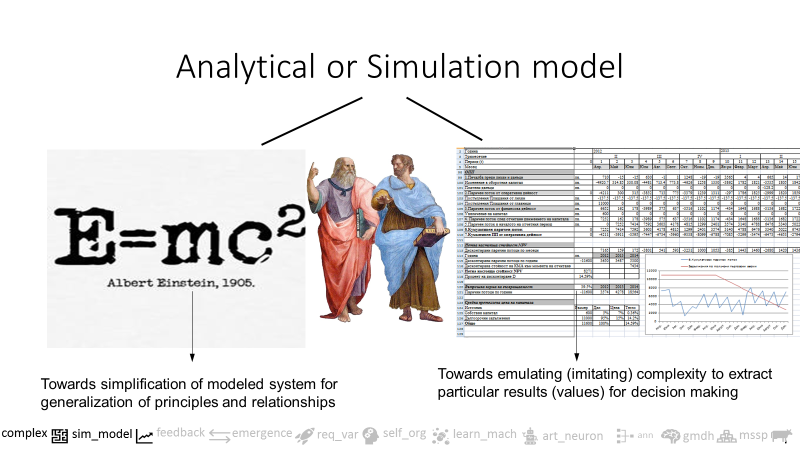

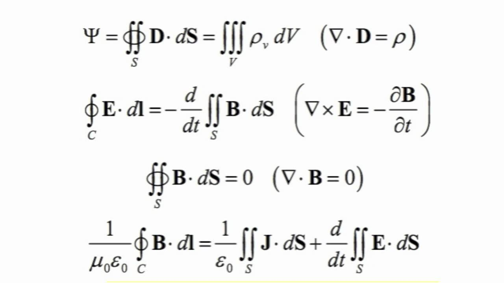

## [Имитационно моделиране. Имитационен модел. Имитация. 184](#_Toc465408415)

Твърде голям
текст

### [Характерни черти, предимства, недостатъци и класификация на имитационните модели. 191](#_Toc465408417)

Твърде голям текст

what \<Следствия\> IF \<сценарий\>?

### [ИЗПОЛЗВАНЕ НА МОДЕЛИ В УПРАВЛЕНИЕТО. 196](#_Toc465408418)

[Задачи, решавани с помощта на модели. 198](#_Toc465408420)

[Област на приложение на имитационните модели. 196](#_Toc465408419)

[Приложение на имитационното моделиране в човешката дейност.
201](#_Toc465408421)

[Управленски задачи, решавани с помощта на ИМСС. 203](#_Toc465408422)

Използване на моделите за изследователски цели (като средство за
разкриване и анализ на действуващите в моделираната система
закономерности).

Използване на моделите като основа за управленски (делови, операционни,
образователни) игри.

фигура

Използване на моделите като средство за предварително проиграване на
управленски решения и анализ на техните последствия. what
\<Следствия\> IF \<сценарий\>?

Използване на модели в процеса на проектиране или модернизация на
системата.

Използване на модели за оценка на организационни и структурни изменения
в моделираната система.

Използване на модели за прогнозиране на бъдещото поведение на
моделираната система.

фигура

Прогнозни експерименти от типа “Ако ..., то ...”. Моделиране на възможни
ситуации и траектории на развитие.

[Технология и технически средства на имитационното моделиране.
212](#_Toc465408423)

Фунгоидни устройства

## Философия и моделиране

**“МОДЕЛИРАНЕ И ПРОГНОЗИРАНЕ В УПРАВЛЕНИЕТО (МПУ)”**

**Философия и моделиране**

**+ моята концепция за курса, а и за Света.
😊**

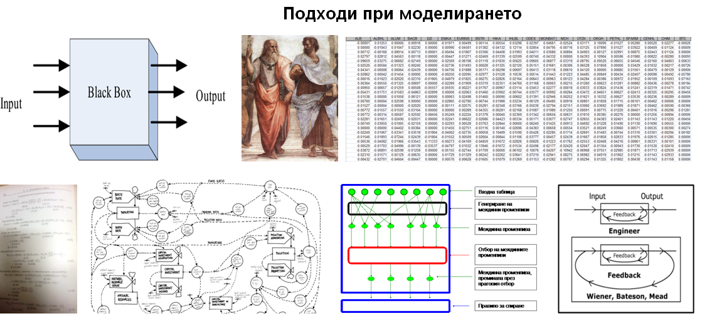

**Подходите в моделирането всъщност са философски въпроси. Споровете
продължават и до днес. **

**ГАВРАИЛ ДАНИЛ И
МИХАИЛ**

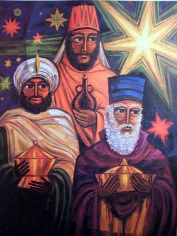

**Материализъм или идеализъм. Познаваемост на света. **

**Научната философия.**

**Дедукция и индукция.
**

**Причинно-следствени връзки. Взаимна зависимост между явленията.
Редукционизъм или холизъм. Науки за сложността.**

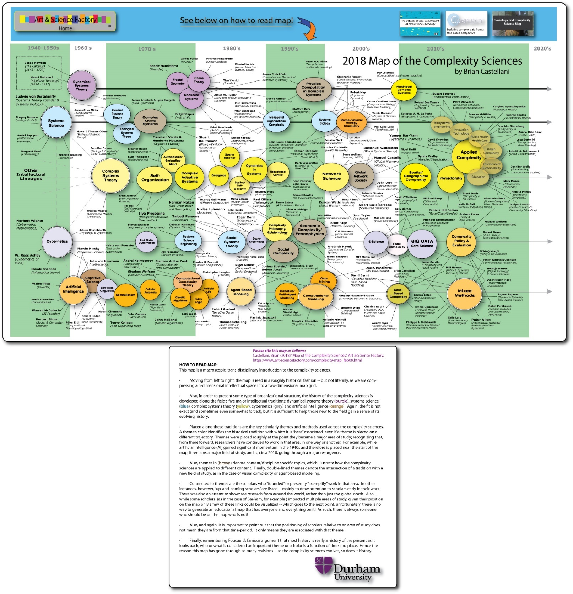

**Обективна и субективна истина. Независимият наблюдател. Ролята на
аналитика.
**

**Данни и реални явления. Априорна и апостериорна
информация.**

**Научният метод. Кой е учен? Научната философия. STEM. Разширено
разбиране за ‚наука‘. Изследователските университети.**

**‘Научният метод’. Дефиниция.**

**A method of research in which:**

  - **а problem is identified,**

  - **relevant data are gathered, **

  - **a hypothesis is formulated from these data, **

  - **and the hypothesis is empirically tested.**

**The Royal Society's motto (1660): 'Nullius in verba' is taken to mean
'take nobody's word for it'.**

**Verify all statements by an appeal to facts determined by
experiment.**

**картинка**

**Естествени науки, не естествени науки и противо естествени науки\! **

**Дотук =========================================2021-10-15**

# предварителни

**Playlist за МПУ:**
2021-09-27-MPU

[https://youtube.com/playlist?list=PLX9ryRl9v7BD-PaKbxayefKsDdcN31FUR](https://l.facebook.com/l.php?u=https%3A%2F%2Fyoutube.com%2Fplaylist%3Flist%3DPLX9ryRl9v7BD-PaKbxayefKsDdcN31FUR%26fbclid%3DIwAR3G4JHcM2iCWlhKn-hDya7TD5ZKlAwwg5WmQXHh4WiVRempgcoPPeLqcmU&h=AT08LI66gJlPbBxxXX1qOxJheqIFh4K6vOmp5NDeHvZeh0zc8jeEApcjFh1ccsEw1es5hKH-f2S7gC4FFnsfEcdNTMVfZXZK4SdSRaNeAfnnw1d0S-hCvzBmSZczO0LIoeXzHg)

**списък до сега:………**

**Куиз**
[**http://bit.ly/mpu-quiz**](https://l.facebook.com/l.php?u=http%3A%2F%2Fbit.ly%2Fmpu-quiz%3Ffbclid%3DIwAR1cHfUVvzK_W_Ebc6CWNJyfT1uQiEiDKzevsG-5A9VvVrZZ0HpY9qWhpQ8&h=AT0XpKqHeyda6DJfgSxnSBWlsBrIatFYDI8OHgQe2ckZKTh08i2ACjqfgejH8TyRZKka03EMxMAMji82Daov-Z2PZvCie7xbY6AoRcOk4IHCU0n11_jSeGFShBqe0d27vs_Ujw)

**Напомням: точки, ЕО, куизове,**

**EXTRA =\> неделя, 20.00, срок за бонус**

**изследователски задания, **

**Задание: Изследователски задачи. Инструктаж. **

**VANGA. Видове. FutureShock**

[**Мисията на
БА**](file:///F:\\1-DISCIPLINI\\MPU\\0-2020-09-MPU\\2020-зимен-Минали-лекции-МПУ\\2013%20graduation%20fixed%20subtitles.mov)

**Xxxxxxxxxxxxxxxxxxxxxxxxxxxxxxxxxxxxxxxxxxxxxxxxxxxxxxxxxxxx**

[**http://bit.ly/mpu-quiz**](http://bit.ly/mpu-quiz)

## ПОДХОДИ В МОДЕЛИРАНЕТО. КРАТЪК ПРЕГЛЕД.

**ПОДХОДИ В МОДЕЛИРАНЕТО. КРАТЪК ПРЕГЛЕД.**

### Дедуктивен подход в моделирането. 

**Дедуктивен подход в моделирането.**

Аз съм бивш фен на **дедуктивния подход**. В. Кисьов и Крайните
автомати. Life. Модел на n-полово общество с променлива
половост. Урсула Льо Гуин, Айзек Азимов и пр. Лoгическа пълнота
и логическа непротиворечивост.

**Органичен подход. Разчита на априорни знания.**

ФМУ. Органичен подход, т.е. идеята тук е да се вникне в логиката на
системата. Малко или никакви минали данни за реалната система.
Колкото е дълбочината на отчитаната предистория. Има смисъл да се
използва, когато се изготвят **прототипи**.

Органичен метод за синтез на математически описания предполага априорни
знания за моделираната система и вникване в икономическата и същност.
При него се синтезират уравнения произтичащи логически от
фундаментални познания.

**При индексния метод** за синтез на математически описания една
променлива се приема като основна (индекс) а останалите се
разглеждат като нейни функции. Например във ФМУ като индексна
променлива използваме ‘приходи от продажби’. Като цяло този метод
на синтез на математически описания е прост и поражда малко нови
променливи в модела. От друга страна той предполага досегашен опит
и знания.

### Интуитивен подход.

**Интуитивен подход в моделирането. **

Всяка професия = наука + изкуство + занаят

Оперна певица, обущар, моделиер
…

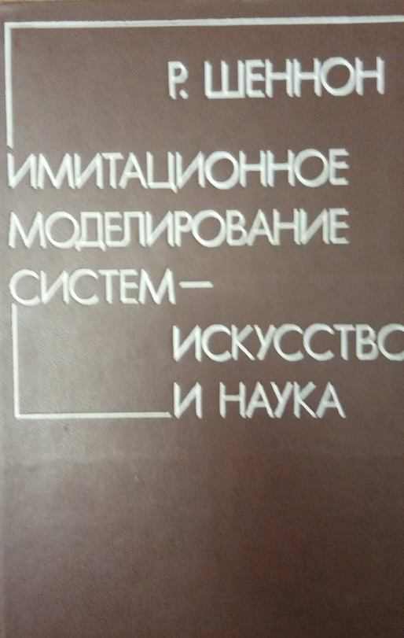
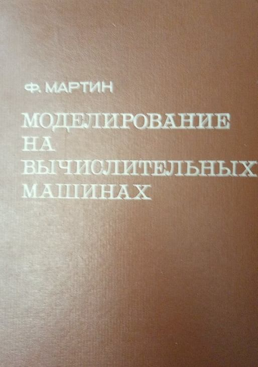

Интуитивния подход при изграждането на модели има смисъл, когато се
строи нещо, което още не съществува (като 'модели на ядрената
зима').

Интуитивен подход - зависи от моделиера - ако моделиера гледа в тавана и
твори глупости - модела става също глупав.

### Опасност от съзнателни идеологически и политически злоупотреби.  

**Опасност от съзнателни идеологически и политически злоупотреби.**  

[Club of Rome](https://en.wikipedia.org/wiki/Club_of_Rome). *The Limits
of Growth.* Денис и Дoнела Медоус. IPCC reports. Макро икономически
модели.

Познавам ги лично; NASAGA/ISAGA/BASAGA; подобни макро икономически игри;
обмен на педагогически трикове (РК срещу въжето)

Диаметрално противоположни разбирания за моделирането; идеологически
подбрани уравнения‚ ‚за доброто на човечеството‘

### Системна динамика. Форестер.

 **Системна динамика. Форестер.**

**Субективен подход, но с използване на стандартизирани елементи (типови
динамични звена от Теория на автоматичното
управление)**

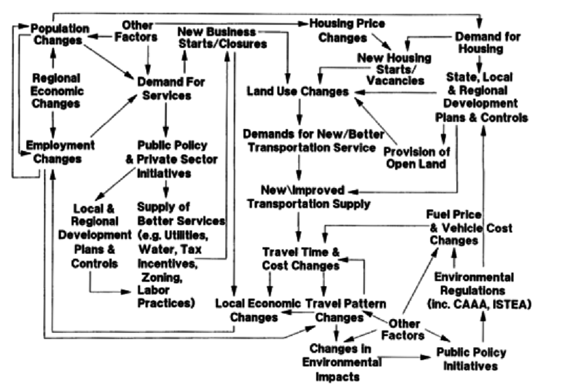
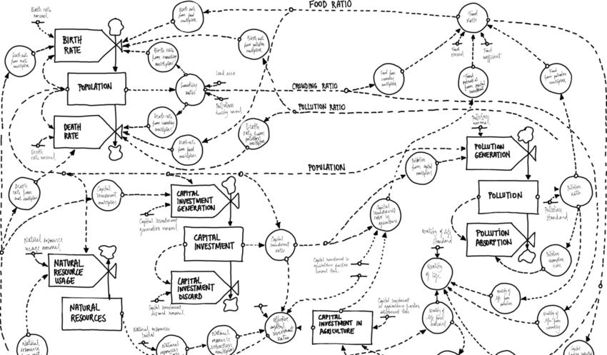

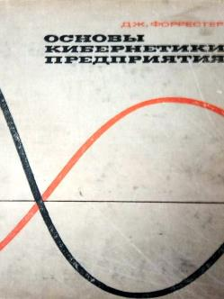

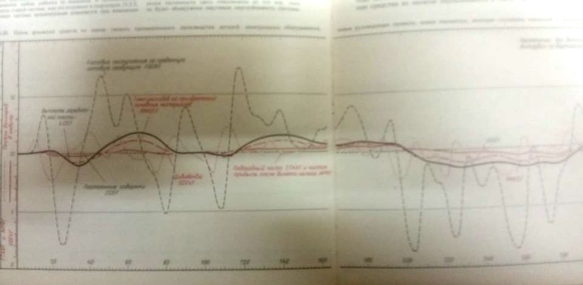

### Автоматно моделиране.

**Автоматно моделиране.**

**(Типовите звена са крайни
автомати)**

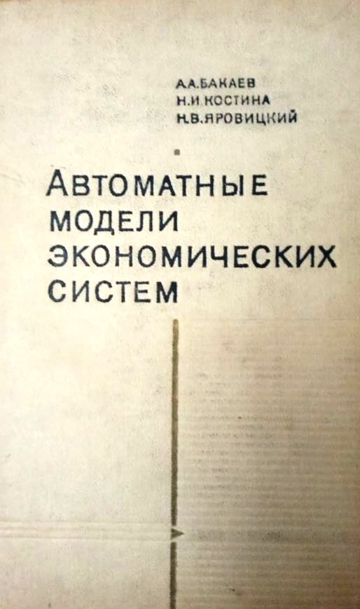

### Агрегатно моделиране.

**Агрегатно моделиране.**

**(типовите звена са ‚агрегати‘ = параметризируеми
‚барбарони‘)**

**По части линейно апроксимиран агрегат с дискретно вмешателство на
случая**

### Разни други. 

**‘Сглобяване’ на модела от готови елементи.**

………………. Най-добрата аналогия е Лего комплекти

### Използване на специализирани езици за моделиране.

**Използване на специализирани езици за моделиране.**

**Над 250 още преди много години**

**Подходящи за дисертация, бързо умират след това. Simscript. DYNAMO. **

### Универсални езици за моделиране

**……………………….. Ксерокс - Канада**

**Мениджърите предпочитат да наемат професионалисти.**

**Професионалистите предпочитат да работят с универсални езици за
програмиране.**

**fortran**

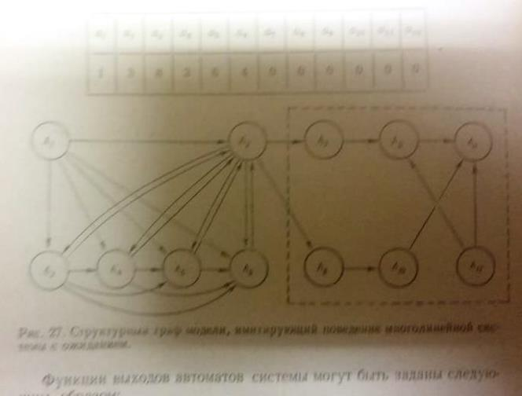
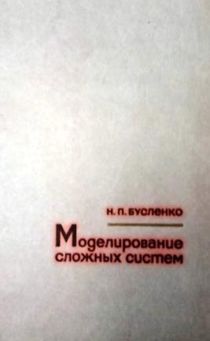

**Basic/lotus**

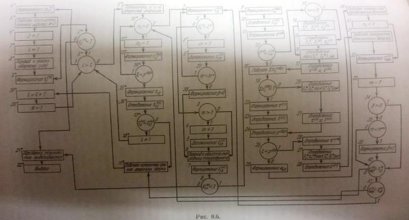
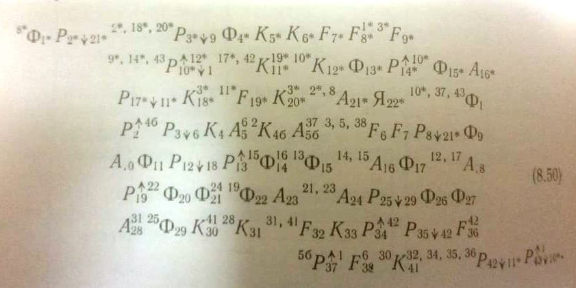

**pascal**

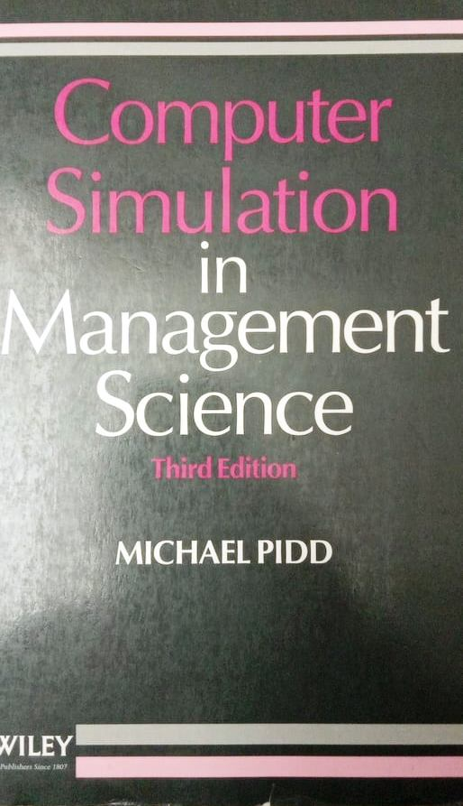
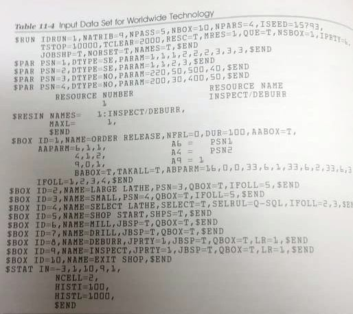

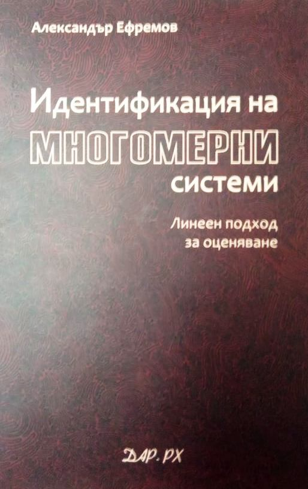

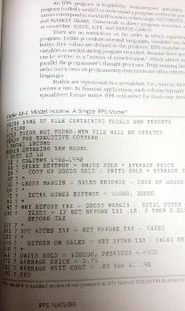
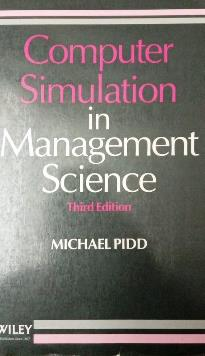

**C++ поема функциите на
PL/1**

### Консултантски фирми по моделиране

**сканирана**

## Емпиричен подход

**Емпиричен подход (индуктивен подход)**

**Базира се на набор емпирични данни. Връзка с Научния метод. **

**Философски смисъл. **

**Принцип на черната кутия. Произход на термина.
**

Друг възможен подход за синтез на математически описания се основава на
наблюдения върху влияещите и зависимите променливи. Това е т. нар.
подход на “черната кутия”. При него се търси връзка между конкретно
входно въздействие и изходен резултат от него.

### Иконометричен подход.

**Иконометричен
подход.**

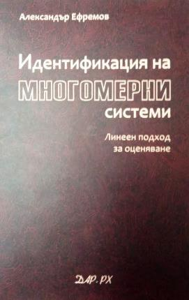
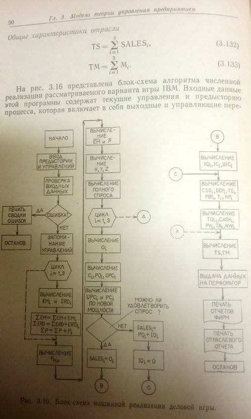
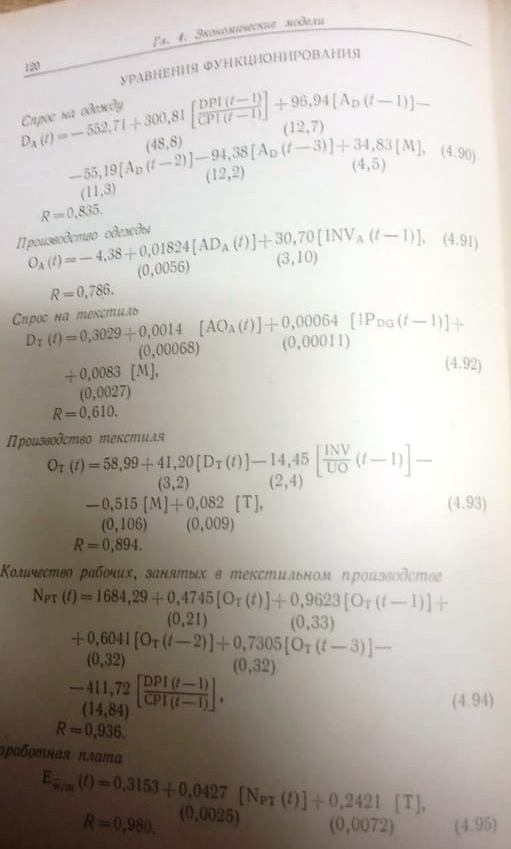

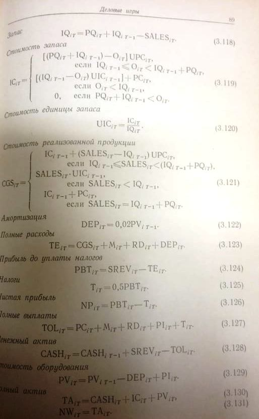

**Сравнение на макро моделите на БГ, синтезирани по различни методики.
ИИ на БАН, Комитет по планиране, СИМУР**

**Xxxxxxxxxxxxxxxxxxxxxxxxxxxxxxxxxxxxxxxxxx**

# 2021-11-05-09-00 МПУ

**Смяна на парадигмата:**

**СИНТЕЗ НА МОДЕЛИ ЧРЕЗ МНОГОРЕДНИ СЕЛЕКЦИОННИ
ПРОЦЕДУРИ.**

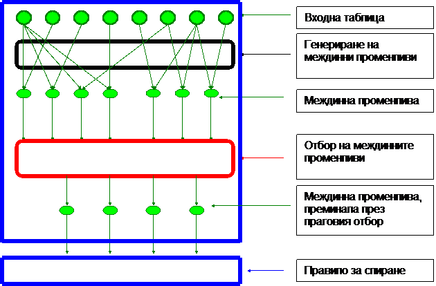
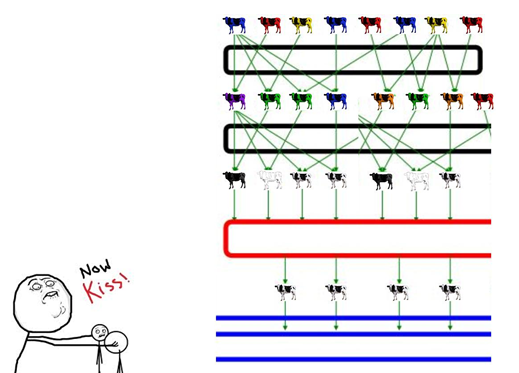

[**http://bit.ly/mpu-quiz**](http://bit.ly/mpu-quiz)

**Покана за тютори. **

**Играта в събота и неделя. **

**Оценка на задания в следващите седмици.**

**Може да се зачете като част от стаж.**

**Любопитно. Младен Савов (историята с кусурите на Solver в Excell) е
избран за член-кореспондент на БАН.**

**Скоро може да си имаме “зубър академик“ 😊**

## Селекционен подход: специално внимание в следващите лекции.

Селекционен подход: специално внимание в следващите лекции.

Време е за смяна на парадигмата.

### Етапи при синтез на модели (класически подход). 

**СТРУКТУРНА ИДЕНТИФИКАЦИЯ НА МОДЕЛА**

  - Определяне на съществените фактори (ако се използва много факторна
    функция).

  - Определяне видът на математическото описание.

  - Представяне на необходимите данни в удобен за обработка вид.

> **ПАРАМЕТРИЧНА ИДЕНТИФИКАЦИЯ НА МОДЕЛА**

  - Оценка на параметрите в прогнозиращата функция по данни от
    досегашното развитие на процеса

  - Предположения за неизменност на действащите закономерности за
    периода на прогнозиране.

> **ИЗПОЛЗВАНЕ НА МОДЕЛА (за прогнозиране, експерименти, решения и т.
> н.)**

  - Изчисляване на прогнозиращите стойности F(Т) за T = D+1, …, D+L

  - Оценка на точността на прогнозиране и проверка на синтезираното
    математическо описание.

  - Представяне на резултатите в удобен за използване вид (визуализация
    на получените резултати).

  - Анализ и използване на резултатите.

Класически подход vs МСП (Многоредни Селекционни Процедури).

### МСП

**Много-редни селекционни процедури**

**Много важно е да се разбере задачата (проблемът) и основната идея за
нейното решаване.**

**Постановка на задачата на една** **Многоредна Селекционна Процедура
(МСП):**

  - **за едновременна структурна и параметрична идентификация **

  - **на сложни модели (системи)**

  - **при малко априорна информация **

  - **и малко ограничаващи допускания**

  - **във високо автоматизирана процедура (силно усложнена, но
    автоматизирана****, до напълно автоматична (?) )**

  - **на основа на Научният метод**

  - **(не само за синтез на модели) **

**Много не знаем, силно ни мързи, но знаем правилния метод\! 😊**

**Автоматизация на изследователската дейност**

**Смяна на парадигмата**

## Многоредни селекционни процедури (МСП). Основна идея.

Идеята: от селекционерската практика в селското стопанство.

Крави и бикове.

Селекция на броколи.

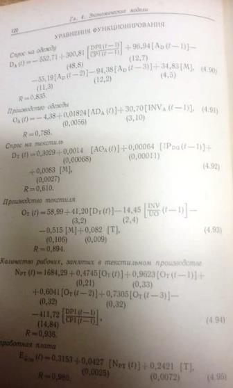

Всичко питомно е GMO\!

Естествена еволюция (natural evolution) vs насочена селекция

‘естественото’ в повечето случаи значи ‘некадърно’;

‘селектираното’ има всички шансове да превъзхожда ‘еволюиралото’

Основна идея. Селекционерска практика. Селекция. Еволюция vs Селекция.

Само-организация. Заимстване идеи от селекционерската практика (Крави,
лалета и зелки). Създаване на условия за насочена селекция.
Конкуренция и състезания на хипотези. Принципи на
само-организацията:

Принцип на неокончателното решение.

Запазване на свободата за избор в бъдеще.

Генериране на разнообразие от хипотези.

Прагов подбор на хипотези.

Правило за спиране.

Генерационно дърво.

**СИНТЕЗ НА МОДЕЛИ ЧРЕЗ МНОГОРЕДНИ СЕЛЕКЦИОННИ
ПРОЦЕДУРИ.**

Селекционен подход: специално внимание в следващите лекции.

Днес стъпка в правилна посока: Невронни мрежи

Ьььььььььььььььььььььььььььььььььььььььььььььььььььььь

## [ЕТАПИ ПРИ ИЗГРАЖДАНЕ НА МОДЕЛИТЕ. 221](#_Toc465408424)

[Формулиране на проблема и създаване на концептуален модел.
223](#_Toc465408425)

[Събиране на информация за моделираната система. 229](#_Toc465408426)

[Синтез на математическите описания на блоковете в модела.
232](#_Toc465408427)

[Програмна реализация на модела. 236](#_Toc465408428)

[Подбор на блоковете и настройка на коефициентите. 239](#_Toc465408429)

[Оценка на адекватността и избор на окончателен вариант на модела.
241](#_Toc465408430)

[Използване на изградения модел. Провеждане на моделни експерименти.
247](#_Toc465408431)

Изграждане на модели на реални системи –
примери.

xxxxxxxxxxxxxxxxxxxxxxxxxxxxxxxxxxxxxxxxxxxxxxxxxxxxxxxxxxxxxxxxxxxxxxxxxxxxxxxxxxxxx

### Netlogo

### [https://game.marchev.science/basaga/Wolf\_Sheep\_Predation.html](https://l.facebook.com/l.php?u=https%3A%2F%2Fgame.marchev.science%2Fbasaga%2FWolf_Sheep_Predation.html%3Ffbclid%3DIwAR2pj3TdPXHdqprxP5WvJxA8skuMTAzXHa02sYg7gNrNsj8rfz2s9KInIAE&h=AT3jH6Lp7BEtGSGNCwdZx86x7YUcITdHEP_pAp1n0RRFT87tYCOG8ch_yaXc812uzcAMK6-Pj_E16ohMVr63vgtLApQdCfxdHdwSo8Rpd0frnDrIRt-veJWAiOv03NycJUXqsA)

## Демо на NetLogo. Задачка: Настройка на параметри. Ако има време.

xxxxxxxxxxxxxxxxxxxxxxxxxxxxxxxxxxxxxxxxxxxxxxxxxxxxxxxxxxxxxxxxxxxxxxxxxxxxxxxxxxxxx

### Fact based world view

**“МОДЕЛИРАНЕ И ПРОГНОЗИРАНЕ В УПРАВЛЕНИЕТО (МПУ)”**

**For Fact Based World View: Апология за Hans Rosling **

1.  **Малко био. Успехи: публичeн достъп до публичните данни;
    количествен анализ на актуални явления; Gapminder.org; и
    най-вече motion charts\!**

2.  **Най-добрия метод за онагледяване на статистически данни.**

3.  **1-Hans Rosling\_s 200 Countries, 200 Years, 4 Min**

4.  **Борба срещу световното невежеството. Нобеловия комитет и
    маймунката. :) **

5.  **2-Hans Rosling and Ola Rosling How not to be ignorant about the
    World**

6.  **Read the
    book [*Factfulness*](https://en.wikipedia.org/wiki/Factfulness:_Ten_Reasons_We%27re_Wrong_About_the_World_%E2%80%93_and_Why_Things_Are_Better_Than_You_Think)**
    **\! Visit the Site: <https://www.gapminder.org/>\!**

7.  **Добавки от Калоян и Младши: Ръководство за студента за
    motion\_chart\_in\_excelBG**

8.  **Да се изфукам :** 
    [**http://forms.gapminder.org/s3/test-2018**](http://forms.gapminder.org/s3/test-2018)

> 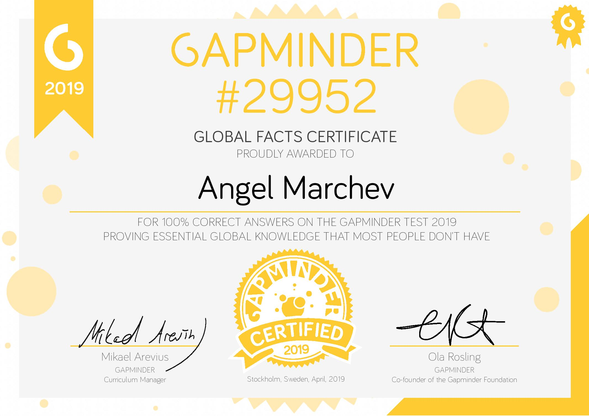
> 
> **Пералнята =\> за резерва.**
> 
> **Пост в негова чест. For fact based world
view\!**

xxxxxxxxxxxxxxxxxxxxxxxxxxxxxxxxxxxxxxxxxxxxxxxxxxxxxxxxxxxxxxxxxxxxxxxxxxxxxxxxxxxxx

## моята концепция за курса, а и за Света. 😊

**Моята концепция за курса, а и за Света. 😊**

**Практичната материалистка (скоро ще завърши БА 😊 ):**

**Дай нещо практично. С което да печелим пари и да правим кариера. Стига
с тази философия. Остави я за друг път\! **

**Всъщност задачите EXTRA са съвсем практични.**

**Yes, And… Нещо веднага полезно + нещо дългосрочно и мотивиращо. **

[**Мисията на БА**](2013%20graduation%20fixed%20subtitles.mov)

**МПУ: В най-чист вид приложение на научният метод за решаване на
практически проблеми. От всички области на живота\! (Като фото
проявяване).**

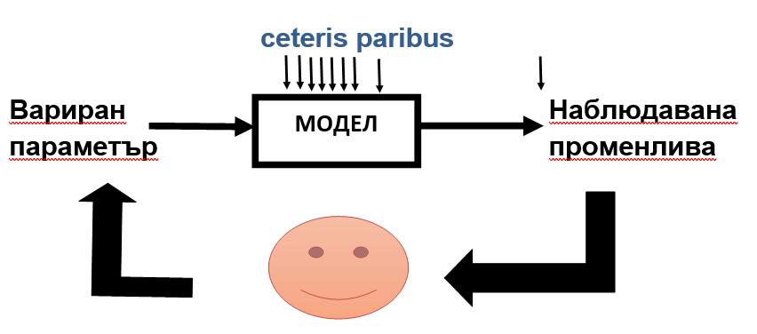

**Няма нищо по практично от добрата теория. (уравненията на
Maxwell):**

**Има доказал се емпиричен подход и Learning by Doing:**

**Компютрите са нашите кокали. Научният метод е най-големия кокал. 😊**

**Има грандиозна мечта, даваща посоката. Митът за Гилгемеш, плочка
11.**

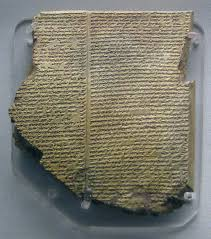

**Investments in Longevity: тъкмо за изследователски задачи**

**Моето любимо четиво. Това вече го
взехме.**

xxxxxxxxxxxxxxxxxxxxxxxxxxxxxxxxxxxxxxxxxxxxxxxxxxxxxxxxxxxxxxxxxxxxxxxxxxxxxxxxxxxxx

# Debrif, проповед, резюме до момента:

1.  **МПУ е ‘любимото ни чадо’.**

2.  
3.  **Поздравления\! **

4.  **Изпълнихме и преизпълнихме присъствените часове, а за всички
    останали теми от учебната програма има достатъчно време в
    лекциите.**

5.  **Теста: с повече въпроси, но запазена граница, т. е. ще стане
    по-лесен. **

6.  **Отбелязаните с жълто теми от учебната програма няма да са в теста
    (още не е публикувана).**

7.  **Четете Вестникът\! Гледайте ГРАФИК\! **

8.  **Четвъртък =\> на лекции; събота =\> консултации.**

9.  **С това сме изпълнили всички молитви и жертвоприношения към бога на
    администрацията. Но той не е толкова важен и не е нашия бог. **

10. 
11. **Истинският бог, на който служим е богът на науката. Той е
    ненаситен\! **

12. **Допълнителни задания по избор ‘Само за ценители’. Има. И ще
    добавим още. Защото обичаме Зубърът\! **

13. 
14. **Цел 1 на курса (практически умения) е постигната. Нашата част от
    работата е свършена. Сега остава да намерите кому да продадете
    тези умения по най-добра цена. Много наши възпитаници вече го
    направиха у нас и по света.**

15. 
16. **Цел 2. Знания по компютърно моделиране на сложни системи до
    най-предния фронт на съвременната наука. До някаква степен е
    постигната, продължаваме с лекции и DEMOS. Най-малко основните
    дескриптори ще са споменати.**

17. 
18. **Цел 3. Поглед още по-напред в бъдещето с малко ‘Футурология и
    трансхуманизъм‘ предстои.**

19. **Играта никога не спира\! **

20. 
21. **Предварително поздравявам всички тютори, носещи факела на знанието
    високо над главите си. **

22. **В 15.30, КОНСУЛТ = Прозорец за видео-консултации:**
    <https://hangouts.google.com/call/mwgt4cxsrrewlbpebodga5mazey?fbclid=IwAR17s65Zs5G-XX-Pn_NinIu0l2b5THMPyrWkyCGzz_JWm_4GFT98AVytum4>

23. **Маестро, музика\!
**

[**https://youtu.be/DZ\_NImYJke0?t=79**](https://youtu.be/DZ_NImYJke0?t=79)

[**https://www.youtube.com/watch?v=DZ\_NImYJke0\&ab\_channel=Andr%C3%A9Rieu**](https://www.youtube.com/watch?v=DZ_NImYJke0&ab_channel=Andr%C3%A9Rieu)

# Футурология, Longevity, Transhumanism

**Футурология, Longevity, Transhumanism**

**Футурология. Успешни и неуспешни прогнози. **

**Бойко въведение: Сърцето; отглеждане на органи; синтетична биология;**

**Постиженията на нашите зубри (списък)**

**Трансхуманизъм**

**Основни цели**

**Важни източници на информация**

**Книгата на Никола Данаилов**

**H+ pedia; Andre; David; Handbook; виж. ТРАНС;**

## разни

**Как се оценяваха знанията и уменията в кат. ‘Автоматика’, когато аз
бях студент?**

**Сега биха го нарекли ‘Open books’. **

Оставащи задачи:

**Запис за амебата**

**Dobawki kym kombinirani**

**ДР Сергей =\> смесване в лекц по МПУ, демо ФМУ**

**Demo Важна за бъдещето бележка: Не сега, но после … мулти-медийни
среди.** Collaborative innovation network Пример: GitHub-мark down;
notebook

ДЕМО с разни готови модели ще показваме ли?

Да, може Но там да пишем ли точки?

Все да повторя въпроса. Други демо модели ще показваме ли?

За точки още не знам. По-скоро бих импровизирал в момента.

Можеш ли да направиш списък с лесни ДЕМО-та и оценка колко време би
изяло всяко.

Ще погледна тестовите въпроси и ще проверя дали има тема, която не сме
покрили с лекции. Освен това ме друсат идеи за нови въпроси.

ami az prawih demonstracii na razni ne\]a - sredi, platformi i pro\`ie
za okolo edna lekciq wreme

Питам кои не са правени (ако има).

ами почти никакви демонстрации не съм правил

Готини са. В минали години сме правили демо.

.

Добре multi-agent modelling може с net logo и демо с разните среди за
моделиране и имам за прогнозиране няколко неща, най-вече prediction
markets това е извън нещата по msp мсп

Аз сега ще превключа на трансхуманска тематика. За СЕУ имам само няколко
бележки във връзка с структурна/редуцирана форма и 'чист екстраполатор'
+ малко спомени. Tell them a story.

Точно тези теми/въпроси/демо имах предвид. prediction markets
включително. Можеш ли да направиш списък/план с оценка на
необходимото време?

ахааа... ами то аз всеки път подбирам и обновявам - ще огледам

Освен това може да предложим доп. задания за ценители. След като свършат
задължителната част.

Списък = план = подобрени лекции.

Да. Самостоятелно/екипно задание = курсова задача = курсова
рабо

## Задания по AI:

[https://docs.google.com/document/d/1WhTkjpfbuyKPkv0dZGF\_vmRNwX4VXTZQwaE1OmmFK-U/edit](https://l.facebook.com/l.php?u=https%3A%2F%2Fdocs.google.com%2Fdocument%2Fd%2F1WhTkjpfbuyKPkv0dZGF_vmRNwX4VXTZQwaE1OmmFK-U%2Fedit%3Ffbclid%3DIwAR0ME4jPaLGTRBUKnyARlxrN8BvB-3Vrzk4Ush7gjRWHc5UMsVVtYXbhs_w&h=AT0XpKqHeyda6DJfgSxnSBWlsBrIatFYDI8OHgQe2ckZKTh08i2ACjqfgejH8TyRZKka03EMxMAMji82Daov-Z2PZvCie7xbY6AoRcOk4IHCU0n11_jSeGFShBqe0d27vs_Ujw)

## 

## Календарен план

**2021-09-24: Встъпителна лекция. Моето любимо четиво.**

**2021-09-26: Прогнозиране. Експертни оценки.**

**2021-09-26: Прогнозиране чрез екстраполация.**

**2021-09-26: Синтез на математически описания (прогнозиращи функции)**

**2021-10-01: Параметрична идентификация на математически описания.**

**2021-10-08: Модел и моделиране. Видове модели. ИМСС. Философия и
моделиране.**

**2021-10-15: Подходи при изграждане на моделите. **

**2021-10-22: Подходи при изграждане на моделите. **

**2021-10-29: Как се добива чисто „Злато“. Изследователско задание.
Много зайци с един куршум. **

**2021-11-05: Синтез на модели чрез много-редни селекционни процедури.
**

**2021-11-12: Синтез на модели чрез много-редни селекционни процедури.
Гадове.**

**2021-11-19: Синтез на модели чрез много-редни селекционни процедури.
**

**2020-11-26: Апология за Ханс Рослинг. Сертификати.**

**2020-12-03: Дебриф за курса. Книжков ден.**

**Методика за изграждане на модели. Етапи при моделирането. Генериране
на модела от варианти на блокове.**

**Невронни мрежи. Задачки.**

**Прогнозиране и моделиране на Longevity and Transhumanism. **

Демо на NetLogo. Задачка: Настройка на параметри. Ако има време.

**Моята концепция за курса, а и за света. 😊 **

**2021-12-10: резерва**

**2021-12-17: Администрацията: Всичко за 4-ти курс. Как да се подготвим
за държавния изпит? 'Стажовете през летния семестър'**

## КНИЖКОВ ДЕН ДОЙДЕ\!

**МПУ**

**КНИЖКОВ ДЕН ДОЙДЕ\!**

**Крайна анкета.**

**Дебриф за курса. +куизове, мотивация, МСП**

**Край, но всеки край е ново начало. **

**Зубри по МПУ\! **

**Точки – граници. **

**Зубър-зубрикуми за цялото следване\!\!\!**

**Точки – таблица. No tears\! Магия =\> Изненада. 😊**

**Драпащи. До 2021-12-03-20-00.**

**Без достатъчно точки, пропуснати и допълнителни задания. До
2022-01-19-21-00\!**

**Без достатъчни куизове =\> Изпитен тест.**

**Изпит: 2022-01-21-09-00.**

**Поправителна сесия: 2022-01-27-09-00**

**Електронни протоколи: 2022-01-31-09-00. Окончателно\!**

**Консултации и други.**

**Стаж.**
