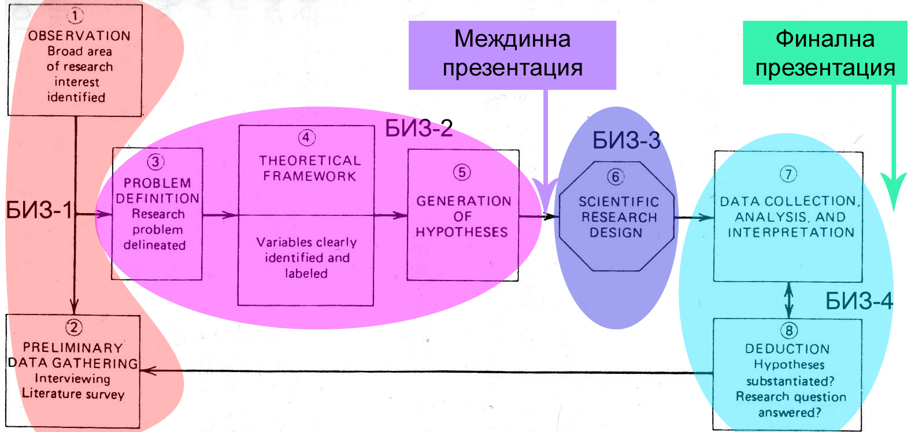
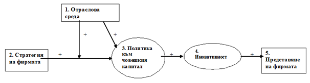
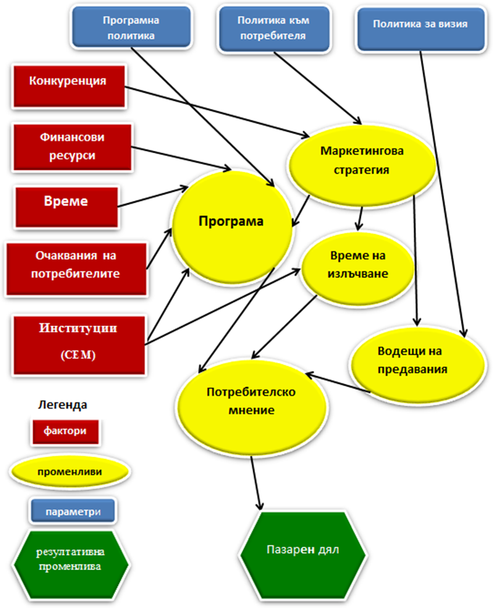
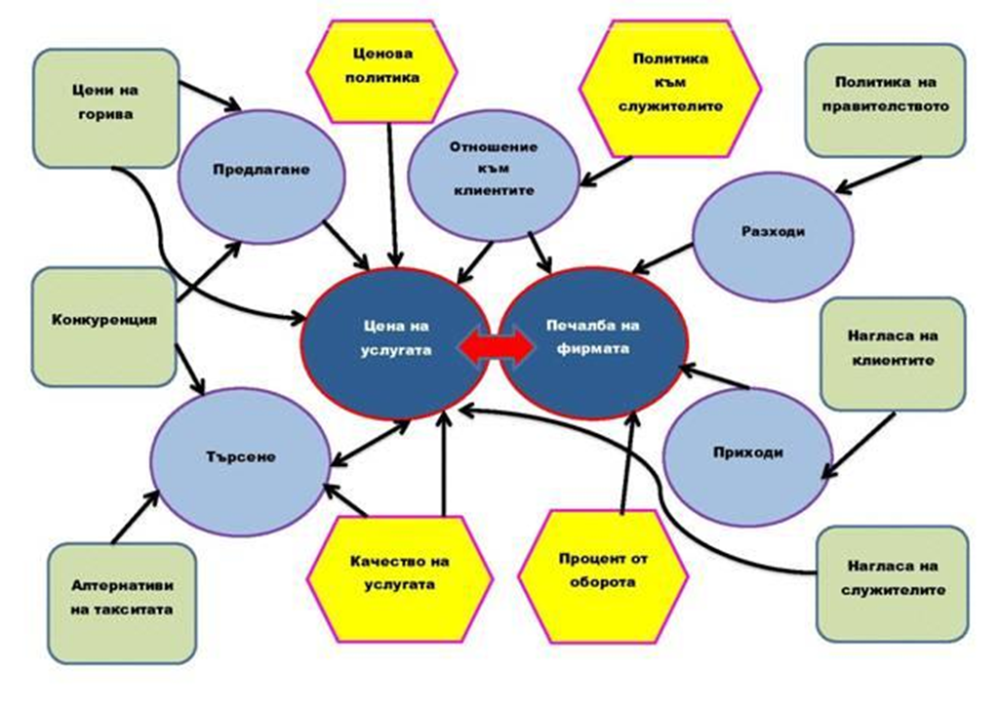
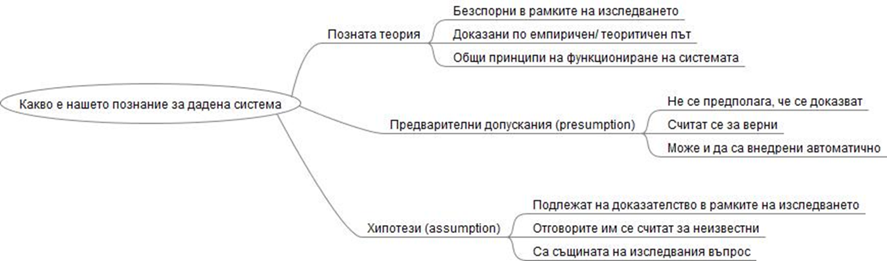
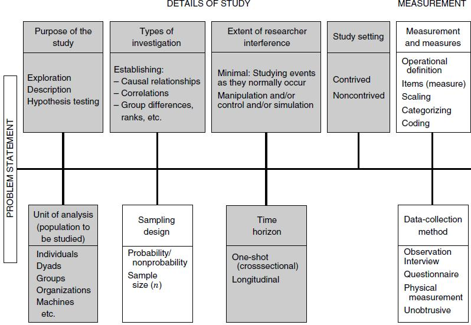
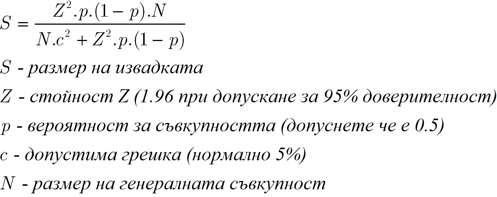
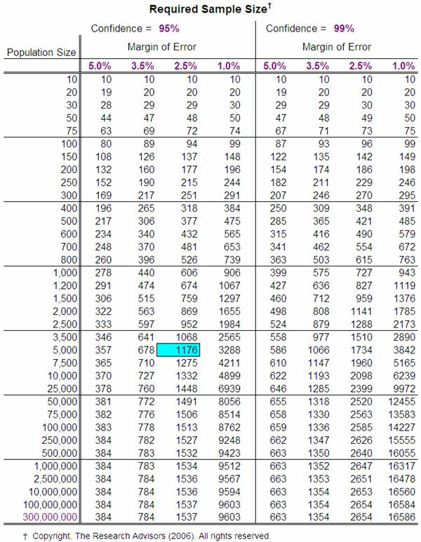
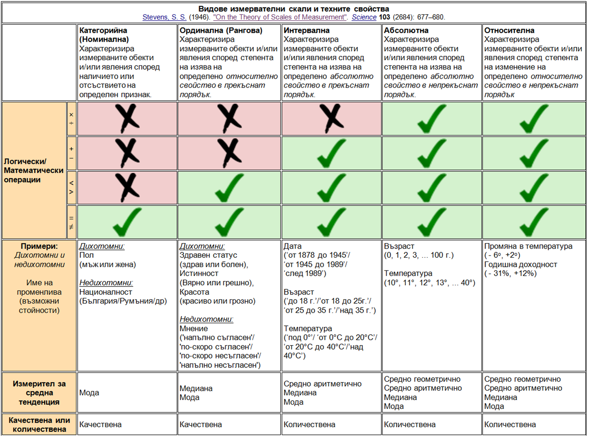

**Бизнес - изследователска задача (БИЗ) по дисциплината "Методи за
изследване в бизнеса"**

** **

**Основни теоритически източници по дисциплината:**

[**\* на български език -
УикиБА...**](http://basaga.org/wiki/index.php?title=%D0%A1%D0%BF%D0%B5%D1%86%D0%B8%D0%B0%D0%BB%D0%BD%D0%B8:%D0%9A%D0%B0%D1%82%D0%B5%D0%B3%D0%BE%D1%80%D0%B8%D0%B8)

[**\* на англисйки език - "Research methods for business" (Uma Sekaran)**](http://bookzz.org/dl/2216527/a2020f)

[**https://iped.bg/download.php?id=725**](https://iped.bg/download.php?id=725)

<!-- [**Вижте тук точките по заданието до момента...**](https://docs.google.com/spreadsheets/d/1JjBVYJSGG-zmWFwgUMTSfxjosstgYTVyEdxi4lgg8yg/edit?usp=sharing)-->

**0. Предварителна подготовка**

**0.1. Формиране на екипи.**

Всеки екип се състои от 2 до 3 участника, екипите се самоорганизират. 

**0.2. Изясняване на предмета на дейност на компаниите.**

Всеки екип ще представлява мениджъри или консултанти на  хипотетични
компании, пред които ще стои необходимо бизнес изследване. За сега,
обаче, е най-важно да решите каква е дейността на компанията ви.
Предметът и обектът на изследването ще бъдат изяснени в първи
етап от БИЗ.

**0.3. Регистриране в Google.Docs.**

За целите на дисциплината всеки екип трябва да се регистрира в
[http://drive.google.com/](http://drive.google.com/)
. Потребителско име трябва да бъде с формат: ekip.01.ba.14, паролата
поне 8 символа. След регистрацията всеки екип трябва да ми
сподели директорията си на адрес anmarchev@gmail.com с пълни редакторкси права.

Първият документ на сайта, който създавате е текстов файл -
заглавна страница със списъка на екипа.
Като него може да го редактирате. Точки получават тези, които са в
списъка към момента на изтичането на крайния срок за предаване на
поредния БИЗ.

**0.4. Предложение за тема на изследването.**

В дискусия на обсъждаме предложенията на всички екипи за тема на изследването. Не случайно организираме дискусия (макар и малко
хаотична), тъй като процеса на публично предлагане на идеи в дсикусионна среда подпомага креативното И конструктивното мислене. В
хода на дискуцията екипите избират:

\*каква е компанията, за която се прави изследването;

\*генерална област на изследването;

\*конкретна тема на изследването. 

 

В отговор на основните бележки, които имам относно оформянето на изследователскияте доклади на вашите колеги от миналите години,
ви предлагам някои съвети за оформяне на бизнес или научен текст:

 \*Заглавната страница се оформя както следва: заглавие – видът и тема на документа; надзаглавни данни – организация, отдел; подзаглавни
данни – автори, екип, град, година

 \* Съдържание: веднага след заглавната страница; номерация на разделите и подзаглавията точно както са в текста; с номера на страниците,
отговарящи на реалното разпределение на текста

 \* Увод: цел, задачи, тематичен обхват на текста, резюме (накратко за какво става дума).

 \* Оформянето на основния текст е разбира се най-важната задача. Трябва да присъства разнообразяване на текста като подзаглавия, подточки,
номерирано изброяване и пр. Задължително е номерирането на страниците. Когато използвате чужда мисъл (от друга книга, текст
или документ), задължително цитирате оригиналния източник библиографски под черта или в квадратни скоби. Фигури, таблици, формули се
озаглавяват (отгоре) и номерират.

 \* Заключение: как са изпълнени задачите, поставени в увода. Би трябвало читателя да прочете увода и заключението и да разбере
на кратко за какво става въпрос и какво е постигнато в текста.

 \* Други възможни части на текста: индекс на ключови думи или автори;
речник терминологичен или на абривиетурите в текста или на чуждиците в
текста; използвани информационни източници – номерирани и библиографски
описани; приложения - големи фигури или таблици, които биха разкъсали
логически основния текст, НО може и всякакви интересни материали,
които са близо по темата.

Правила за цитиране :
[http://www.nbu.bg/PUBLIC/IMAGES/File/departments/CENTER\_COG/Documents/7\_PravilaLiteratura.pdf](http://www.nbu.bg/PUBLIC/IMAGES/File/departments/CENTER_COG/Documents/7_PravilaLiteratura.pdf)

Друг полезен линк :
[http://www.mic.ul.ie/academicdepts/english/Documents/Cite%20It%20Right.pdf](http://www.mic.ul.ie/academicdepts/english/Documents/Cite%20It%20Right.pdf)

Полезен линк по темата е:
[http://www.aresearchguide.com/](http://www.aresearchguide.com/)

  

**1. Бизнес - изследователска задача 1 (БИЗ-1):
"Изясняване на ситуацията и дефиниране на изследователската
област"**

На този етап е време да се опише изследователския "сюжет". Така не само
ще се постави необходимата основа за предстоящите изследвания, но и ще
бъде подпомогнато вникването в проблемната област.

В допълнение екипите ще започнат работа върху презентациите, които ще
бъдат представени пред специално свикана комисия след около един
месец. Презентациите за сега могат да бъдат разработвани като
Presentation в среда Google. Docs  за да могат да  бъдат внасяни
необходими корекции в реално време (а от там винаги могат да
бъдат даунлоуднати). Най-вероятно ще е удобно допълнително всеки
член от екипа да си направи регистрация в Google.docs и така ще
можете всички непрекъснато да колаборирате върху вашия проект без
да е необходимо да се срещате лично (всъщност по тази дисциплина няма
да приемам никакви оправдания за закъснение - вече всички сте онлайн).

Паралелно с презентацията ще работите върху изследователски отчет,
следващ поредността на изпълнението на всички етапи от
изследването. Той  представлява съвкупност от 4-те БИЗ-а, но
оформени по подходящ начин. Може да го разработвате и сглобявате
паралелно със останалите неща като накрая на семестъра ще бъде
оценен отделно от БИЗ-овете.

В изследователския отчет се съдържа подробната аргументация по всяка
точка (и подточка) от БИЗ, докато в презентацията е само абстрактът
от най-важното за кратко отчитане пред комисията( не изпадайте в
излишни детайли, а се концентрирайте върху най-важното)
Презентациите ще бъдат две - междинна и финална. 

<!--За всеки БИЗ (презентация+отчет) ще има краен срок за изпълнение.
(Срокът за изпълнение на БИЗ1 е до 18:00 на
23.02.2017, Четвъртък. Тези, които предадат на време, ще получат точки;
тези от тях които са се справили по-качествено, показвайки системност,
оригинални идеи и способности за обобщаване на информация, ще получат
допълнително точки).

До тогава ще има следният график за възможни консултации по екипи
(следете промените, защото може да се добавят нови възможности за
консултации):

Сряда, зала 1048, от 10:00 до 16:00-->

\*Забележка - разбира се за кратки, бързи и ясни въпроси винаги може да
ме питате онлайн

Задачата за БИЗ1 е във вашата презентация и изследователски отчет да се
съдържат (презентацията трябва да маркира всичко съществено в няколко
слайда):

**1.1.  СЮЖЕТ: Пълно описание на организацията и моментната ситуация, в
която се намира.**

Сюжетът включва възможно най-пълно описание на организацията (виж
по-долу) и вникване в конкретната ситуация (като за улеснение
допускаме, че организацията оперира в момента в България). И за
двете неща е необходимо обосноваване, което виe ще подготвите във
вече оформящия се отчет. Вие поемате роля на мениджмънта на
организацията и/или на консултанти, наети от мениджмънта за
провждане на предстоящото проучване. 

Възможни (но неизчепателни) характеристики на бизнес организация:

  - > Вид на организацията съгласно юридическата й регистрация

  - > Икономически живот на организацията от регистрацията й в България
    > (в брой години)

  - > Наличие на чуждестранно участие

  - > Приблизителна стойност на балансово число

  - > Големината на организация (според класификатора за микро-,малък,
    > среден и голям бизнес), включително брой служители и брой лица с
    > ръководни функции

  - > Ниво на дейност на организацията (международно, регионално, местно
    > и прочие)

  - > Брой на клонове/филиали/офиси в цялата страна

  - > Сферата на дейност на организацията (Производство, Търговия,
    > Селско стопанство, Услуги, Консултанска дейност, Финанси,
    > Високи технологии, Други)

  - > Етап от жизнения цикъл, в който се намира.

  - > други

При избор и описание на сюжета, са възможни три варианта:

\- да опишете изцяло реален съществуващ казус (конкретна организация в
реалната й ситуация)

ИЛИ

\- да опишете реален казус с добавки, измислени от вас (както
преценявате, че е по-удобно, по-предизвикателно или по-ясно)

ИЛИ

\- изцяло измислен от вас казус (но трябва да е реалистичен).

**1.2. Описание на областта и насоката на изследването (етап 1 на
графиката).**

На този етап трябва да се изясни изследователската насока, като се опише
възможно най-ясно, това, което знаете за предстоящото ви изследване към
момента (ясно е, че предстоят много неща да ви се изяснят):

\* Какво? Какво ще е изследването? Какво ще изследвате? Какво се очаква
да се постигне? (да се изясни и обоснове същността на изследването).

\* Защо? Защо е (най-) необходимо точно такова изследване към момента?
Може да подкрепите аргументите си със статистически данни за
икономиката и бизнес климата и/или анализи на експерти и/или
нормативни документи (само не забравяйте, че се занимаваме с наука и
бизнес, които са противоположни концепции съответно на журналистика и
мрънкане).

**1.3. Предварително проучване на практиката (етап 2 на графиката).**

На този етап трябва да покажете истински примери от световната и наша
бизнес практика, които са имали подобни проблемни ситуации и как са
се справили (т.е. задачата е да се проучи и използва чуждия опит).
Може да се посочат примерни изследвания. Може да се посочат примери
и от класическите публикации по управление, а и от публикациите и
речите на управленските гуру.

Полезни линкове по темата, в които има разнообразна
информация:

[http://www.slideshare.net/?ss](http://www.slideshare.net/?ss) 

[http://www.innosupport.net/index.php?id=2387\&L=3](http://www.innosupport.net/index.php?id=2387&L=3)

[http://www.flgr.bg/bg/innovations/?subact=show\_cats](http://www.flgr.bg/bg/innovations/?subact=show_cats)

**2. Бизнес - изследователска задача 2 (БИЗ-2):
"Цели, задачи, основни понятия и хипотези на изследването"**

След първоначалната ориентация от БИЗ-1, е време да започне същинската
изследователска работа. Като сега е ред на конкртеното изясняване на
проблемната област и съществените й аспекти.

\!\!\!\!\! Припомням, че в процеса на работа от тук нататък, може да
променяте вече представени части на БИЗ и презентацията. Както ще
видите от заданието по-долу, някои от екипите има съществена част от
БИЗ-2 вече написана (без да знаят). Същевременно припомням, че не
измерваме резултата в брой страници или в брой гигабайти - не ме
радвате като видя всичките ви курсови работи от първи курс до сега
копирани наведнъж в заданието.\!\!\!\!\!\!

Както и до сега всички най-важни моменти от БИЗ трябва се намират и в
презентацията, която паралено разработвате. Не забравяйте, че  скоро
след като изтече срокът за предаване на БИЗ-2, ще представяте
презентацията си пред специално свикана комисия. В този смисъл
се очаква, че към края на срока за БИЗ-2 презентацията ви е изцяло
готова за показване.

<!--(Срокът за изпълнение на БИЗ-2 е до 19:00,
16.03.2017, docs.google.com. Тези, които предадат на време, ще получат
точки; тези от тях които са се справили по-качествено, показвайки
системност, способности за обобщаване на информация и
целенасоченост, ще получат допълнителноо точки. Не
закъснявайте, за да няма недоволни после \!\!).

Консултации:

Сряда, зала 1048, от 10:00 до 16:00-->

\*Забележка - разбира се за кратки, бързи и ясни въпроси винаги може да
ме питате онлайн

 

**2.1.  Постановка на изследването (етап 3 на графиката).**

Тази част на изследването, макар и кратка, е от осноовополагащ характер.
Лошото й формулиране може да доведе до подвеждане на цялото изследване в
грешна насока или по грешен път, което от своя страна би довело до
необходимост от преработка на цялата работа в по-късен етап.

Преминаване от обща област на изследването към изяснен изседователски
въпрос. Важно е въпросът да е много точно дефиниран - от една страна
да е достатъчно конкретен за да бъде възможно провеждане на изследване,
от друга да не се търси решение просто на симптом за проблем, а на
основен (в рамките на сюжета) проблем. Например: "спад в
производителността" не е достатъчно ясен проблем, а по-скоро
симптом (следствие) за друг проблем като "технологично износване на
активите", който от своя страна може да е просто симптом (следствие)
за още по-дълбок проблем като "необходимост от инвестиране в нова
технология". Вашата задача е да идентифицирате (след известен
размисъл и/или брейнсторминг, естествено) кой е този основен
проблем от избраната от вас обща област на изследването, който
лежи в основата на създалата се ситуация. Съответно да формулирате
изследователския въпрос, отговорът на който трябва да изясни част или
изцяло проблема. Например: "Инвестирането в избрана нова технология би
ли довело до подобряване на производителността?".

Полезен линк :
[http://www.innosupport.net/index.php?id=75\&no\_cache=1\&L=3](http://www.innosupport.net/index.php?id=75&no_cache=1&L=3)

Най-лесно е да се дефинира проблем от гледна точка на разлика между
желано (идеално) състояние и настоящо състояние. Така при
дефинирането на изследователския проблем може да подходите
като изясните желаното състояние (възможно най-ясно: конкретни
стойности на конкретни измерители) и да го съпоставите с
настоящото състояние.

Освен описание на съществуващия проблем, във вашия изследователски отчет
трябва да има малко аргументация/описание на вашите разсъждения относно
защо точно това е основния проблем в ситуацията и как сте стигнали до
поставения въпрос.

След като сте изяснили съществуващия проблем и формулирате
изследователския въпрос, може да се пристъпи към
очертаване на необходимото изследване. Не забравяйте, че с
изследването не решавате очертания от вас основен проблем, а
набирате информация за проблема и/или направо търсите възможни
подходи за решаване (т.е. отговаряте на поставения въпрос):

\* Цел на изследването - трябва да може да се дефинира в рамките на едно
изречение, Например: "Целта на изследването е да се изясни нуждата от
нова технология и при необходимост да се избере най-подходящата за
настоящите условия на предприятието."

\* Задачи на изследването са списък от (4-5) конкретизирани
последователни стъпки на изследването, решаващи поставената
цел. Те са така структурирани, че ако всичките се изпълнят, се изпълнява
и целта на изследването. Всяка задача се описва с по-едно изречение. В
дадения пример задачи могат да бъдат:"1. Да се открият необходимите
данни за инвестиране в нова технология; 2. Да се формулират критерии
за избор на нова технология; 3. Да се оценят всички потенциални
възможни технологии (включително и настоящата) по изяснените
критерии; 4. Да се съпоставят получените резултати; 5. Да се
направят изводи за целесъобразността на подмяна на технология с
новата."

\* Методически обхват на изследването - посочват се методите, които ще
бъдат използвани за решаване на всяка задача. Трябва ясно да
помислите, по-какъв начин е най-добре да се подходи за
отделните задачи. Как си представяте решаването им по
най-икономичен и същевременно информативен от изследователска
гледна точка начин.

\* Съществуващи реални ограничения при използване на методите и/или при
решаване на отделните задачи. Винаги е добре да се помисли за
възможните трудности от всякакъв характер (данни, срокове,
методика), свързани с изследването. Най-често идентифицираните
трудности резултират в дефиниране на ограничения на изследването,
които обаче трябва да се изтъкнат още в неговото начало. Така в
последващите етапи за да се заобикалят ограничението може да се
подходи, чрез издигане на опростяващи допускания или чрез модификация
на метод.

**2.2. Теоретическа обосновка (етап 4 на графиката).**

За тази част на заданието ще се наложи да отделите съществен ресурс от
време. Теоретическата обосновка има задачата да изясни каква е
концепцтуалната основа на различните апекти от изследването,
което предстои да бъде проведено. Какво твърди общоприетата теория
за изследваните величини, какви се взаимодействията между тях, каква е
терминологията. В рамките на този раздел трябва да се направи кратък
обзор на наличната научна и научно-популярна литература и предишни
проведени изследвания,  свързани с изследваната област и конкретно с
поставените задачи.

Всяка теоретична обосновка е добре да бъде структурирана в обособени
подраздели, всеки от който логически следва и произхожда от
предходния на принципа "от общо към конкретно":

\* В началото на теоретичната обосновка обикновено се описват най-общите
постановки и същността на изследването. За основните понятия се
уточняват формулировките и дефинициите им. Величините във всяка
една област, които подлежат на изследване и дефиниране, биват фактори,
параметри и променливи. Може да изведете речник с основните понятия,
така всеки незапознат с темата ще може бързо да се ориентира.

\* Провежда се системен анализ на изследвания проблем. Така се получава
система от величини. Величините в всяка една област, които подлежат на
изследване и дефиниране, биват фактори, параметри и променливи.
Примерната схема по-долу показва в най-прост вид видовете
величини, но най-вероятно във вашия случай системата ще се получи
доста по-сложна. Схемата ще ви помогне много за основната логика и ще ви
насочи как да опишете връзките. Всяка една връзка трябва да бъде
аргументирана. Не се впускайте да съчинявате преди схемата ви да
е
готова\!\!\!  

 

 

 Трябва конкретно и ясно да си изясните, кое във вашето изследване е :

●Факторите – това са  са въздействия от околната среда, неподлежащи на
контрол от изследователя. Примерен фактор е държавната политика спрямо
отрасъла, в който оперира вашата компания) . (1. на схемата)

●Параметрите  - те могат да се представят като допускания издигани от
изследователя, като при промени в техните стойности се изменят
възможните резултати. (2. на схемата). Примерен параметър може да
бъде маркетинговата стратегия на компанията.

●Променливите -   най-важните величини в едно изследване. Те се
изменят/зависят/следват от промените във факторите, параметрите
и/или други променливи. Биват междинни променливи (3. и 4. на схемата)
и Изходни (или резултативни) променливи (5. на схемата). 

Пример, обвързващ  тези 3 величини е :  Конкуренцията(фактор) в отрасъла
е нещо, което няма как да предвидите и не зависи от вашата компания, но
вашият бизнес може сериозно да бъде повлиян и изтласкан на дъното. В
резултат на това вие променяте маркетинговата си стратегия(параметър)
и я проектирате така, че клиентите да се мотивират да избират новия ви
продукт, вследствие от това, че рекламните кампании, които сте провели
са създали емоционална обвързаност(междинна променлива) между
потребителите и компанията ви. Резултат – повишени продажби
на новия продукт ( резултативна променлива).

\- подходяща хипотеза е : Продажбите на новият продукт ще се увеличи,
ако се наблегне на емоционалната връзка между компанията и
потребителя.

 

\* По-нататък се изясняват по-конкретни аспекти на изследваните
величини, свързани с настоящото изследване. Характеристиките им,
които са съществени и важни за изследването и т.н. Изясняват се посоката
и силата на връзките между тях.

\* Към края е изяснен конретният проблем, описан в детайли и чрез
схематично описни взаимодействия.

\* След като приключите работа по теоретическата обосновка, би трябвало
да има вече списък от използвани информационни източници (който,
разбира се се слага винаги накрая на цялото изследване, преди
приложенията). Считайте за задължително цитирането в текста, тъй
като липсата на цитиране показва липса на познания на теорията.

**2.3. Издигане на работни хипотези (етап 5 на графиката).**

Като резултат от теоритическата обосновка и преди да се стигне до
изграждане на същинското изследване се издигат работни хипотези.
В рамките на всяко изседване работните хипотези могат да бъдат с
различен брой - от 3-4 до 12-15. За изясняването на всяка
хипотеза по-късно ще бъде насочен специален раздел в
изследването. В някои случаи проверката на хипотеза изисква
задаването на относително прост въпрос на множество респонденти (т.е.
проверката е проста), докато в други случаи преди да е възможна
проверка, трябва да се извършат множество изследователски
дейности. Ето защо не може да се каже колко трябва да са
работните хипотези за дадено изследване.

Хипотезата е логически обвързана догадка относно връзката между две или
повече величини в изследването (променливи, фактори, параметри),
изказана в проверяема форма. В идеалния вариант хипотезата трябва
да може да получи еднозначен прост отговор, който да я отхвърли или да я
потвърди. Отхвърлянето или потвърждаването й трябва да носи достатъчна
информация, за решаването (по един или друг начин) на даден въпрос.

При разработване на дадена хипотеза е добре да помислите доколко тя:

\* може да бъде тествана (необходимо условие за да бъде проведено
изследване)  
\* е опростена (т.е. спестява максимално необходимостта от набирани
данни)  
\* има обхват (т.е. може да реши въпроси за много случаи свързани с
изследваното явление)  
\* е плодотворна (т.е. може да решава въпроси и за други явления)  
\* е консервативна (т.е. е съгласувана с настоящите познания и факти).

Работните хипотези могат да се формулират, съобразявайки се с две
основни категории:

\* Лексикално те могат да се оформят като теърдение или от типа
"Какво.... ако...". Например хипотезата: "Колкото по-нова е
технологията, толкова по-висока ще е производителността" може да
се оформи и така "Ако технология 'А' е по нова от технология 'В', то
технология 'А' ще доведе до по-висока производителност".

\* Насочеността на хипотезата означава до колко издигнатата хипотеза
изказва посока на влияние. Възможностите са две:

\- Директната хипотеза назовава ясна връзка и посока на промяна между
изведените два (или повече) величнини на изследване. В директните
хипотези се срещат думи  като "повече", "по-малко", "позитивна
връзка", "негативна зависимост" и пр. Например: "Колкото по-нова е
технологията, толкова по-висока ще е производителността".

\- Индиректната хипотеза озказва (проверява за) наличие на връзка между
величините в изследването. Например "Има връзка между новостта на
технологията и производителността".

 

**3. Бизнес - изследователска задача 3 (БИЗ-3):
"Проектиране на изследването" (етап 6 на графиката)**

До тук бяха изяснени концептуалните, теоритичните и предварителните
особености на цялото изследване. В тази част се описват конкретните
намерения за предстоящото провеждане на изследване (в смисъла на
набиране и обработване на данни).  Важно е да се изясни какво
точно ще правите с данните, преди още да сте ги събрали. Обратното е
най-голямата възможна грешка при едно изследване. Припомням, че в
процеса на работа от тук нататък, може да променяте вече
представени части на доклада и презентацията (със сигурност ще
се наложи да се коригират прекалено амбициозните проекти за използване
на много изследователски методи).

<!--(Срокът за изпълнение на БИЗ-3 е до 18:00 на
06.04.2017, Четвъртък. Тези, които предадат на време, ще получат точки;
тези от тях които са се справили по-качествено, показвайки системност,
вникване и методически познания, ще получат допълнително точки. След
06.04 ще навлезем в период на "набиране на емпирични данни", в който бих
искал да помоля всички екипи да участват взаимно в изследванията на
другите като респонденти/експерти и т. н. Така ще симулираме
данните, с цел да има някакъв емпиричен материал за
БИЗ-4.)

Консултации:

17.03.2017, 13:00 - 14:00, зала П034, Инструктаж с демонстрация, как се
прави онлайн въпросник в Google Drive 

17.03.2017, 14:30 - 17:00, зала 5026, консултации (и ако искате се
упражнявате) за онлайн въпросник в Google Drive (Поли и Наталия)

Сряда, зала 1048, от 10:00 до 16:00-->

 

\*Забележка - разбира се за кратки, бързи и ясни въпроси винаги може да
ме питате онлайн

 

**3.1.  Методически особености на изследването.**

В рамките на няколко параграфа трябва да се опишат и аргументират
конкретно всички характеристики на предстоящото изследване (виж
фигурата по-горе):

\- Същност на изследването - Изяснява се вида на изследването:

\*описващо текущо състояние - проучва се и се изяснява състоянието на
изследваното явление/среда/система

И/ИЛИ

\*откриване на нови области/факти/принципи - провежда се при наличие на
неизяснени, но вече появили се ефекти и явления

И/ИЛИ

\*проверка на хипотези - провежда се когато има ясно
предположение/предложение за реашаване на даден
проблем, с цел да се провери до колко е подходящо

\- Метод на набиране на данни - на кратко се изяснява точно в какво ще
се изразява и как ще се проведе набирането и обработката на данните.

\- Ниво на изследователска намеса - в зависимост от типа изследване може
да имате различна намеса в поведението на изследваните обекти:

\* без намеса - вашите действия по време на набирането на данни и по
никакъв начин не  влияят на поведението на изследваните обекти
(напр. при наблюдение или при кабинетно проучване)

\* слабо до средно ниво на намеса - до някъде повлиявате на поведението
на обекта. Най-често това е нивото на намеса при анкетните проучвания,
където респондентът е отговаря на въпросите, но ако го нямаше
проучването не би го направил. Някои анкети имат по-голямо
вмешателство в поведението на респондентите от други.

\* средно до високо ниво на намеса - съществено повлиявате на
поведението на обектите на изследване. Такъв типично е
случаят при експертни проучвания (присъствени или анонимизирани),
при провеждане на интервю и при изследвания с управляващи въздействия
(когато се изследва ефектът от нововъведение или новост в системата)  
\* пълна намеса - когато всички фактори на поведението на изследвания
обект са във ваш контрол (напр. при компютърна симулация или при
лабораторен експеримент)

\- Дефиниране на отделен обект на изследването (ясно описание на
характеристиките на целевата група респонденти или експерти или
отделни единици на изследване),  дефиниране на размера на генералната
съвкупност на изследването (колко са общо обектите на изследване -
съветвам да използвате статистиките на НСИ и други публични данни,
като неминуемо ще се наложи да направите известни допускания) и вида
на извадката (типично е случайна извадка, но много често може да имате
пълна извадка - при малки съвкупности- или гнездова извадка. След като
знаете генералната съвкупност и вида на извадката определете размера
на извадката (на практика колко отделни единици трябва да включите в
изследването) по метода на за определяне на извдка (в социалните науки
се приема за очаквано ниво на доверителност 95% и допустима грешка от
5%).

Забележка: при експертните проучвания и при кабинетните проучвания,
съзнателно не се спазват критериите за статистическа значимост,
описани по-долу, тъй като се предполага, че източниците на
информация са с висока степен на достоверност и валидност. За
да се гарантира това, обаче, те трябва да бъдат селектирани възможно
най-обективно. Така че, критериите за включване на всеки отделен
източник (експерт/документ) като обекти на изследването трябва да
са възможно най-ясно и обективно описани.

Формула:

 

Таблица за определяне на случайна
извадка:

[Може да използвате този калкулатор за
определяне на случайна
извадка.](http://www.pragmatica.bg/calculators.php)

\- Времеви хоризонт - изяснява се дали изследването е лонглитудно
(набира се една и съща информация от едни и същи обекти през
определен период от време) или в разрез (търси се максимално
полезна информация, към даден момент и се съпоставят обекти).

\- други характеристики може да бъдат също описани, ако сметнете за
необходимо (всяко изследване има специфични особености, важни за
провеждането му).

\- Задължително трябва да има обосновка за икономичност  
1\) изяснявате колко е стойността на изследвания от вас проблем -
типично е разлика между настоящо и желано състояние, измервано в
паричен измерител (може да се наложи да направите някои реалистични
допускания)

2\) Правите кратък бюджет на разходите за провеждане на изследването по
видове

3\) Бюджетът на изследването би следвало да се ограничи до около 5% от
стойността на решавания проблем

 

**3.2. Последователност на работата.**

Описват се последователните стъпки (раздели от изследването), които
предстоят да се предприемат. План за действие за това как точно ще
се набере и обработи информацията. Добре е да се опише как тези стъпки
се разполагат в календарно време, колко отнема всяка и прочие. Може да
си представите този план и като блоксхема от операции, особено ако във
вашето изследване има разклонения на действията (например ако дадена
хипотеза се приема, то правим едно нещо, а ако се отхвърля, то правим
друго нещо). Добре би било на този етап да обърнете внимание на
концепциите за план на експеримента (на англ. "experimental
design").

 

**3.3. Електронен въпросник в Google.Docs .**

(Прецених, че е най-подходящо този раздел да се обособи като отделен и
да се оценява отделно. [Известна помощна
информация може да видите
тук...](http://ua.basaga.org/images/google_form.pdf))

Независимо кой метод за набиране на информация ще използвате, при всички
случаи ви е необходим електронен въпросник - дали попълван от
интервюиращия/наблюдаващия или от респондента. В рамките на
заданието ще изготвите въпросник в Google.Docs, чрез който ще е
възможно да се въвежда информация в електронна таблица директно
от улеснен потребителски интерфейс. Много е важно въпросникът да бъде
адекватен на вашите хипотези и да ви помага да за анализа на
резултатите, всеки въпрос трябва да е мотивиран и да има
насоченост към изследването. Ако анкетата ви не е правилно
съставена ще се сдобиете само с ненужна информация, която по
никакъв начин няма да спомогне за целите на вашето изследване.

Освен самото реализиране на въпросника в Google.docs, тук се описват
всички необходими детайли за всеки въпрос/група въпроси, като
например:

\- изследователска насоченост към даден раздел на изследването

\- тип (отворен, затворен, затворен с повече от един възможен, смесен,
решетка и прочие)

\- вид информация, която се набира

\- последователност

\- връзка с други въпроси

\- кодиране (цифрено-буквени означения за всеки въпрос и предложен
отговор)

\- скала и измерване (бих ви посъветвал да обърнете внимание на
Ликертови скали, без те да са навсякъде приложими). Помислете и
докажете, че избраните скали измерват точно това, което искаме и го
мерят с достатъчна точност.

Полезни линкове по темата за ликертовите скали
:

[http://whatis.techtarget.com/definition/Likert-scale](http://whatis.techtarget.com/definition/Likert-scale)

[http://poincare.matf.bg.ac.rs/~kristina/topic-dane-likert.pdf](http://poincare.matf.bg.ac.rs/~kristina/topic-dane-likert.pdf)

 

\- ако даден въпрос е насочен към провеждане на следващи етап от
изследване, това трябва да се обясни (много често се налага в
такъв случай в първия етап въпросът да е отворен)

\- общ дизайн на въпросника - от гледна точка на по-добрата му
използваемост.

 

**3.4. Изследователски инструментариум. **

Тук се описват конкретните софтуерни решения (методики), които ще
използвате за набиране и обработка на данните - точно кой
софтуер, с точно коя негова функция, (ако е необходимо) с точно
кои настройки. Къде ще бъде разпространен  въпросника.

**4. Бизнес - изследователска задача 4 (БИЗ-4):
"Обобщение на данните, анализи и изводи" (етапи 7 и 8 на
графиката)**

<!-- (Срокът за изпълнение на БИЗ-4 е до 18:00 на
05.05.2017, Петък. Тогава трябва да е поставена и актуална версия на
презентацията и окончателната версия на БИЗ-4. Тези, които предадат
на време, ще получат точки; тези от тях които са се справили
по-качествено, показвайки системност, оригиналност на
представяне на данните и способност за извеждане на научни
анализи, аргументи и изводи, ще получат допълнително точки. Преди
това на 05.05 ще бъдат проведени окончателните презентации.
Окончателния изследователски отчет трябва да се качи до
10.05.2017, 18:00).

\!\!На финалната презентация се съсредоточете върху резултатите,
изводите и правилната им аргументация, както и приемането или
отхвърлянето на хипотезите, които сте поставили. Не е необходимо да
давате излишна техническа информация от БИЗ 3, само най-главното\!\!\!

Консултации (след ваканцията):

Сряда, зала 1048, от 10:00 до 16:00

Четвъртък, зала 2066, от 12:30 до 17:00-->

 

Припомням, че в началото на срока за БИЗ-4, сме определили период на
"набиране на емпирични данни", в който бих искал да помоля всички
екипи да участват взаимно в изследванията на другите като
респонденти/експерти и т. н. Така ще симулираме данните, с
цел да има някакъв емпиричен материал за БИЗ-4. Би било добре за
около една седмица да успеете да наберете колкото може повече от
необходимите ви данни  (в идеалния случай - всички от извадката си,
но не е фатално ако са по-малко).

След като са събрани данните от проучването, идва време да се обработват
(съгласно възходящ процес на емпиричния подход):

1\) Данните се събират в удобен за работа вид\*.

2\) Така събраните данни се обработват по предвидения в методическата
част (БИЗ-3) начин, с което се получава полезната за изследването
информация.

3\) Събраната информация се анализира, като се търсят тенденции и
закономерности, с което се изясняват факти и зависимости
(съждения) относно изследвания обект/въпрос/явление. По нататък
тези новооткрити по отделно съждения се обобщават в цялостни изводи и
се описват в общ текст.

<table>
<thead>
<tr class="header">
<th><blockquote>

ПОЗНАНИЕ

</blockquote></th>
<th><blockquote>

 

</blockquote></th>
<th><blockquote>

БИЗ:4.3

</blockquote></th>
</tr>
</thead>
<tbody>
<tr class="odd">
<td><blockquote>

↑

</blockquote></td>
<td><blockquote>

общи изводи/заключения

</blockquote></td>
<td><blockquote>

БИЗ:4.3

</blockquote></td>
</tr>
<tr class="even">
<td><blockquote>

СЪЖДЕНИЯ

</blockquote></td>
<td><blockquote>

 

</blockquote></td>
<td><blockquote>

БИЗ:4.3

</blockquote></td>
</tr>
<tr class="odd">
<td><blockquote>

↑

</blockquote></td>
<td><blockquote>

обобщение/анализи

</blockquote></td>
<td><blockquote>

БИЗ:4.3

</blockquote></td>
</tr>
<tr class="even">
<td><blockquote>

ИНФОРМАЦИЯ

</blockquote></td>
<td><blockquote>

 

</blockquote></td>
<td><blockquote>

БИЗ:4.2

</blockquote></td>
</tr>
<tr class="odd">
<td><blockquote>

↑

</blockquote></td>
<td><blockquote>

обработка/изводи

</blockquote></td>
<td><blockquote>

БИЗ:4.2

</blockquote></td>
</tr>
<tr class="even">
<td><blockquote>

ДАННИ*

</blockquote></td>
<td><blockquote>

 

</blockquote></td>
<td><blockquote>

БИЗ:4.1

</blockquote></td>
</tr>
</tbody>
</table>

 \*ЗАБЕЛЕЖКА: виж пояснението за предварителна обработка на данни.

 Припомням, че в процеса на работа от тук нататък, може да променяте
вече представени части на доклада и презентацията.

 

**4.1. Кратко описание на събраните данни.**

В рамките на няколко параграфа трябва да се опишат вжните особености на
така събраната емпирична база (ако са събрани няколко различни типа
данни, от няколко различни типа изследване, напр. експертно и
социологическо, се описват по отделно) :

\- Начин на събиране

\- Период на събиране

\- Брой събрани данни

\- Предварителна обработка на данните се прави така, че от суровите
набрани данни да се преработи базата данни в удобен за работа и
анализ вид. Предварителната обработка е необходима по три възможни
причини:

\*допъване на данни: почти е сигурно, че преди още да сте започнали
същинската обработка ще се наложи предварително да се "допълнят и
коригират" данните. Става въпрос за допълване на липсващи полета,
които респондентите са пропуснали, но са необходими за обработката.
Обикновено се използват статистически алгоритми за попълване на липсващи
данни, но в някои случаи може и да се подходи по-семпло. Например може
да се попълни средна стойност за цялата извадка по този въпрос или да
се попълни най-неутралния отговор или друго.

\*Друга необходима дейност по коригирането на данни се налага ако за
целите на обработката ви трябват кодирани данни (например за
обработка в SPSS). Тогава трябва всеки възможен отговор да се
кодира еднозначно и на отделен файл да се замести отговора на всеки
респондент със съответния код.

\*създаване на нови променливи, необходими за по-нататъчния анализ, чрез
някаква математическа, логическа или смислова преработка на съществуващи
данни.

\- други особености при набиране на данните.

 

**4.2. Обработка на данните и изводи.**

Тук се прилагат методите описани в последователността на работата
(БИЗ-3), стъпка по стъпка (естествено става дума само за онези
стъпки, при които има обработка на емпирични данни). Всеки метод
или етап се описва в отделен раздел, озаглавен по съответния начин и
номериран последователно (4.2.х).

Накратко: спазвате определения от вас план, като внимавате да използвате
коректно методите. Важното тук че, че прилагате даден метод за обработка
върху един отделен набор данни и констатирате самостоятелно факт(че)
и/или извод(че), БЕЗ да го свързвате с някакви други изводи, които
сте направили или предстои да направите.

Така например в една отделна стъпчица (от даден подраздел) може да
изчислите чрез осредняване възрастта на респондентите и да
стигнете до извод за средната възраст на клинтите. В друга
отделна стъпчица може да изчислите чрез филтириране съотношението
на мъже и жени сред клиентите си и т.н.

Обръщам внимание, че дори малко допитване с малък брой респонденти може
да доведе до произвеждане на МНОГО много числени изводи. Ето защо е
добре извежданите тук изводи да са такива, че да ви помoгнат в
посоката на изследването (проверка на работните хипотези,
изпълнение на задачите, отговор на изследователския въпрос и
прочие).

 

**4.3. Анализи и обобщения.**

В предишната част (4.2.) от всеки етап от изследването са изведени
отделни факти/извод. В тази част те се обобщават в по-генерални
зависимости и в цялостна "картинка".

Тук може да се кръстосат два (или повече) извода, от 4.2. и да получите
ново синтезирана зависимост (използвайки по-горният пример може чрез
комбинация да се стигне до обща структура на клиентите по признаците
пол и среден доход).

Изработвайки множество комбинирани и обобщени съждения стигате до общи
изводи. Обръщам внимание, че е добре извежданите общи изводи да
стъпват и да включват САМО вече изведени изводи от 4.2. без
излишно "творчество".

Сега е моментът тези изводи да се съпоставят с издигнатите работни
хипотези. В идеалния случай за всички издигнати работни хипотези
трябва да се получи отговор. Отговорите могат да бъдат в общи линии
три: потвърдена хипотеза, отхвърлена хипотеза и неопределност за
дадена хипотеза.

В края на този раздел трябва да се стигне до окончателно заключение
относно всички въпроси и задачи на настоящото изследване, като
същевременно може да се стигне до издигане на нови хипотези и
насоки за бъдещи изследвания.

Ако решите да обработвате данните с MS Excel, може би най-полезно ще ви
бъде да използвате Pivot Table. Може да прочетете
[тук малко
инструкции](http://data-mining.beep.com/files/pivot_table.pdf).
Доста по-мощен инструмент за анализ е [Power
Pivot](https://support.office.com/bg-bg/article/%d0%a1%d1%82%d0%b0%d1%80%d1%82%d0%b8%d1%80%d0%b0%d0%bd%d0%b5-%d0%bd%d0%b0-Power-Pivot-%d0%b2-%d0%b4%d0%be%d0%b1%d0%b0%d0%b2%d0%ba%d0%b0-%d0%bd%d0%b0-Microsoft-Excel-a891a66d-36e3-43fc-81e8-fc4798f39ea8?ui=bg-BG&rs=bg-BG&ad=BG)
.

Ако решите да обработвате данните в SPSS, ви препоръчвам да
[разгледате следната помощна
информация...](http://ebox.nbu.bg/statmethods/Base%20Guide/Bulgarian/SPSS.pdf)

 

**4.4. Онагледяване на данните и анализите.**

Това не е отделна част от изследването, но го пиша, за да наблегна на
необходимостта от намиране на подходящ информативен и оригинален
начин за онагледяване. Отнася се за всички отделни части на БИЗ-4 и
за финалната презентация. Съвременните технологии дават широк спектър от
възможности в тази насока и е необходимо всеки мениджър (още повече
бъдещ) да има такива умения. Тук давам само някои идеи, но имате
пълна свобода на действие за откриване на други (откриването на
подходящ, оригинален, достъпен нов сайт/софтуер за онагледяване на
данни и използването му се модифицира). Оценявам високо всяка проява на
креативност и графично представяне на данните различно от стандарта в
Excel.

 

ИНФОРМАТИВНОСТ ПРИ СТАНДАРТНИТЕ ФОРМА ИНА ОНАГЛЕДЯВАНЕ:

\- Книгата "[Say it with
charts](https://www.dropbox.com/s/t89dex1crrlafy0/7-2_Say_it_with_charts.pdf?dl=0)"
е основен източник при обучението за визуализация на данни

\- Можете да се вдъхновите от няколко добри практики за представяне на
данните -
[http://www.slideshare.net/fidelman/125-insanely-creative-infographics-charts-and-graphs](http://www.slideshare.net/fidelman/125-insanely-creative-infographics-charts-and-graphs)

ОРИГИНАЛНИ ФОРМИ НА ОНАГЛЕДЯВАНЕ

\- [Филм на Стенфордския университет (разделен в
8 епизода)](http://datajournalism.stanford.edu/index.html)

\-
[ManyEyes](http://www-969.ibm.com/software/analytics/manyeyes/) е
един от сайтовете, които се прокламират във филма, но ако гледайте
внимателно филма - има още много.

\- За ефектно онагледяване на честотен контент анализ, може да
използвате Word Cloud, за целта
препоръчвам [http://wordle.net](http://wordle.net/)

\- Много интересни статии за визуализиране на
данни:

[http://blogs.hbr.org/2014/05/visualizing-zero-how-to-show-something-with-nothing/](http://blogs.hbr.org/2014/05/visualizing-zero-how-to-show-something-with-nothing/)

[http://blogs.hbr.org/2014/05/how-data-visualization-answered-one-of-retails-most-vexing-questions/](http://blogs.hbr.org/2014/05/how-data-visualization-answered-one-of-retails-most-vexing-questions/)

[http://blogs.hbr.org/2014/05/the-case-for-the-5-second-interactive/](http://blogs.hbr.org/2014/05/the-case-for-the-5-second-interactive/)

[http://blogs.hbr.org/2014/05/generating-data-on-what-customers-really-want/](http://blogs.hbr.org/2014/05/generating-data-on-what-customers-really-want/)

[http://blogs.hbr.org/2014/05/10-kinds-of-stories-to-tell-with-data/](http://blogs.hbr.org/2014/05/10-kinds-of-stories-to-tell-with-data/)

 

ДИНАМИЧНИ (АНИМИРАНИ) ДИАГРАМИ, ОСОБЕНО ПОДХОДЯЩИ ЗА ПРЕЗЕНТИРАНЕ НА
ЖИВО

\- [Сайтът и платформата на гениалния Ханс
Рослинг (разгледайте първо "Videos", след това "Gapminder
World").](http://gapminder.org/)

\- Google.Docs закупиха софтуера от Ханс Рослинг и го направиха достъпен
като Gadget (Motion chart) в електронните таблици - за повече информация
може да погледнете
[тук](http://docs.google.com/support/bin/answer.py?answer=91610) и [тук](http://www.youtube.com/results?search_query=motion+chart+google.docs&aq=f).

Сайтът [http://piktochart.com](http://piktochart.com/) предоставя
възможности за интерактивни графики и за инфографики.

 

СЪВРЕМЕННИ ФОРМИ ЗА ПРЕЗЕНТАЦИИ

\- [Prezi.com](http://prezi.com/) е сайт
за изработка на динамични Flash презентации, които могат да се свалят и
като файл.

 

\- [Powtoon.com](http://powtoon.com/) е
нов интерактивен начин за представяне на анимирани презентации.

\- [https://sway.com/](https://sway.com/)
е един от най-новите подходи за изграждане на информативни флаш
презентации

\- Отново друг оригинален и много полезен подход за онагледяване (и
систематизиране на идеи) са мисловните карти (Mind maps). Може да
видите повече за тях на
[http://mindmapping.bg/mindmaps/](http://mindmapping.bg/mindmaps/about/) (има
и линк за сваляне на оригиналния софтуер на Тони Бюзан). 

\- Безплатен (но не толкова "шарен") софтуер за мисловни карти е
FreeMind
[http://freemind.en.softonic.com/download](http://freemind.en.softonic.com/download)

\- Друг полезен линк по темата
е: [http://www.aresearchguide.com/](http://www.aresearchguide.com/)

 

ОБЩИ РЕСУРСИ

\-
[http://www.coolinfographics.com/tools/](http://www.coolinfographics.com/tools/)
е страница с линкове към десетки онлайн сайтове и платформи за
онагледяване на емпирични данни и други.

 

**ФИНАЛЕН ОТЧЕТ**

Поради многобройните въпроси (главно отнасящи се за неща, които сме
говорили в час), все пак реших да напиша следните няколко реда с
инструкции за финалния отчет:

1\) Финалният отчет не е нищо повече от събраните на едно място последно
коригирани версии на БИЗ-1, БИЗ-2, БИЗ-3, БИЗ-4. Всичко онези корекции,
които са възниквали пост-фактум за една или друга част от БИЗ трябва да
бъдат нанесени. Самите разделения на отделни БИЗ-части до сега са
направени малко изкуствено и може спокойно да махнете заглавията
"БИЗ-1", "БИЗ-2" и пр.

2\) Финалният отчет се оценява като общо цяло и затова в него трябва да
се следва логическа рамка и последователност на представяне на
информацията.

3\) Финалният отчет се оценява по следните критерии (0 до 5 за всеки):

\* Структура, логика, външен вид - до момента тоази аспект от вашите
разработки не беше оценяван, но всъщност финалният отчет
представлява завършеният ви продукт, който представяте на
този, който е поръчал изследването. Съдейки по досегашната ви работа
и моите бележки е силно препоръчително да обърнете внимание на
оформянето. Най-добре оформете отчетът офлайн и само качете
готовия .doc или .pdf файл онлайн.

\* Системен подход и методичност - оценява се коректното използване и
прилагане на избраните от вас методи, а както и цялостната рамка на
изследването.

\* Теоритичен и методически обхват, обосновка - оценява се до колко
обяснено и обосновано е всяко написано нещо в текста.

\* Евристика и оригинални идеи - всеки интелектуален продукт изисква
оригиналност и креативно мислене, когато то е използвано подходящо и
с такт, качеството на работата силно се подобрява.

<!--4\) Краен срок за представяне на финалния отчет е 18:00 на 10.05.-->
